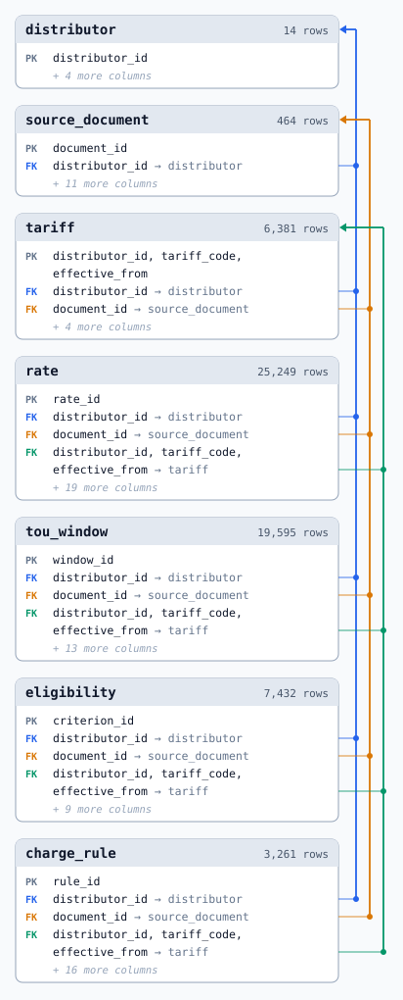
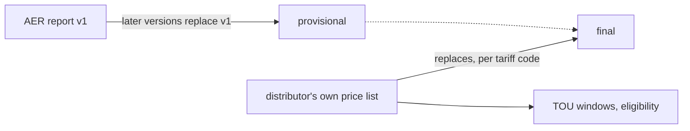

# standardise_network_tariff_tables

Australian electricity **network tariffs** for all 14 distributors, 2023-24 to 2026-27, as one historical dataset:
per tariff code, the final rate the customer is charged, with its TOU windows and eligibility.



| | |
|---|---|
| Data | `data/tariffdb/tables/*.csv` (canonical, committed) |
| SQLite | `.venv/bin/python scripts/tariffdb/load.py --out out/tariffdb.sqlite` (built, not committed) |
| Schema | [docs/schema.md](docs/schema.md): every table and column, examples, a worked tariff |
| Update and validate | [docs/update-and-validate.md](docs/update-and-validate.md) |
| Scope | network tariffs, metering and export (feed-in) network charges; not retail plans, not the DUoS/TUoS breakdown |

## Workflow: AER v1 first, distributor replaces



- Load the AER report as soon as v1 is out (`status = provisional`); each later AER version replaces it.
- When the distributor publishes its own price list, its rates replace the AER's for every code it prices
  (`status = final`).
- **Caveat:** the AER report carries rates only. TOU windows and eligibility usually have to wait for the
  distributor's documents (`validate.py --coverage` lists the gaps).

Recipes and checks: [docs/update-and-validate.md](docs/update-and-validate.md).

## Reconciliation (AER vs distributor)

The repository also reconciles the AER's published prices against each distributor's own list:

- `REPORT.md` - the report: what the AER files are each year, which distributor documents were used, the method,
  the explained and the genuine differences, format changes, items marked `[UNSURE]`, recommendations, and a
  per-distributor-and-year detail section with the full source inventory.
- `discrepancies.csv` - every discrepancy (value differs, AER-only and distributor-only tariff codes and
  components) with its explanation class and the source URL on both sides.

## Reproduce

```
./run.sh              # needs uv (https://docs.astral.sh/uv/); creates .venv, fetches, parses, reconciles, writes out/ and refreshes REPORT.md + discrepancies.csv
./run.sh --no-fetch   # offline: skip the download step
```

`out/` (not committed) then also holds `discrepancies.xlsx` (full comparison, summary grid, format timeline and
source inventory as sheets), `recon_detail.csv` (every compared pair), `match_grid.csv`, `format_timeline.csv`,
`recon_summary.json`, `aer_long.csv` (AER side, normalised) and `dnsp/*.csv` (distributor side, normalised), plus `report.html` for visual review.

## Source documents

`sources/inventory.csv` lists every document the reconciliation reads: distributor, year, role, local path, the
exact URL it was retrieved from, an access note and the SHA-256 of the file that was used. Three kinds of rows:

- **AER-authored files** (`sources/aer/`, side `AER`): committed, because the AER replaces the file behind its
  landing page with each new version (v1..v5 a year) and takes the superseded file private. Every version, held or
  not, is a `source_document` row in the tariff database; the versions that are not held are listed as gaps in
  `REPORT.md`. `scripts/reconcile.py --aer-version <document_id>` reconciles any held version.
- **Wayback Machine copies** (URL on `web.archive.org`): documents whose publisher blocks automated access
  (energex.com.au, ergon.com.au, powerwater.com.au) or no longer serves the file. These are committed under
  `sources/` because they cannot be re-fetched reliably.
- **Everything else** is not committed. `scripts/fetch_sources.py` (run by `./run.sh`) downloads each missing
  file from its recorded URL and verifies the checksum, so a changed checksum shows that the publisher replaced
  the document in place. `scripts/fetch_sources.py --check` only reports what is missing or differs.

Rows without a local path are documents that could not be obtained at all (the access note says why); the
report treats those distributor-years as "no distributor-side data".

## Layout

- `scripts/parse_aer.py` - reads the AER files into one long table (`out/aer_long.csv`).
- `scripts/dnsp/*.py` - one parser per distributor group, all emitting the `scripts/schema.py` columns
  (contract in `scripts/dnsp/CONTRACT.md`).
- `scripts/units.py` - unit normalisation (cents; fixed charges per day; demand per published period).
- `scripts/reconcile.py` - code and component matching, difference classification, grid and discrepancy outputs
  (`--aer-version` for a superseded AER version; the default run also writes `out/version_grid.csv`).
- `scripts/adjustments.py` - the documented AER-to-distributor adjustments (metering, Evoenergy LFiT): scope,
  amounts and evidence, shared by the reconciliation and the tariff database.
- `scripts/published.py` - reads spreadsheet numbers exactly as Excel displays them.
- `scripts/report_tables.py` and `scripts/write_report.py` - report tables and report assembly from
  `notes/report_head.md` and `notes/report_sections/*.md`.
- `notes/format_notes.json` - per distributor-year notes on document format changes.
- `scripts/tariffdb/` - the tariff database: `spec.py` (schema, single source of truth), `build.py` (builds
  `data/tariffdb/` from the parser outputs and `data/tariffdb/curated/*.yaml`), `curated.py` (checks the curated
  TOU and eligibility facts against their sources), `validate.py` (every rule and source check), `load.py` (SQLite
  load, `--out` to save a database), `schema_doc.py` (writes `docs/schema.md` and `docs/schema-erd.svg`),
  `build_support.py` (distributors and the document registry), `locators.py` (reads a value at its cell or page).
  Tests: `.venv/bin/python -m unittest tests/test_tariffdb.py`.
