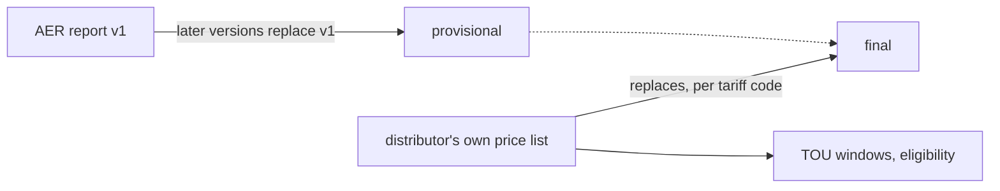

# standardise_network_tariff_tables

Australian electricity **network tariffs** for all 14 distributors, every pricing year in effect from 1 January 2017 to 2026-27
(except Ergon, which starts at 2020-21: its 2016-17 to 2019-20 documents print the network price only as separate
DUOS / TUOS / jurisdictional parts, and the dataset stores only printed totals), as one historical dataset:
per tariff code, the final rate the customer is charged, with what a bill needs besides it: TOU windows, eligibility,
which sites pay a rate (opt-in, meter type), metering charges and how each demand charge is measured.
`scripts/billcalc.py sweep` bills each tariff-period on a synthetic month and lists what it had to assume or could not
find:

| Pricing years | Tariff-periods | Exact | Assumed | Blocked |
|---|---|---|---|---|
| 2023-24 to 2026-27 | 2,391 | 1,230 | 702 | 459 (230 TOU rates without a stated window, mostly locational, storage and trial tariffs; 148 demand rules; 106 tariffs with no rates) |
| 2016-17 / Victoria 2017 to 2022-23 | 3,990 | 2,213 | 1,214 | 563 (308 TOU rates without a stated window, 222 block bounds, 123 seasons without months) |

The older years' TOU windows, demand rules and block bounds come from each year's own price list, pricing proposal or
tariff guide, or the tariff structure statement for its period; Ergon's 2016-17 to 2019-20 stay unstored (above). Most
of their `assumed` bills rest on a fact the documents leave unstated: the clock basis of the windows (992
tariff-periods over all years), a c/kW/year demand price spread over the days (548), a demand window stated in
daylight time all year (206), whether a quarterly block resets by calendar or billing quarter (179), or a window that
leaves part of the day unpriced (21). CitiPower's and Powercor's 2021-H1 kW demand tariffs (CR, CRB, CG, CGB, CMG, CMGB;
DD, NDD, NDM) bill as `assumed`: no held 2021-H1 document states how their demand is measured, and the 2017-2020
tariff structure statement does not cover 2021-H1 (`tests/billcalc_sweep_exceptions.csv`).

## Download

**[Latest release](https://github.com/yehezkieled/standardise_network_tariff_tables/releases/latest)**: coverage,
known gaps and checksums in its notes.

| File | Contents |
|---|---|
| [`tariffdb.sqlite`](https://github.com/yehezkieled/standardise_network_tariff_tables/releases/latest/download/tariffdb.sqlite) | SQLite database: every table with its keys and constraints |
| [`tariffdb-csv.zip`](https://github.com/yehezkieled/standardise_network_tariff_tables/releases/latest/download/tariffdb-csv.zip) | the same tables as CSV, with the schema (`schema.json`, `schema.sqlite.sql`, `schema.md`) |
| [`tariffdb.xlsx`](https://github.com/yehezkieled/standardise_network_tariff_tables/releases/latest/download/tariffdb.xlsx) | the flat views, one sheet each: `tariff_flat` (every tariff with its rates, price per day, windows, conditions and demand rule), `tou_flat` (every tariff's TOU windows and season dates), `unit_spelling`, and a `columns` sheet describing them |
| [`SHA256SUMS`](https://github.com/yehezkieled/standardise_network_tariff_tables/releases/latest/download/SHA256SUMS) | `sha256sum -c SHA256SUMS` |

Built from `main` by `.venv/bin/python scripts/release.py --publish` (standard library only, Python 3.12+;
`--ref` builds another commit).


| | |
|---|---|
| Data | `data/tariffdb/tables/*.csv` (canonical, committed) |
| SQLite | [download](#download), or `.venv/bin/python scripts/tariffdb/load.py --out out/tariffdb.sqlite` (built, not committed) |
| Schema | [docs/schema.md](docs/schema.md): every table and column, examples, a worked tariff |
| Update and validate | [docs/update-and-validate.md](docs/update-and-validate.md) |
| Bill, categorise, compare | `scripts/billcalc.py` on interval data ([docs/update-and-validate.md](docs/update-and-validate.md), "Bill calculator") |
| Scope | network tariffs, metering and export (feed-in) network charges; not retail plans, not the DUoS/TUoS breakdown |

## Coverage and known gaps

Stored strict, shown simple: the tables are normalised (keys, foreign keys, a CHECK for every fixed list, a unit table,
NULL wherever no held document states a value, and a verbatim quote for every curated fact); the views `tariff_flat`,
`tou_flat` and `unit_spelling` flatten them for reading. Every tariff appears in both tariff views
(`tests/test_tariffdb.py`, `TestViewsAndCoverage`).

| Fact | Coverage |
|---|---|
| Rates | every rate has a unit from the `unit` table; all but 21 have a price per day or kWh (`value_std`) or a calendar factor |
| TOU windows | 755 of 1,399 window sets tile every day (the rest state only some hours, or date a season by daylight saving or not at all); every rate priced in a period finds its window, except event periods (hours notified), capacity bands, and tariff-periods with no window for that charge group (`tou_rates_without_windows` in the sweep) |
| Clock and public holidays | 1,045 window sets state their clock and 633 their public-holiday rule, each with its quote; the rest are NULL (billcalc reads local time and public holidays as non-business days, and flags it) |
| Public-holiday calendar | `public_holiday`, each state's holidays from python-holidays (`build_support.HOLIDAYS_VERSION`), 2016 to 2027 |
| Eligibility | 2023-24 on; criteria in controlled values and units, including supply, export and storage capacity, connection and agreement |
| Assignment | one quoted `tariff_assignment` row per statement; `is_default` in `tariff_flat` |

Known gaps:

- **21 rates have no stated billing period** (`c/kW/period_not_stated`, no `value_std`): AusNet NASN2P, NASN2S
  (2017) and NAST16T (2024-25); CitiPower CG, CMG, CR (2025-26); Energex 92000, 92100, 94000 and Ergon ECFLEXT1,
  ECPRCET1, ELFLEXT1 critical-peak rates (2024-25); SA Power Networks ZSS766 (2024-25).
- **17 tariff-periods are both default and opt-in**: their documents make each the default for some customers and
  opt-in for others (Ausgrid EA116, EA256 2023-24; CitiPower CHV1, CHV2, CLLV1, CLLV2 2024-25; Endeavour N73, N93
  2023-24; Essential BLNBSS1, BLNE22AU, BLNRSS2 2024-25 to 2026-27). Both statements are stored, and `is_default` is
  1.
- **Clock rules left NULL on purpose**: the Energex 2026-27 and Ergon 2025-26 and 2026-27 trial tariffs, whose only
  statement is a guide's general definition; and the AusNet 2017 and 2018 dedicated-circuit and two-rate five-day
  schedules, where "Times are AEST" is printed under only some of the tables that use them.
- **Essential Energy basic meters** (2016-17, 2017-18) follow "Summer Time" (last Sunday in October to last Sunday in
  March), not NSW daylight saving; the windows are stored as `local_time`, which shifts their dates slightly. The Far
  West region's meters use Eastern Standard or Summer Time depending on when they were programmed: not modelled.
- **Public holidays** are state-wide as python-holidays lists them: regional and part-day holidays are not told apart.
- **Endeavour N50, N54**: "a Residential or General Supply tariff also applies" is stored as two `secondary_of` links,
  to the residential and business classes. Reading General Supply as the business class is the curator's [UNSURE].
- Six bare "snowfields" headings (AusNet NEE55, NSP55 2024-25 to 2026-27) stay as `other` criteria: they state no
  connection rule.
- No held fact needs `kva_else_kw`: Ergon prints its kW variant of a kVA demand charge as a rate of its own.

## Workflow: AER v1 first, distributor replaces



- Load the AER report as soon as v1 is out (`status = provisional`); each later AER version replaces it.
- When the distributor publishes its own price list, its rates replace the AER's for every code it prices
  (`status = final`).
- **Caveat:** the AER report carries rates only. TOU windows and eligibility usually have to wait for the
  distributor's documents (`validate.py --coverage` lists the gaps).

Recipes and checks: [docs/update-and-validate.md](docs/update-and-validate.md).
New releases: a monthly workflow (`.github/workflows/release-check.yml`) runs `scripts/check_releases.py` and opens an
issue when the AER or a distributor publishes something new; any AI coding agent can then follow
[AGENTS.md](AGENTS.md) ("Updating from new releases") to load it and open a PR.

## Reconciliation (AER vs distributor)

The repository also reconciles the AER's published prices against each distributor's own list:

- `REPORT.md` - the report: what the AER files are each year, which distributor documents were used, the method,
  the explained and the genuine differences, format changes, items marked `[UNSURE]`, recommendations, and a
  per-distributor-and-year detail section with the full source inventory.
- `discrepancies.csv` - every discrepancy (value differs, AER-only and distributor-only tariff codes and
  components) with its explanation class and the source URL on both sides.

## Reproduce

```
./run.sh              # needs uv (https://docs.astral.sh/uv/); creates .venv, fetches, parses, reconciles, writes out/ and refreshes REPORT.md + discrepancies.csv
./run.sh --no-fetch   # offline: skip the download step
```

`out/` (not committed) then also holds `discrepancies.xlsx` (full comparison, summary grid, format timeline and
source inventory as sheets), `recon_detail.csv` (every compared pair), `match_grid.csv`, `format_timeline.csv`,
`recon_summary.json`, `aer_long.csv` (AER side, normalised) and `dnsp/*.csv` (distributor side, normalised), plus `report.html` for visual review.

## Source documents

`sources/inventory.csv` lists every document the reconciliation reads: distributor, year, role, local path, the
exact URL it was retrieved from, an access note and the SHA-256 of the file that was used. Three kinds of rows:

- **AER-authored files** (`sources/aer/`, side `AER`): committed, because the AER replaces the file behind its
  landing page with each new version (v1..v5 a year) and takes the superseded file private. Every version, held or
  not, is a `source_document` row in the tariff database; the versions that are not held are listed as gaps in
  `REPORT.md`. `scripts/reconcile.py --aer-version <document_id>` reconciles any held version.
- **Wayback Machine copies** (URL on `web.archive.org`): documents whose publisher blocks automated access
  (energex.com.au, ergon.com.au, powerwater.com.au) or no longer serves the file.
- **Distributor documents** fetched from the distributor's site.

Every file is committed: publishers replace documents in place and remove old ones. `scripts/fetch_sources.py`
(run by `./run.sh`) re-downloads a missing file from its recorded URL and verifies the checksum, so a changed
checksum shows that the publisher replaced the document; `scripts/fetch_sources.py --check` only reports what is
missing or differs.

Rows without a local path are documents that could not be obtained at all (the access note says why); the
report treats those distributor-years as "no distributor-side data".

Pricing years before 2023-24: `sources/archive/` holds every older public document found (AER-hosted proposals
and price lists back to 2009-10, distributor and state-regulator documents), with its own inventory, a coverage table
per distributor and year, and the reason for each gap (`sources/archive/README.md`). The parsers in
`scripts/history/` read them into the same tables (`sources/archive/` is committed in full, so every historical value
is re-checked against its page in CI).

### Older years (before 2017)

The database stores the pricing years in effect on or after 1 January 2017 (2016-17, Victoria's 2017, and later). The
archive and the parsers already cover 1996-97 to 2016 (every parser output passes `scripts/history/check.py`, which
checks all years). To store them as well:

1. Lower `FIRST_STORED_DAY` in `scripts/tariffdb/build_support.py` (e.g. `"1996-07-01"`).
2. `./run.sh --no-fetch` (or run the `scripts/history/*.py` parsers), then rebuild and validate as in
   [docs/update-and-validate.md](docs/update-and-validate.md).

A year whose documents print only parts and no total is never stored, whatever the cutoff; it is listed with its
evidence in `sources/archive/gaps.csv` (Ergon 2016-17 to 2019-20, see above).

## Layout

- `scripts/parse_aer.py` - reads the AER files into one long table (`out/aer_long.csv`).
- `scripts/dnsp/*.py` - one parser per distributor group, all emitting the `scripts/schema.py` columns
  (contract in `scripts/dnsp/CONTRACT.md`).
- `scripts/history/*.py` - one parser per distributor group for the archived pricing years before 2023-24
  (contract in `scripts/history/CONTRACT.md`; `check.py <slug> --sources` verifies one parser's output);
  `scripts/archive_sources.py` adds, re-files and corrects archived documents.
- `scripts/units.py` - unit normalisation (cents; fixed charges per day; demand per published period).
- `scripts/reconcile.py` - code and component matching, difference classification, grid and discrepancy outputs
  (`--aer-version` for a superseded AER version; the default run also writes `out/version_grid.csv`).
- `scripts/adjustments.py` - the documented AER-to-distributor adjustments (metering, Evoenergy LFiT): scope,
  amounts and evidence, shared by the reconciliation and the tariff database.
- `scripts/published.py` - reads spreadsheet numbers exactly as Excel displays them.
- `scripts/report_tables.py` and `scripts/write_report.py` - report tables and report assembly from
  `notes/report_head.md` and `notes/report_sections/*.md`.
- `notes/format_notes.json` - per distributor-year notes on document format changes.
- `scripts/release.py` - builds the downloadable SQLite and CSV zip from a commit and publishes the GitHub release.
- `scripts/tariffdb/` - the tariff database: `spec.py` (schema, single source of truth), `build.py` (builds
  `data/tariffdb/` from the parser outputs and `data/tariffdb/curated/*.yaml`), `curated.py` (checks the curated
  facts against their sources), `validate.py` (every rule and source check), `load.py` (SQLite
  load, `--out` to save a database), `schema_doc.py` (writes `docs/schema.md` and `docs/schema-erd.svg`),
  `build_support.py` (distributors and the document registry), `locators.py` (reads a value at its cell or page),
  `joins.py` (how a rate finds its TOU windows).
  Tests: `.venv/bin/python -m unittest tests/test_tariffdb.py tests/test_archive.py`.
- `scripts/billcalc.py` - the network bill calculator over the tariff database: bills interval data, labels each
  interval with its periods, compares tariffs, and reports every fact it had to assume or could not find.
  Tests: `.venv/bin/python -m unittest tests/test_billcalc.py` (the distributors' published example bills).
