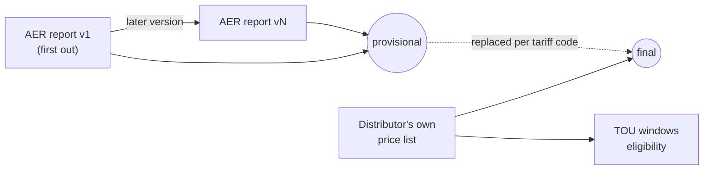
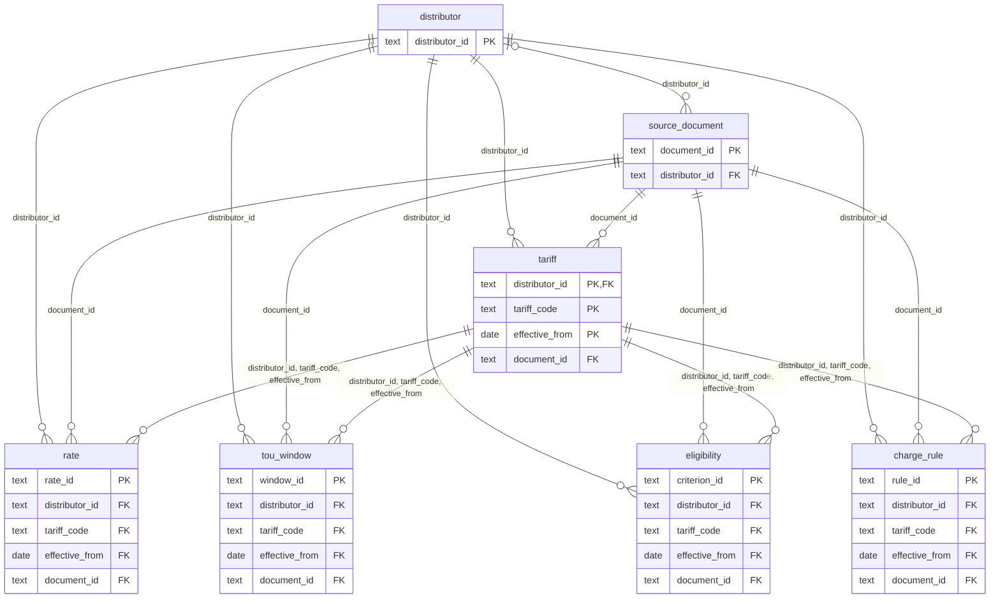

# Network tariff database: schema

<!-- Generated by scripts/tariffdb/schema_doc.py from data/tariffdb/schema.json and the tables; do not edit by hand. -->

[yehezkieled/standardise_network_tariff_tables](https://github.com/yehezkieled/standardise_network_tariff_tables)


|  |  |
|---|---|
| Stores | the network price charged per tariff code: daily, usage, demand, capacity, export and metering rates, TOU windows, eligibility criteria |
| Not stored | retail plans; the DUoS / TUoS / jurisdictional breakdown |
| Years | 2016-17 to 2026-27 |
| Distributors | 14 |
| Tariff-years | 6,381 (5,060 final, 1,321 provisional) |
| Rates | 25,249 |
| Data (canonical) | `data/tariffdb/tables/<table>.csv`, committed |
| SQLite | `.venv/bin/python scripts/tariffdb/load.py --out out/tariffdb.sqlite` (built, not committed: a binary does not diff and would drift from the CSVs) |
| Schema source | `scripts/tariffdb/spec.py` → `schema.json`, `schema.sqlite.sql`, this page |
| Update and validate | [update-and-validate.md](update-and-validate.md) |

## Tables

| Table | One row is | Key | Rows |
|---|---|---|---|
| [`distributor`](#distributor) | one distributor (DNSP) | distributor_id | 14 |
| [`source_document`](#source_document) | one version of one source document, held or not | document_id | 464 |
| [`tariff`](#tariff) | one tariff code of one distributor for one period (a pricing year, or part of one after a mid-year change) | distributor_id, tariff_code, effective_from | 6,381 |
| [`rate`](#rate) | one price of one tariff for one period: charge type x TOU period x season x block | rate_id | 25,249 |
| [`tou_window`](#tou_window) | one time window that one tariff's charges use, for one period | window_id | 19,595 |
| [`eligibility`](#eligibility) | one stated criterion of one tariff for one period | criterion_id | 7,432 |
| [`charge_rule`](#charge_rule) | one stated measurement rule of one tariff's demand, capacity or export charges, for one period | rule_id | 3,270 |

## History

| What | How |
|---|---|
| A price over time | one `tariff` + `rate` rows per period (`effective_from` .. `effective_to`, inclusive) |
| A new year | new rows; earlier years stay |
| A mid-year change | the old period ends the day before; a new period starts that day |
| AER → distributor | the distributor's list replaces the AER rows of each code it prices (`status` provisional → final) |
| Replaced provisional rates | in git history of `rate.csv` |
| Every document version | a `source_document` row, kept for good |



## Walk-through

`BLND4SB`, Essential Energy, on 2025-10-01. Real output of each query on `out/tariffdb.sqlite`.

### 1. Distributor

```sql
SELECT name, state, iana_timezone, observes_dst FROM distributor WHERE distributor_id = 'essential';
```

| name | state | iana_timezone | observes_dst |
|---|---|---|---|
| Essential Energy | NSW | Australia/Sydney | 1 |

### 2. Tariff, every year

```sql
SELECT effective_from, effective_to, tariff_name, status, document_id
FROM tariff WHERE distributor_id = 'essential' AND tariff_code = 'BLND4SB' ORDER BY effective_from;
```

| effective_from | effective_to | tariff_name | status | document_id |
|---|---|---|---|---|
| 2024-07-01 | 2025-06-30 | LV Small Scale Storage | final | essential-price-list-and-explanatory-notes-2024-25 |
| 2025-07-01 | 2026-06-30 | LV Small Scale Storage | final | essential-price-list-and-explanatory-notes-2025-26 |
| 2026-07-01 | 2027-06-30 | LV Small Scale Storage | final | essential-price-list-and-explanatory-notes-2026-27 |

### 3. Documents for 2025-26

```sql
SELECT document_id, publisher, version_label, price_status, published_on
FROM source_document WHERE pricing_year = '2025-26'
  AND (distributor_id = 'essential' OR distributor_id IS NULL) ORDER BY published_on;
```

| document_id | publisher | version_label | price_status | published_on |
|---|---|---|---|---|
| aer-consolidated-2025-26-landing-page | AER | as retrieved 2026-10-06 | published | NULL |
| essential-price-list-and-explanatory-notes-2025-26 | distributor | as published | published | NULL |
| aer-consolidated-2025-26-v1 | AER | v1 | proposed | 2025-04-08 |
| aer-consolidated-2025-26-v2 | AER | v2 | proposed | 2025-04-10 |
| aer-consolidated-2025-26-v3 | AER | v3 | mixed | 2025-05-14 |
| aer-consolidated-2025-26-v4 | AER | v4 | mixed | 2025-05-16 |
| aer-consolidated-2025-26-v5 | AER | v5 | approved | 2025-05-26 |

### 4. Rates on 2025-10-01

```sql
SELECT charge_type, tou_period, value, unit, component, status, locator
FROM rate WHERE distributor_id = 'essential' AND tariff_code = 'BLND4SB' AND '2025-10-01' BETWEEN effective_from AND effective_to ORDER BY charge_type, tou_period;
```

| charge_type | tou_period | value | unit | component | status | locator |
|---|---|---|---|---|---|---|
| daily | NULL | 222.29 | c/day | Network Access | final | pdf:p1 |
| demand | off_peak | 449.43 | c/kVA/month | Demand - Off Peak | final | pdf:p1 |
| demand | peak | 1436.02 | c/kVA/month | Demand - Peak | final | pdf:p1 |
| demand | shoulder | 604.11 | c/kVA/month | Demand - Shoulder | final | pdf:p1 |
| export | peak | -5.1247 | c/kWh | Export - Rebate | final | pdf:p1 |
| export | solar_soak | 117.98 | c/kW/month | Export - Charge >1.5KW | final | pdf:p1 |

### 5. TOU windows on 2025-10-01

```sql
SELECT applies_to, tou_period, day_type, start_time, end_time, months
FROM tou_window WHERE distributor_id = 'essential' AND tariff_code = 'BLND4SB' AND '2025-10-01' BETWEEN effective_from AND effective_to ORDER BY applies_to, start_time;
```

| applies_to | tou_period | day_type | start_time | end_time | months |
|---|---|---|---|---|---|
| demand | off_peak | all_days | 00:00 | 07:00 | 1,2,3,4,5,6,7,8,9,10,11,12 |
| demand | shoulder | all_days | 07:00 | 10:00 | 1,2,3,4,5,6,7,8,9,10,11,12 |
| demand | solar_soak | all_days | 10:00 | 15:00 | 1,2,3,4,5,6,7,8,9,10,11,12 |
| demand | shoulder | all_days | 15:00 | 17:00 | 1,2,3,4,5,6,7,8,9,10,11,12 |
| demand | peak | all_days | 17:00 | 20:00 | 1,2,3,4,5,6,7,8,9,10,11,12 |
| demand | shoulder | all_days | 20:00 | 22:00 | 1,2,3,4,5,6,7,8,9,10,11,12 |
| demand | off_peak | all_days | 22:00 | 24:00 | 1,2,3,4,5,6,7,8,9,10,11,12 |
| export | solar_soak | all_days | 10:00 | 15:00 | 1,2,3,4,5,6,7,8,9,10,11,12 |
| export | peak | all_days | 17:00 | 20:00 | 1,2,3,4,5,6,7,8,9,10,11,12 |

### 6. Eligibility on 2025-10-01

```sql
SELECT criterion, operator, value_num, value_unit, value_text, quote
FROM eligibility WHERE distributor_id = 'essential' AND tariff_code = 'BLND4SB' AND '2025-10-01' BETWEEN effective_from AND effective_to ORDER BY criterion_id;
```

| criterion | operator | value_num | value_unit | value_text | quote |
|---|---|---|---|---|---|
| customer_type | NULL | NULL | NULL | storage | New customers connected to the low-voltage distribution net… |
| demand_max | le | 250 | kW | NULL | Eligible storage is up to and including 250kW. |
| voltage_level | NULL | NULL | NULL | LV | New customers connected to the low-voltage distribution net… |

## Table reference

### distributor

The electricity distribution network service providers whose tariffs are stored.

|  |  |
|---|---|
| One row is | one distributor (DNSP) |
| Primary key | `distributor_id` |
| Rows | 14 |
| Source | reference data in scripts/tariffdb/build_support.py (DISTRIBUTORS) |
| File | `data/tariffdb/tables/distributor.csv` |
| References | none |
| Referenced by | `source_document` (distributor_id); `tariff` (distributor_id); `rate` (distributor_id); `tou_window` (distributor_id); `eligibility` (distributor_id); `charge_rule` (distributor_id) |

| Column | Type | Null | Key | Allowed values / unit | Meaning | Example |
|---|---|---|---|---|---|---|
| `distributor_id` | text | no | PK |  | slug, e.g. ausgrid | `essential` |
| `name` | text | no |  |  | name | `Essential Energy` |
| `state` | text | no |  | NSW, VIC, QLD, SA, TAS, ACT, NT | jurisdiction | `NSW` |
| `iana_timezone` | text | no |  |  | time zone of the network area, e.g. Australia/Sydney; TOU times are local clock times there | `Australia/Sydney` |
| `observes_dst` | boolean | no |  | 0, 1 | 1 when local clocks move for daylight saving (not QLD, NT) | `1` |

### source_document

Every document version the rates, TOU windows and criteria are read from, with where it came from. A re-issued document is a new row; no version replaces another.

|  |  |
|---|---|
| One row is | one version of one source document, held or not |
| Primary key | `document_id` |
| Rows | 464 |
| Source | sources/inventory.csv (2023-24 on) and sources/archive/inventory.csv (earlier years) read by build_support.documents(), plus the AER versions it registers |
| File | `data/tariffdb/tables/source_document.csv` |
| References | (distributor_id) → [`distributor`](#distributor) |
| Referenced by | `tariff` (document_id); `rate` (document_id); `tou_window` (document_id); `eligibility` (document_id); `charge_rule` (document_id) |
| Check | `(local_path IS NULL) = (sha256 IS NULL)` |

| Column | Type | Null | Key | Allowed values / unit | Meaning | Example |
|---|---|---|---|---|---|---|
| `document_id` | text | no | PK |  | slug derived from the file name | `essential-price-list-and-explanatory-notes-2025-26` |
| `distributor_id` | text | yes | FK → distributor |  | distributor whose prices it carries; NULL for an AER report covering every distributor | `essential` |
| `pricing_year` | text | no |  | 1996-97, 1997-98, 1998-99, 1999-00, 2000-01, 2001-02, 2002-03, 2003-04, 2004-05, 2005-06, 2006-07, 2007-08, 2008-09, 2009-10, 2010-11, 2011-12, 2012-13, 2013-14, 2014-15, 2015-16, 2016-17, 2017-18, 2018-19, 2019-20, 2020-21, 2021-22, 2022-23, 2023-24, 2024-25, 2025-26, 2026-27, 2000, 2001, 2002, 2003, 2004, 2005, 2006, 2007, 2008, 2009, 2010, 2011, 2012, 2013, 2014, 2015, 2016, 2017, 2018, 2019, 2020, 2000-H2, 2008-H1, 2021-H1 | pricing year: a financial year (2025-26), or the calendar year (2005) or half year (2021-H1) a regulator priced by (Victoria 2000-H2 to 2021-H1, Tasmania to 2008-H1) | `2025-26` |
| `publisher` | text | no |  | AER, distributor, regulator | who published the prices | `distributor` |
| `document_type` | text | no |  | aer_consolidated_stakeholder_report, aer_stakeholder_report, aer_landing_page, pricing_proposal, pricing_proposal_overview, price_list, tariff_summary, tariff_schedule, schedule_of_charges, statement_of_tariff_classes, price_guide, pricing_schedule, annual_tariff_report, pricing_model, tariff_structure_statement, tariff_trial_notification | kind of publication | `price_list` |
| `hosted_by_aer` | boolean | no |  | 0, 1 | 1 for a distributor document taken from aer.gov.au rather than the distributor's own site | `0` |
| `version_label` | text | no |  |  | version as published, e.g. v1, v5, 'updated 17 Jul 2024' | `as published` |
| `version_seq` | integer | no |  |  | order within its publication series (1 = first) | `1` |
| `price_status` | text | no |  | proposed, approved, mixed, published, unverified | regulatory status of the prices, as a held source states it | `published` |
| `published_on` | date | yes |  | YYYY-MM-DD | publication date, when known | `2025-04-08` |
| `source_url` | text | yes |  |  | exact URL the file was retrieved from (the landing page when not held) | `https://www.essentialenergy.com.au/-/media/Project/Essentia…` |
| `local_path` | text | yes |  |  | repo-relative path of the file; NULL when it could not be retrieved | `sources/dnsp/essential/Essential_Price_List_and_Explanatory…` |
| `sha256` | text | yes |  |  | SHA-256 of the file used | `537df582c360e2625c14b83a6638c57eea6f6d0631963c19cf445cb453a…` |

### tariff

A network tariff code in effect for a period, with its name and customer class as published and whether its rates are provisional (AER) or final (the distributor's own list). A tariff with no rate rows is one its document lists with every price zero.

|  |  |
|---|---|
| One row is | one tariff code of one distributor for one period (a pricing year, or part of one after a mid-year change) |
| Primary key | `distributor_id`, `tariff_code`, `effective_from` |
| Rows | 6,381 |
| Source | built by scripts/tariffdb/build.py from the parsed price lists (out/aer_long.csv, out/dnsp/*.csv, out/history/*.csv) |
| File | `data/tariffdb/tables/tariff.csv` |
| References | (distributor_id) → [`distributor`](#distributor); (document_id) → [`source_document`](#source_document) |
| Referenced by | `rate` (distributor_id, tariff_code, effective_from); `tou_window` (distributor_id, tariff_code, effective_from); `eligibility` (distributor_id, tariff_code, effective_from); `charge_rule` (distributor_id, tariff_code, effective_from) |
| Check | `effective_from <= effective_to` |

| Column | Type | Null | Key | Allowed values / unit | Meaning | Example |
|---|---|---|---|---|---|---|
| `distributor_id` | text | no | PK, FK → distributor |  | distributor | `essential` |
| `tariff_code` | text | no | PK |  | tariff code as the source document prints it | `BLND4SB` |
| `effective_from` | date | no | PK | YYYY-MM-DD | first day the tariff applies | `2025-07-01` |
| `effective_to` | date | no |  | YYYY-MM-DD | last day the tariff applies (inclusive) | `2026-06-30` |
| `tariff_name` | text | yes |  |  | name as published | `LV Small Scale Storage` |
| `customer_class` | text | yes |  |  | tariff class or customer class heading as published | `Business Tariffs` |
| `status` | text | no |  | provisional, final | provisional = rates from the AER's report or a proposal; final = rates from the distributor's own published price list, or the schedule a state regulator published | `final` |
| `document_id` | text | no | FK → source_document |  | document the tariff and its rates are read from | `essential-price-list-and-explanatory-notes-2025-26` |

### rate

The network price charged for one component of a tariff: the total network price (no DUoS/TUoS/jurisdictional breakdown), GST exclusive, in standard units next to the value as published.

|  |  |
|---|---|
| One row is | one price of one tariff for one period: charge type x TOU period x season x block |
| Primary key | `rate_id` |
| Rows | 25,249 |
| Source | built by scripts/tariffdb/build.py from the parsed price lists (total network price, GST exclusive) and, for block bounds, data/tariffdb/curated/*.yaml |
| File | `data/tariffdb/tables/rate.csv` |
| References | (distributor_id) → [`distributor`](#distributor); (document_id) → [`source_document`](#source_document); (distributor_id, tariff_code, effective_from) → [`tariff`](#tariff) |
| Referenced by | none |
| Check | `effective_from <= effective_to` |
| Check | `block IS NULL OR block > 0` |
| Check | `block_from IS NULL OR block_to IS NULL OR block_from < block_to` |
| Check | `(register IS NULL) = (charge_type IN ('daily', 'metering', 'other'))` |
| Check | `charge_type != 'export' OR register = 'export'` |
| Check | `condition IS NULL OR condition GLOB 'opt_in:[a-z0-9]*' OR condition GLOB 'meter_type:[a-z0-9]*' OR condition GLOB 'meter_class:[a-z0-9]*'` |

| Column | Type | Null | Key | Allowed values / unit | Meaning | Example |
|---|---|---|---|---|---|---|
| `rate_id` | text | no | PK |  | <distributor_id>:<tariff_code>:<effective_from>:<charge_type>:<component>[:<tou_period>][:<season>][:<block>][:<region>] | `essential:BLND4SB:2025-07-01:daily:network-access` |
| `distributor_id` | text | no | FK → tariff |  | distributor | `essential` |
| `tariff_code` | text | no | FK → tariff |  | tariff code | `BLND4SB` |
| `effective_from` | date | no | FK → tariff | YYYY-MM-DD | first day the price applies | `2025-07-01` |
| `effective_to` | date | no |  | YYYY-MM-DD | last day the price applies (inclusive) | `2026-06-30` |
| `charge_type` | text | no |  | daily, usage, demand, capacity, export, metering, other | daily = fixed charge per day; usage = per kWh or kVAh; demand / capacity = per kW or kVA; export = per exported kWh or kW (negative = a reward paid); metering = metering charge; other | `daily` |
| `tou_period` | text | yes |  | anytime, peak, shoulder, off_peak, super_off_peak, critical_peak, solar_soak, capacity_minimum, capacity_remaining, critical_minimum, dynamic_maximum, dynamic_minimum | time-of-use period the price applies in (anytime = all times); NULL for daily and metering charges | `anytime` |
| `season` | text | yes |  | summer, non_summer, high, low, winter, spring, autumn | season the price applies in; NULL = all year | `high` |
| `block` | integer | yes |  |  | consumption block number (1 = first) of a stepped price; NULL otherwise | `1` |
| `block_from` | numeric | yes |  |  | lower bound of the block, from the curated block ladder | `0` |
| `block_to` | numeric | yes |  |  | upper bound of the block; NULL = unbounded or not stated | `1020` |
| `block_unit` | text | yes |  | kWh/day, kWh/billing_day, kWh/quarter, kWh | unit and reset period of the bounds | `kWh/quarter` |
| `region` | text | yes |  |  | pricing zone, when the document prices one code by zone | `East` |
| `register` | text | yes |  | general, controlled_load, export | meter register the quantity is measured on: general = general-supply import, controlled_load = a separately metered controlled-load circuit, export = energy sent out; NULL for daily, metering and other charges | `general` |
| `condition` | text | yes |  |  | NULL = always charged; opt_in:<name> = only for a customer who opts in to <name>; meter_type:<type> = only at a site with that meter; meter_class:<class> = only at a site in that class of the distributor's metering schedule; a\|b = either (curated, quoted in data/tariffdb/curated/*.yaml) | `meter_class:network_meter_before_july_2015\|replaced_by_thir…` |
| `value` | numeric | no |  | unit: see unit | price in standard units | `222.29` |
| `unit` | text | no |  |  | standard unit: c/day, c/kWh, c/kVAh, c/kW/day, c/kW/month, c/kVA/month ... (? = billing period not stated) | `c/day` |
| `value_published` | text | no |  |  | number exactly as printed | `2.2229` |
| `unit_published` | text | yes |  |  | unit exactly as printed | `$/Day` |
| `component` | text | no |  |  | component label as printed | `Network Access` |
| `status` | text | no |  | provisional, final | provisional or final (the tariff's status) | `final` |
| `document_id` | text | no | FK → source_document |  | source document version | `essential-price-list-and-explanatory-notes-2025-26` |
| `locator` | text | no |  |  | where in the document: xlsx:<sheet>!<cell>, pdf:p<page> or pdf-ocr:p<page> (grammar in scripts/tariffdb/locators.py) | `pdf:p1` |
| `note` | text | yes |  |  | caveat from the source or the parser | `NUOS network price (total network price incl. transmission…` |

### tou_window

When each time-of-use period applies: day type, start and end time, months. Times are local clock times as the document states them.

|  |  |
|---|---|
| One row is | one time window that one tariff's charges use, for one period |
| Primary key | `window_id` |
| Rows | 19,595 |
| Source | data/tariffdb/curated/*.yaml (tou_schedules), as stated in the distributor's documents |
| File | `data/tariffdb/tables/tou_window.csv` |
| References | (distributor_id) → [`distributor`](#distributor); (document_id) → [`source_document`](#source_document); (distributor_id, tariff_code, effective_from) → [`tariff`](#tariff) |
| Referenced by | none |
| Check | `effective_from <= effective_to` |
| Check | `start_time < end_time` |
| Check | `months IS NOT NULL OR season_label IS NOT NULL` |
| Check | `season IS NULL OR season_label IS NOT NULL` |

| Column | Type | Null | Key | Allowed values / unit | Meaning | Example |
|---|---|---|---|---|---|---|
| `window_id` | text | no | PK |  | <distributor_id>:<tariff_code>:<effective_from>:<applies_to>:<tou_period>:<day_type>:<start>-<end>:<months> (season-<season> or months-not-stated when the document names the season without its months) | `essential:BLND4SB:2025-07-01:demand:off_peak:all_days:00:00…` |
| `distributor_id` | text | no | FK → tariff |  | distributor | `essential` |
| `tariff_code` | text | no | FK → tariff |  | tariff code | `BLND4SB` |
| `effective_from` | date | no | FK → tariff | YYYY-MM-DD | first day the window applies | `2025-07-01` |
| `effective_to` | date | no |  | YYYY-MM-DD | last day the window applies (inclusive) | `2026-06-30` |
| `applies_to` | text | no |  | usage, demand, export, controlled_load, all | which charges of the tariff the window prices | `demand` |
| `tou_period` | text | no |  | anytime, peak, shoulder, off_peak, super_off_peak, critical_peak, solar_soak, capacity_minimum, capacity_remaining, critical_minimum, dynamic_maximum, dynamic_minimum, controlled_load_supply | the rate.tou_period the window prices (peak, off_peak, solar_soak ...); controlled_load_supply = the hours a controlled-load circuit is switched on (prices nothing) | `off_peak` |
| `period_label` | text | no |  |  | period name as published | `Off-peak` |
| `day_type` | text | no |  | weekday, weekend, all_days, business_day, non_business_day | days the window applies on | `all_days` |
| `start_time` | time | no |  | HH:MM | inclusive | `00:00` |
| `end_time` | time | no |  | HH:MM | exclusive; 24:00 = midnight at the end of the day | `07:00` |
| `months` | text | yes |  |  | comma-separated months 1-12; NULL when the source names a season without its months | `1,2,3,4,5,6,7,8,9,10,11,12` |
| `season` | text | yes |  | summer, non_summer, high, low, winter, spring, autumn | the rate.season the window belongs to; NULL = every season | `high` |
| `season_label` | text | yes |  |  | season name as published | `High season (8 months)` |
| `time_basis` | text | no |  | local_time, standard_time, daylight_time, not_stated | clock the times refer to, as stated | `local_time` |
| `public_holidays` | text | no |  | as_weekday, as_non_business_day, not_stated, unchanged | how public holidays are treated | `unchanged` |
| `document_id` | text | no | FK → source_document |  | source document version | `essential-price-list-and-explanatory-notes-2025-26` |
| `locator` | text | no |  |  | where in the document: xlsx:<sheet>!<cell>, pdf:p<page> or pdf-ocr:p<page> (grammar in scripts/tariffdb/locators.py) | `pdf:p7` |

### eligibility

Who can or must be on the tariff: customer type, voltage, consumption or demand thresholds, meter type, assignment (default, opt-in, opt-out), availability, required technology.

|  |  |
|---|---|
| One row is | one stated criterion of one tariff for one period |
| Primary key | `criterion_id` |
| Rows | 7,432 |
| Source | data/tariffdb/curated/*.yaml (eligibility), quoted from the distributor's documents |
| File | `data/tariffdb/tables/eligibility.csv` |
| References | (distributor_id) → [`distributor`](#distributor); (document_id) → [`source_document`](#source_document); (distributor_id, tariff_code, effective_from) → [`tariff`](#tariff) |
| Referenced by | none |
| Check | `effective_from <= effective_to` |
| Check | `value_num IS NOT NULL OR value_text IS NOT NULL OR target_tariff_code IS NOT NULL` |
| Check | `(value_num IS NULL) = (operator IS NULL)` |

| Column | Type | Null | Key | Allowed values / unit | Meaning | Example |
|---|---|---|---|---|---|---|
| `criterion_id` | text | no | PK |  | <distributor_id>:<tariff_code>:<effective_from>:<criterion>:<n> | `essential:BLND4SB:2025-07-01:customer_type:1` |
| `distributor_id` | text | no | FK → tariff |  | distributor | `essential` |
| `tariff_code` | text | no | FK → tariff |  | tariff code | `BLND4SB` |
| `effective_from` | date | no | FK → tariff | YYYY-MM-DD | first day the criterion applies | `2025-07-01` |
| `effective_to` | date | no |  | YYYY-MM-DD | last day the criterion applies (inclusive) | `2026-06-30` |
| `criterion` | text | no |  | customer_type, voltage_level, consumption_min, consumption_max, demand_min, demand_max, meter_type, assignment, availability, requires_technology, opt_out_to, minimum_demand_charge, other | what is constrained | `customer_type` |
| `operator` | text | yes |  | eq, lt, le, gt, ge, ge_unstated, le_unstated | comparison for a numeric threshold | `lt` |
| `value_num` | numeric | yes |  |  | threshold | `40` |
| `value_unit` | text | yes |  |  | unit of the threshold (MWh/yr, kVA, kW, kV ...) | `MWh/yr` |
| `value_text` | text | yes |  |  | categorical value (residential, LV, interval, default, opt_in ...) | `storage` |
| `target_tariff_code` | text | yes |  |  | tariff referred to (opt-out target, required companion) | `EA025` |
| `document_id` | text | no | FK → source_document |  | source document version | `essential-price-list-and-explanatory-notes-2025-26` |
| `locator` | text | no |  |  | where in the document: xlsx:<sheet>!<cell>, pdf:p<page> or pdf-ocr:p<page> (grammar in scripts/tariffdb/locators.py) | `pdf:p3` |
| `quote` | text | no |  |  | verbatim wording at the locator | `New customers connected to the low-voltage distribution net…` |

### charge_rule

How the quantity a demand, capacity or export rate is applied to is measured: in kW or kVA, over which interval, highest or an average of the highest, reset when, with any minimum, threshold or free allowance the document states.

|  |  |
|---|---|
| One row is | one stated measurement rule of one tariff's demand, capacity or export charges, for one period |
| Primary key | `rule_id` |
| Rows | 3,270 |
| Source | data/tariffdb/curated/*.yaml (charge_rules), quoted from the distributor's documents |
| File | `data/tariffdb/tables/charge_rule.csv` |
| References | (distributor_id) → [`distributor`](#distributor); (document_id) → [`source_document`](#source_document); (distributor_id, tariff_code, effective_from) → [`tariff`](#tariff) |
| Referenced by | none |
| Check | `effective_from <= effective_to` |
| Check | `(n IS NULL) = (method NOT IN ('avg_top_n_days', 'avg_top_n_intervals', 'avg_nominated_days'))` |
| Check | `allowance_rollover IS NULL OR allowance_per_day IS NOT NULL` |

| Column | Type | Null | Key | Allowed values / unit | Meaning | Example |
|---|---|---|---|---|---|---|
| `rule_id` | text | no | PK |  | <distributor_id>:<tariff_code>:<effective_from>:<charge_type>:<tou_period or all>:<season or all>:<measure> (a tariff priced both per kW and per kVA has a rule for each) | `essential:BLND4SB:2025-07-01:demand:all:all:kVA` |
| `distributor_id` | text | no | FK → tariff |  | distributor | `essential` |
| `tariff_code` | text | no | FK → tariff |  | tariff code | `BLND4SB` |
| `effective_from` | date | no | FK → tariff | YYYY-MM-DD | first day the rule applies | `2025-07-01` |
| `effective_to` | date | no |  | YYYY-MM-DD | last day the rule applies (inclusive) | `2026-06-30` |
| `charge_type` | text | no |  | demand, capacity, export | the rates the rule measures for | `demand` |
| `tou_period` | text | yes |  | anytime, peak, shoulder, off_peak, super_off_peak, critical_peak, solar_soak, capacity_minimum, capacity_remaining, critical_minimum, dynamic_maximum, dynamic_minimum | the rate.tou_period it measures for; NULL = every rate of the charge type | `solar_soak` |
| `season` | text | yes |  | summer, non_summer, high, low, winter, spring, autumn | the rate.season it measures for; NULL = every season | `summer` |
| `measure` | text | no |  | kW, kVA, kWh | quantity measured | `kVA` |
| `interval_min` | integer | yes |  |  | length of the metering interval the demand is averaged over, minutes | `30` |
| `method` | text | no |  | max, avg_top_n_days, avg_top_n_intervals, agreed, max_of_agreed_and_measured, sum, assigned, avg_nominated_days, max_daily_window_mean, excess_over_window_max, kva_at_max_kw, avg_daily_max | max = the highest interval; avg_top_n_days = the mean of the n highest daily maxima; avg_top_n_intervals = the mean of the n highest intervals; agreed = a value agreed with the distributor; max_of_agreed_and_measured = the greater of the two; sum = the total over the span (energy); assigned = a value the distributor sets (a rating); avg_nominated_days = the mean of the daily maxima on the n days the distributor nominates; max_daily_window_mean = the highest daily mean over the window; excess_over_window_max = the highest in the window less the highest in the peak window (floored at 0); kva_at_max_kw = the kVA of the interval with the highest kW; avg_daily_max = the mean of every day's maximum | `max` |
| `n` | integer | yes |  |  | n of the avg_top_n methods and of avg_nominated_days | `5` |
| `reset` | text | no |  | day, month, billing_period, season, year, year_from_april, rolling_12_months, rolling_13_months | span the measured value is taken over before it starts again | `month` |
| `minimum_value` | numeric | yes |  |  | smallest quantity charged, when stated | `500` |
| `threshold_value` | numeric | yes |  |  | the charge applies only to the quantity above this, when stated (e.g. export above 1.5 kW) | `450` |
| `allowance_per_day` | numeric | yes |  |  | free quantity per day before the charge applies, when stated | `6.85` |
| `allowance_rollover` | boolean | yes |  | 0, 1 | 1 when an unused daily allowance carries over within the billing period | `1` |
| `document_id` | text | no | FK → source_document |  | source document version | `essential-price-list-and-explanatory-notes-2025-26` |
| `locator` | text | no |  |  | where in the document: xlsx:<sheet>!<cell>, pdf:p<page> or pdf-ocr:p<page> (grammar in scripts/tariffdb/locators.py) | `pdf:p11` |
| `quote` | text | no |  |  | verbatim wording at the locator | `maximum half hour demand for the month occurring` |
| `note` | text | yes |  |  | caveat from the curator | `Definitions, 'THREE RATE DEMAND' (p11, a three-column page…` |

## Conventions

| Type | SQLite | Values |
|---|---|---|
| text | TEXT | UTF-8 text |
| integer | INTEGER | whole number |
| numeric | NUMERIC | decimal number |
| date | TEXT | YYYY-MM-DD; effective_to is inclusive |
| time | TEXT | HH:MM local clock time; start inclusive, end exclusive, 24:00 = end of day |
| boolean | INTEGER | 0 or 1 |

|  |  |
|---|---|
| Empty CSV field | NULL |
| Prices | total network price, GST exclusive, in cents: c/day, c/kWh, c/kVAh, c/kW/month ... (`?` = the source states no billing period); `value_published` / `unit_published` as printed |
| Negative price | a reward paid to the customer (export rebates) |
| `tariff_code` | as the distributor prints it; AER spellings map onto it (case and spaces, plus the rules in `data/tariffdb/code_alias.csv`) |
| Keys | built from content (distributor, code, period, component), never row order, so a rebuild is byte-identical |
| `locator` | `xlsx:<sheet>!<cell>`, `pdf:p<page>` (`scripts/tariffdb/locators.py`) |

## Diagram as Mermaid


