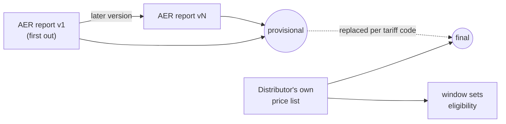

# Network tariff database: schema

<!-- Generated by scripts/tariffdb/schema_doc.py from data/tariffdb/schema.json and the tables; do not edit by hand. -->

[yehezkieled/standardise_network_tariff_tables](https://github.com/yehezkieled/standardise_network_tariff_tables)


|  |  |
|---|---|
| Stores | the network price charged per tariff code: daily, usage, demand, capacity, export and metering rates, TOU windows, eligibility criteria |
| Not stored | retail plans; the DUoS / TUoS / jurisdictional breakdown |
| Years | 2016-17 to 2026-27 |
| Distributors | 14 |
| Tariff-years | 6,381 (5,060 final, 1,321 provisional) |
| Rates | 25,249 |
| Data (canonical) | `data/tariffdb/tables/<table>.csv`, committed |
| SQLite | `.venv/bin/python scripts/tariffdb/load.py --out out/tariffdb.sqlite` (built, not committed: a binary does not diff and would drift from the CSVs) |
| Schema source | `scripts/tariffdb/spec.py` → `schema.json`, `schema.sqlite.sql`, this page |
| Update and validate | [update-and-validate.md](update-and-validate.md) |

## Tables

| Table | One row is | Key | Rows |
|---|---|---|---|
| [`value_list`](#value_list) | one allowed value of one fixed list | list_name, value | 291 |
| [`data_dictionary`](#data_dictionary) | one column of one table | table_name, column_name | 166 |
| [`unit`](#unit) | one stored unit | unit | 12 |
| [`distributor`](#distributor) | one distributor (DNSP) | distributor_id | 14 |
| [`source_document`](#source_document) | one version of one source document, held or not | document_id | 464 |
| [`tariff`](#tariff) | one tariff code of one distributor for one period (a pricing year, or part of one after a mid-year change) | distributor_id, tariff_code, effective_from | 6,381 |
| [`tariff_assignment`](#tariff_assignment) | one quoted statement of how customers come to be on one tariff, for one period | distributor_id, tariff_code, effective_from, assignment_no | 484 |
| [`tariff_link`](#tariff_link) | one stated relation of one tariff period to another tariff code or customer class | distributor_id, tariff_code, effective_from, link_no | 314 |
| [`rate`](#rate) | one price of one tariff for one period: charge type x TOU period x season x block | rate_id | 25,249 |
| [`rate_condition`](#rate_condition) | one value of one condition a rate is charged under | rate_id, condition_kind, value | 774 |
| [`window_set`](#window_set) | one stated time-of-use schedule: the windows one passage of one document sets out | window_set_id | 1,399 |
| [`season`](#season) | one season of one window set: a named rate season, or the months windows apply in | season_id | 1,770 |
| [`season_part`](#season_part) | one span of dates of one season, repeating every year | season_id, part_no | 1,773 |
| [`time_window`](#time_window) | one time window of one window set | window_id | 5,059 |
| [`tariff_window_set`](#tariff_window_set) | one window set used by one charge group of one tariff period | distributor_id, tariff_code, effective_from, window_set_id, applies_to | 5,563 |
| [`eligibility`](#eligibility) | one stated criterion of one tariff for one period | criterion_id | 6,958 |
| [`charge_rule`](#charge_rule) | one stated measurement rule of one tariff's demand, capacity or export charges, for one period | rule_id | 3,301 |

## History

| What | How |
|---|---|
| A price over time | one `tariff` row per period (`effective_from` .. `effective_to`, inclusive); its rates, windows and criteria carry the tariff's key, not their own dates |
| A new year | new rows; earlier years stay |
| A mid-year change | the old period ends the day before; a new period starts that day |
| AER → distributor | the distributor's list replaces the AER rows of each code it prices (`tariff.status` provisional → final); the AER's spelling stays as a `tariff_link` alias |
| Replaced provisional rates | in git history of `rate.csv` |
| Every document version | a `source_document` row, kept for good |



## Walk-through

`BLND4SB`, Essential Energy, on 2025-10-01. Real output of each query on `out/tariffdb.sqlite`.

### 1. Distributor

```sql
SELECT name, state, iana_timezone, observes_dst FROM distributor WHERE distributor_id = 'essential';
```

| name | state | iana_timezone | observes_dst |
|---|---|---|---|
| Essential Energy | NSW | Australia/Sydney | 1 |

### 2. Tariff, every year

```sql
SELECT effective_from, effective_to, tariff_name, status, document_id
FROM tariff WHERE distributor_id = 'essential' AND tariff_code = 'BLND4SB' ORDER BY effective_from;
```

| effective_from | effective_to | tariff_name | status | document_id |
|---|---|---|---|---|
| 2024-07-01 | 2025-06-30 | LV Small Scale Storage | final | essential-price-list-and-explanatory-notes-2024-25 |
| 2025-07-01 | 2026-06-30 | LV Small Scale Storage | final | essential-price-list-and-explanatory-notes-2025-26 |
| 2026-07-01 | 2027-06-30 | LV Small Scale Storage | final | essential-price-list-and-explanatory-notes-2026-27 |

### 3. Documents for 2025-26

```sql
SELECT document_id, publisher, version_label, price_status, published_on
FROM source_document WHERE pricing_year = '2025-26'
  AND (distributor_id = 'essential' OR distributor_id IS NULL) ORDER BY published_on;
```

| document_id | publisher | version_label | price_status | published_on |
|---|---|---|---|---|
| aer-consolidated-2025-26-landing-page | aer | as retrieved 2026-10-06 | published | NULL |
| essential-price-list-and-explanatory-notes-2025-26 | distributor | as published | published | NULL |
| aer-consolidated-2025-26-v1 | aer | v1 | proposed | 2025-04-08 |
| aer-consolidated-2025-26-v2 | aer | v2 | proposed | 2025-04-10 |
| aer-consolidated-2025-26-v3 | aer | v3 | mixed | 2025-05-14 |
| aer-consolidated-2025-26-v4 | aer | v4 | mixed | 2025-05-16 |
| aer-consolidated-2025-26-v5 | aer | v5 | approved | 2025-05-26 |

### 4. Rates on 2025-10-01

```sql
SELECT charge_type, tou_period, value, unit, component, locator
FROM rate WHERE distributor_id = 'essential' AND tariff_code = 'BLND4SB' AND effective_from = (SELECT effective_from FROM tariff WHERE distributor_id = 'essential' AND tariff_code = 'BLND4SB'
  AND '2025-10-01' BETWEEN effective_from AND effective_to)
ORDER BY charge_type, tou_period;
```

| charge_type | tou_period | value | unit | component | locator |
|---|---|---|---|---|---|
| daily | NULL | 222.29 | c/day | Network Access | pdf:p1 |
| demand | off_peak | 449.43 | c/kVA/month | Demand - Off Peak | pdf:p1 |
| demand | peak | 1436.02 | c/kVA/month | Demand - Peak | pdf:p1 |
| demand | shoulder | 604.11 | c/kVA/month | Demand - Shoulder | pdf:p1 |
| export | peak | -5.1247 | c/kWh | Export - Rebate | pdf:p1 |
| export | solar_soak | 117.98 | c/kW/month | Export - Charge >1.5KW | pdf:p1 |

### 5. TOU windows on 2025-10-01

```sql
SELECT l.applies_to, w.tou_period, w.day_type, w.start_time, w.end_time, s.season_label, p.start_month, p.end_month
FROM tariff_window_set l JOIN time_window w USING (window_set_id)
JOIN season s USING (season_id) LEFT JOIN season_part p USING (season_id)
WHERE l.distributor_id = 'essential' AND l.tariff_code = 'BLND4SB' AND l.effective_from = (SELECT effective_from FROM tariff WHERE distributor_id = 'essential' AND tariff_code = 'BLND4SB'
  AND '2025-10-01' BETWEEN effective_from AND effective_to)
ORDER BY l.applies_to, w.start_time;
```

| applies_to | tou_period | day_type | start_time | end_time | season_label | start_month | end_month |
|---|---|---|---|---|---|---|---|
| demand | off_peak | all_days | 00:00 | 07:00 | NULL | 1 | 12 |
| demand | shoulder | all_days | 07:00 | 10:00 | NULL | 1 | 12 |
| demand | solar_soak | all_days | 10:00 | 15:00 | NULL | 1 | 12 |
| demand | shoulder | all_days | 15:00 | 17:00 | NULL | 1 | 12 |
| demand | peak | all_days | 17:00 | 20:00 | NULL | 1 | 12 |
| demand | shoulder | all_days | 20:00 | 22:00 | NULL | 1 | 12 |
| demand | off_peak | all_days | 22:00 | 24:00 | NULL | 1 | 12 |
| export | solar_soak | all_days | 10:00 | 15:00 | NULL | 1 | 12 |
| export | peak | all_days | 17:00 | 20:00 | NULL | 1 | 12 |

### 6. Eligibility on 2025-10-01

```sql
SELECT criterion_group, criterion, operator, value_num, value_unit, value_text, quote
FROM eligibility WHERE distributor_id = 'essential' AND tariff_code = 'BLND4SB' AND effective_from = (SELECT effective_from FROM tariff WHERE distributor_id = 'essential' AND tariff_code = 'BLND4SB'
  AND '2025-10-01' BETWEEN effective_from AND effective_to) ORDER BY criterion_id;
```

| criterion_group | criterion | operator | value_num | value_unit | value_text | quote |
|---|---|---|---|---|---|---|
| 1 | customer_type | NULL | NULL | NULL | storage | New customers connected to the low-voltage distribution net… |
| 1 | demand_max | le | 250 | kW | NULL | Eligible storage is up to and including 250kW. |
| 1 | voltage_level | NULL | NULL | NULL | LV | New customers connected to the low-voltage distribution net… |

## Table reference

### value_list

Every value a controlled column may hold, with its meaning. data_dictionary.value_list names the list a column takes its values from.

|  |  |
|---|---|
| One row is | one allowed value of one fixed list |
| Primary key | `list_name`, `value` |
| Rows | 291 |
| Source | generated from scripts/tariffdb/spec.py (VALUE_LISTS) |
| File | `data/tariffdb/tables/value_list.csv` |
| References | none |
| Referenced by | none |

| Column | Type | Null | Key | Allowed values / unit | Meaning | Example |
|---|---|---|---|---|---|---|
| `list_name` | text | no | PK |  | name of the list, e.g. charge_type | `assignment` |
| `value` | text | no | PK |  | the value as stored | `assigned_by_distributor` |
| `definition` | text | no |  |  | what the value means | `the distributor assigns it` |

### data_dictionary

Every column of every table: its type, whether it is required, the fixed list or unit it takes, and its meaning.

|  |  |
|---|---|
| One row is | one column of one table |
| Primary key | `table_name`, `column_name` |
| Rows | 166 |
| Source | generated from scripts/tariffdb/spec.py (TABLES) |
| File | `data/tariffdb/tables/data_dictionary.csv` |
| References | none |
| Referenced by | none |

| Column | Type | Null | Key | Allowed values / unit | Meaning | Example |
|---|---|---|---|---|---|---|
| `table_name` | text | no | PK |  | table | `charge_rule` |
| `column_name` | text | no | PK |  | column | `allowance_per_day` |
| `ordinal` | integer | no |  |  | position of the column in the table (1 = first) | `15` |
| `data_type` | text | no |  |  | text, integer, numeric, date (YYYY-MM-DD), time (HH:MM) or boolean (0/1) | `numeric` |
| `required` | boolean | no |  | 0, 1 | 1 when the column may not be NULL | `0` |
| `is_primary_key` | boolean | no |  | 0, 1 | 1 when the column is part of the table's primary key | `0` |
| `references_table` | text | yes |  |  | table the column refers to (foreign key) | `distributor` |
| `value_list` | text | yes |  |  | the value_list.list_name the column's values come from | `rule_charge` |
| `unit` | text | yes |  |  | unit of a numeric column | `see measure` |
| `definition` | text | no |  |  | what the column holds | `free quantity per day before the charge applies, when stated` |

### unit

Every unit a rate may be stored in, what it prices per, and how to reach its standard unit: value_std = value x multiplier, or divide by the days of the billed month or year (calendar_factor) for a price per month or year. A unit whose billing period no held document states has neither.

|  |  |
|---|---|
| One row is | one stored unit |
| Primary key | `unit` |
| Rows | 12 |
| Source | generated from scripts/tariffdb/spec.py (UNITS) |
| File | `data/tariffdb/tables/unit.csv` |
| References | none |
| Referenced by | `rate` (unit) |
| Check | `(multiplier IS NULL) OR (calendar_factor IS NULL)` |
| Check | `(unit_std IS NULL) = (billing_period IS 'not_stated')` |

| Column | Type | Null | Key | Allowed values / unit | Meaning | Example |
|---|---|---|---|---|---|---|
| `unit` | text | no | PK |  | the unit as stored, e.g. c/kW/month | `c/day` |
| `quantity` | text | no |  | customer, lamp, kWh, kVAh, kW, kVA (list `unit_quantity`) | what one unit of the price is charged per | `customer` |
| `billing_period` | text | yes |  | day, month, year, not_stated (list `billing_period`) | the period the price is charged per; NULL for an energy price | `day` |
| `unit_std` | text | yes |  |  | the standard unit value_std is in: cents per day, per kWh or per kVAh | `c/day` |
| `multiplier` | numeric | yes |  |  | value_std = value x multiplier; NULL when the calendar decides it | `1` |
| `calendar_factor` | text | yes |  | days_in_month, days_in_year (list `calendar_factor`) | how a price per month or year becomes a price per day | `days_in_month` |
| `definition` | text | no |  |  | what the unit means | `cents per customer per day` |

### distributor

The electricity distribution network service providers whose tariffs are stored.

|  |  |
|---|---|
| One row is | one distributor (DNSP) |
| Primary key | `distributor_id` |
| Rows | 14 |
| Source | reference data in scripts/tariffdb/build_support.py (DISTRIBUTORS) |
| File | `data/tariffdb/tables/distributor.csv` |
| References | none |
| Referenced by | `source_document` (distributor_id); `tariff` (distributor_id); `tariff_assignment` (distributor_id); `tariff_link` (distributor_id); `rate` (distributor_id); `window_set` (distributor_id); `tariff_window_set` (distributor_id); `eligibility` (distributor_id); `charge_rule` (distributor_id) |

| Column | Type | Null | Key | Allowed values / unit | Meaning | Example |
|---|---|---|---|---|---|---|
| `distributor_id` | text | no | PK |  | slug, e.g. ausgrid | `essential` |
| `name` | text | no |  |  | name | `Essential Energy` |
| `state` | text | no |  | NSW, VIC, QLD, SA, TAS, ACT, NT (list `state`) | jurisdiction | `NSW` |
| `iana_timezone` | text | no |  |  | time zone of the network area, e.g. Australia/Sydney; TOU times are local clock times there | `Australia/Sydney` |
| `observes_dst` | boolean | no |  | 0, 1 | 1 when local clocks move for daylight saving (not QLD, NT) | `1` |

### source_document

Every document version the rates, TOU windows and criteria are read from, with where it came from. A re-issued document is a new row; no version replaces another.

|  |  |
|---|---|
| One row is | one version of one source document, held or not |
| Primary key | `document_id` |
| Rows | 464 |
| Source | sources/inventory.csv (2023-24 on) and sources/archive/inventory.csv (earlier years) read by build_support.documents(), plus the AER versions it registers |
| File | `data/tariffdb/tables/source_document.csv` |
| References | (distributor_id) → [`distributor`](#distributor) |
| Referenced by | `tariff` (document_id); `tariff_assignment` (document_id); `tariff_link` (document_id); `rate_condition` (document_id); `window_set` (document_id); `eligibility` (document_id); `charge_rule` (document_id) |
| Check | `(local_path IS NULL) = (sha256 IS NULL)` |

| Column | Type | Null | Key | Allowed values / unit | Meaning | Example |
|---|---|---|---|---|---|---|
| `document_id` | text | no | PK |  | slug derived from the file name | `essential-price-list-and-explanatory-notes-2025-26` |
| `distributor_id` | text | yes | FK → distributor |  | distributor whose prices it carries; NULL for an AER report covering every distributor | `essential` |
| `pricing_year` | text | no |  | 55 values (list `pricing_year`) | pricing year: a financial year (2025-26), or the calendar year (2005) or half year (2021-H1) a regulator priced by (Victoria 2000-H2 to 2021-H1, Tasmania to 2008-H1) | `2025-26` |
| `publisher` | text | no |  | aer, distributor, regulator (list `publisher`) | who published the prices | `distributor` |
| `document_type` | text | no |  | 16 values (list `document_type`) | kind of publication | `price_list` |
| `hosted_by_aer` | boolean | no |  | 0, 1 | 1 for a distributor document taken from aer.gov.au rather than the distributor's own site | `0` |
| `version_label` | text | no |  |  | version as published, e.g. v1, v5, 'updated 17 Jul 2024' | `as published` |
| `version_seq` | integer | no |  |  | order within its publication series (1 = first) | `1` |
| `price_status` | text | no |  | proposed, approved, mixed, published, unverified (list `price_status`) | regulatory status of the prices, as a held source states it | `published` |
| `published_on` | date | yes |  | YYYY-MM-DD | publication date, when known | `2025-04-08` |
| `source_url` | text | yes |  |  | exact URL the file was retrieved from (the landing page when not held) | `https://www.essentialenergy.com.au/-/media/Project/Essentia…` |
| `local_path` | text | yes |  |  | repo-relative path of the file; NULL when it could not be retrieved | `sources/dnsp/essential/Essential_Price_List_and_Explanatory…` |
| `sha256` | text | yes |  |  | SHA-256 of the file used | `537df582c360e2625c14b83a6638c57eea6f6d0631963c19cf445cb453a…` |

### tariff

A network tariff code in effect for a period, with its name and customer class as published and whether its rates are provisional (AER) or final (the distributor's own list). A tariff with no rate rows is one its document lists with every price zero.

|  |  |
|---|---|
| One row is | one tariff code of one distributor for one period (a pricing year, or part of one after a mid-year change) |
| Primary key | `distributor_id`, `tariff_code`, `effective_from` |
| Rows | 6,381 |
| Source | built by scripts/tariffdb/build.py from the parsed price lists (out/aer_long.csv, out/dnsp/*.csv, out/history/*.csv) |
| File | `data/tariffdb/tables/tariff.csv` |
| References | (distributor_id) → [`distributor`](#distributor); (document_id) → [`source_document`](#source_document) |
| Referenced by | `tariff_assignment` (distributor_id, tariff_code, effective_from); `tariff_link` (distributor_id, tariff_code, effective_from); `rate` (distributor_id, tariff_code, effective_from); `tariff_window_set` (distributor_id, tariff_code, effective_from); `eligibility` (distributor_id, tariff_code, effective_from); `charge_rule` (distributor_id, tariff_code, effective_from) |
| Check | `effective_from <= effective_to` |
| Check | `customer_class IS NULL OR customer_class_published IS NOT NULL` |

| Column | Type | Null | Key | Allowed values / unit | Meaning | Example |
|---|---|---|---|---|---|---|
| `distributor_id` | text | no | PK, FK → distributor |  | distributor | `essential` |
| `tariff_code` | text | no | PK |  | tariff code as the source document prints it | `BLND4SB` |
| `effective_from` | date | no | PK | YYYY-MM-DD | first day the tariff applies | `2025-07-01` |
| `effective_to` | date | no |  | YYYY-MM-DD | last day the tariff applies (inclusive) | `2026-06-30` |
| `tariff_name` | text | yes |  |  | name as published | `LV Small Scale Storage` |
| `customer_class` | text | yes |  | residential, small_business, medium_business, large_business, major_business, business, controlled_load, unmetered, public_lighting, generation, storage (list `customer_class`) | the customer class the published heading names; NULL when it names none | `business` |
| `customer_class_published` | text | yes |  |  | tariff class or customer class heading as published | `Business Tariffs` |
| `pricing_basis` | text | yes |  | published, site_specific, trial (list `pricing_basis`) | how the prices apply: trial or site_specific when the published heading says so, else published; NULL for a tariff with no rates | `published` |
| `status` | text | no |  | provisional, final (list `status`) | provisional = rates from the AER's report or a proposal; final = rates from the distributor's own published price list, or the schedule a state regulator published | `final` |
| `document_id` | text | no | FK → source_document |  | document the tariff and its rates are read from | `essential-price-list-and-explanatory-notes-2025-26` |

### tariff_assignment

Whether a tariff is the default, opt-in, opt-out, mandatory or assigned by the distributor, and for whom the statement says so. A tariff may be the default for one group and opt-in for another; every published statement is kept.

|  |  |
|---|---|
| One row is | one quoted statement of how customers come to be on one tariff, for one period |
| Primary key | `distributor_id`, `tariff_code`, `effective_from`, `assignment_no` |
| Rows | 484 |
| Source | data/tariffdb/curated/*.yaml (eligibility facts with rule_type assignment), quoted from the distributor's documents |
| File | `data/tariffdb/tables/tariff_assignment.csv` |
| References | (distributor_id) → [`distributor`](#distributor); (document_id) → [`source_document`](#source_document); (distributor_id, tariff_code, effective_from) → [`tariff`](#tariff) |
| Referenced by | none |
| Check | `assignment_no > 0` |

| Column | Type | Null | Key | Allowed values / unit | Meaning | Example |
|---|---|---|---|---|---|---|
| `distributor_id` | text | no | PK, FK → tariff |  | distributor | `essential` |
| `tariff_code` | text | no | PK, FK → tariff |  | tariff code | `BHND3AO` |
| `effective_from` | date | no | PK, FK → tariff | YYYY-MM-DD | first day of the tariff period | `2025-07-01` |
| `assignment_no` | integer | no | PK |  | statement number within the tariff period (1 = first) | `1` |
| `assignment` | text | no |  | default, opt_in, opt_out, mandatory, assigned_by_distributor, retailer_request (list `assignment`) | how customers come to be on the tariff | `default` |
| `applies_to` | text | yes |  | new_connection, meter_change, existing_customer (list `assignment_group`) | the customers the statement names; NULL = it names no group | `meter_change` |
| `document_id` | text | no | FK → source_document |  | source document version | `essential-price-list-and-explanatory-notes-2025-26` |
| `locator` | text | no |  |  | where in the document: xlsx:<sheet>!<cell>, pdf:p<page> or pdf-ocr:p<page> (grammar in scripts/tariffdb/locators.py) | `pdf:p3` |
| `quote` | text | no |  |  | verbatim wording at the locator | `Default tariff for business premises whose consumption is c…` |

### tariff_link

How a tariff relates to others: the AER's spelling of it, the tariff a customer may opt out to, the tariff it replaces, a primary tariff it must sit beside, a tariff it may not be combined with ... linked_code is a code as printed and need not be a stored tariff.

|  |  |
|---|---|
| One row is | one stated relation of one tariff period to another tariff code or customer class |
| Primary key | `distributor_id`, `tariff_code`, `effective_from`, `link_no` |
| Rows | 314 |
| Source | built by scripts/tariffdb/build.py: alias and zone_variant_of from the AER spellings the build stores under the distributor's code (data/tariffdb/code_alias.csv); the rest from data/tariffdb/curated/*.yaml, quoted |
| File | `data/tariffdb/tables/tariff_link.csv` |
| References | (distributor_id) → [`distributor`](#distributor); (document_id) → [`source_document`](#source_document); (distributor_id, tariff_code, effective_from) → [`tariff`](#tariff) |
| Referenced by | none |
| Check | `link_no > 0` |
| Check | `linked_code IS NOT NULL OR link_type IN ('cannot_combine', 'secondary_of', 'primary_of')` |
| Check | `linked_customer_class IS NULL OR linked_code IS NULL` |
| Check | `(locator IS NULL) = (quote IS NULL)` |
| Check | `quote IS NOT NULL OR link_type IN ('alias', 'zone_variant_of')` |
| Check | `document_id IS NOT NULL OR quote IS NULL` |

| Column | Type | Null | Key | Allowed values / unit | Meaning | Example |
|---|---|---|---|---|---|---|
| `distributor_id` | text | no | PK, FK → tariff |  | distributor | `citipower` |
| `tariff_code` | text | no | PK, FK → tariff |  | tariff code | `CMG` |
| `effective_from` | date | no | PK, FK → tariff | YYYY-MM-DD | first day of the tariff period | `2025-07-01` |
| `link_no` | integer | no | PK |  | link number within the tariff period (1 = first) | `1` |
| `link_type` | text | no |  | alias, zone_variant_of, opt_out_to, replaces, secondary_of, primary_of, compulsory_pair, cannot_combine, available_only_from (list `link_type`) | the relation | `opt_out_to` |
| `linked_code` | text | yes |  |  | the other tariff code as printed; NULL when the link names a class or every other tariff | `CMGO21` |
| `linked_customer_class` | text | yes |  | residential, small_business, medium_business, large_business, major_business, business, controlled_load, unmetered, public_lighting, generation, storage (list `customer_class`) | the customer class whose tariffs the link names | *always NULL* |
| `document_id` | text | yes | FK → source_document |  | source document version | `citipower-pricing-proposal-2025-26-31mar2025-wayback` |
| `locator` | text | yes |  |  | where in the document: xlsx:<sheet>!<cell>, pdf:p<page> or pdf-ocr:p<page> (grammar in scripts/tariffdb/locators.py) | `pdf:p7` |
| `quote` | text | yes |  |  | verbatim wording at the locator | `CMG customers consuming less than 160MWh pa can opt out of…` |
| `note` | text | yes |  |  | the code_alias.csv rule, or an exception the statement names | `TOU tariff and TOU-demand tariff of the same customer type…` |

### rate

The network price charged for one component of a tariff: the total network price (no DUoS/TUoS/jurisdictional breakdown), GST exclusive, in a unit of the unit table next to the value as published.

|  |  |
|---|---|
| One row is | one price of one tariff for one period: charge type x TOU period x season x block |
| Primary key | `rate_id` |
| Rows | 25,249 |
| Source | built by scripts/tariffdb/build.py from the parsed price lists (total network price, GST exclusive) and, for block bounds and stated units, data/tariffdb/curated/*.yaml |
| File | `data/tariffdb/tables/rate.csv` |
| References | (distributor_id) → [`distributor`](#distributor); (unit) → [`unit`](#unit); (distributor_id, tariff_code, effective_from) → [`tariff`](#tariff) |
| Referenced by | `rate_condition` (rate_id) |
| Check | `block IS NULL OR block > 0` |
| Check | `block_from IS NULL OR block_to IS NULL OR block_from < block_to` |
| Check | `(register IS NULL) = (charge_type IN ('daily', 'metering', 'other'))` |
| Check | `charge_type != 'export' OR register = 'export'` |

| Column | Type | Null | Key | Allowed values / unit | Meaning | Example |
|---|---|---|---|---|---|---|
| `rate_id` | text | no | PK |  | <distributor_id>:<tariff_code>:<effective_from>:<charge_type>:<component>[:<tou_period>][:<season>][:<block>][:<region>] | `essential:BLND4SB:2025-07-01:daily:network-access` |
| `distributor_id` | text | no | FK → tariff |  | distributor | `essential` |
| `tariff_code` | text | no | FK → tariff |  | tariff code | `BLND4SB` |
| `effective_from` | date | no | FK → tariff | YYYY-MM-DD | first day of the tariff period | `2025-07-01` |
| `charge_type` | text | no |  | daily, usage, demand, capacity, export, metering, other (list `charge_type`) | daily = fixed charge per day; usage = per kWh or kVAh; demand / capacity = per kW or kVA; export = per exported kWh or kW (negative = a reward paid); metering = metering charge; other | `daily` |
| `tou_period` | text | yes |  | anytime, peak, shoulder, off_peak, super_off_peak, critical_peak, solar_soak, capacity_minimum, capacity_remaining, critical_minimum, dynamic_maximum, dynamic_minimum (list `rate_period`) | time-of-use period the price applies in (anytime = all times); NULL for daily and metering charges | `anytime` |
| `season` | text | yes |  | summer, non_summer, high, low, winter, spring, autumn (list `season`) | season the price applies in; NULL = all year | `high` |
| `block` | integer | yes |  |  | consumption block number (1 = first) of a stepped price; NULL otherwise | `1` |
| `block_from` | numeric | yes |  | unit: see block_unit | lower bound of the block, from the curated block ladder | `0` |
| `block_to` | numeric | yes |  | unit: see block_unit | upper bound of the block; NULL = unbounded or not stated | `1020` |
| `block_unit` | text | yes |  | kWh/day, kWh/billing_day, kWh/quarter, kWh (list `block_unit`) | unit and reset period of the bounds | `kWh/quarter` |
| `region` | text | yes |  |  | pricing zone, when the document prices one code by zone | `East` |
| `register` | text | yes |  | general, controlled_load, export (list `register`) | meter register the quantity is measured on: general = general-supply import, controlled_load = a separately metered controlled-load circuit, export = energy sent out; NULL for daily, metering and other charges | `general` |
| `value` | numeric | no |  | unit: see unit | price in the rate's unit | `222.29` |
| `unit` | text | no | FK → unit |  | unit of value (the unit table says what it prices per and how to reach its standard unit) | `c/day` |
| `value_published` | text | no |  |  | number exactly as printed | `2.2229` |
| `unit_published` | text | yes |  |  | unit exactly as printed | `$/Day` |
| `component` | text | no |  |  | component label as printed | `Network Access` |
| `locator` | text | no |  |  | where in the tariff's document: where in the document: xlsx:<sheet>!<cell>, pdf:p<page> or pdf-ocr:p<page> (grammar in scripts/tariffdb/locators.py) | `pdf:p1` |
| `note` | text | yes |  |  | caveat from the source or the parser | `NUOS network price (total network price incl. transmission…` |

### rate_condition

A rate with condition rows is charged only at a site that meets, for each condition kind it names, one of that kind's values (values of one kind are alternatives). A rate with none is always charged.

|  |  |
|---|---|
| One row is | one value of one condition a rate is charged under |
| Primary key | `rate_id`, `condition_kind`, `value` |
| Rows | 774 |
| Source | data/tariffdb/curated/*.yaml (conditions, metering), quoted from the distributor's documents |
| File | `data/tariffdb/tables/rate_condition.csv` |
| References | (rate_id) → [`rate`](#rate); (document_id) → [`source_document`](#source_document) |
| Referenced by | none |
| Check | `value GLOB '[a-z0-9]*' AND value NOT GLOB '*[^a-z0-9_]*'` |
| Check | `condition_kind != 'meter_type' OR value IN ('interval', 'smart', 'basic', 'accumulation', 'unmetered', 'any')` |

| Column | Type | Null | Key | Allowed values / unit | Meaning | Example |
|---|---|---|---|---|---|---|
| `rate_id` | text | no | PK, FK → rate |  | the rate | `sapn:B2R:2023-07-01:metering:legacy-metering-service-charge…` |
| `condition_kind` | text | no | PK | opt_in, meter_type, meter_class (list `condition_kind`) | what the site must have or do | `meter_class` |
| `value` | text | no | PK |  | opt_in: the offer's name; meter_type: a meter_type_value; meter_class: the class in the distributor's metering schedule (lower case, underscores) | `network_meter_before_july_2015` |
| `document_id` | text | no | FK → source_document |  | source document version | `sapn-2023-24-annual-pricing-proposal-revised-8may2023` |
| `locator` | text | no |  |  | where in the document: xlsx:<sheet>!<cell>, pdf:p<page> or pdf-ocr:p<page> (grammar in scripts/tariffdb/locators.py) | `pdf:p94` |
| `quote` | text | no |  |  | verbatim wording at the locator | `installed prior to 1 July 2015 - These customers continue t…` |

### window_set

A named set of time windows, with the clock its times refer to and how public holidays are priced, as the document states them. Tariffs use it through tariff_window_set; its windows are in time_window and its seasons in season.

|  |  |
|---|---|
| One row is | one stated time-of-use schedule: the windows one passage of one document sets out |
| Primary key | `window_set_id` |
| Rows | 1,399 |
| Source | data/tariffdb/curated/*.yaml (tou_schedules), as stated in the distributor's documents |
| File | `data/tariffdb/tables/window_set.csv` |
| References | (distributor_id) → [`distributor`](#distributor); (document_id) → [`source_document`](#source_document) |
| Referenced by | `season` (window_set_id); `time_window` (window_set_id); `tariff_window_set` (window_set_id) |

| Column | Type | Null | Key | Allowed values / unit | Meaning | Example |
|---|---|---|---|---|---|---|
| `window_set_id` | text | no | PK |  | slug, unique across distributors (the curated schedule id) | `essential-2016-17-pl-basic-tou` |
| `distributor_id` | text | no | FK → distributor |  | distributor | `essential` |
| `name` | text | no |  |  | what the windows are for, as the curator names them | `Time periods (all ToU charges)` |
| `covers_full_day` | boolean | no |  | 0, 1 | 1 when the windows partition each day type they name over 24 hours | `1` |
| `time_basis` | text | no |  | local_time, standard_time, daylight_time, not_stated (list `time_basis`) | clock the times refer to, as stated | `local_time` |
| `public_holidays` | text | no |  | as_weekday, as_non_business_day, unchanged, not_stated (list `holiday_rule`) | how public holidays are priced, as stated | `unchanged` |
| `document_id` | text | no | FK → source_document |  | source document version | `essential-2016-17-pricelistandexplanatorynotes2016-17-pdf` |
| `locator` | text | no |  |  | where in the document: xlsx:<sheet>!<cell>, pdf:p<page> or pdf-ocr:p<page> (grammar in scripts/tariffdb/locators.py) | `pdf:p10` |
| `quote` | text | no |  |  | verbatim wording at the locator | `PEAK PERIOD is from 7.00am–9.00am and 5.00pm–` |
| `note` | text | yes |  |  | caveat from the curator | `Read by column (the page's three columns interleave in its…` |

### season

The part of the year a window set's windows apply in. season is the rate.season it prices (NULL = the windows belong to no rate season); its dates are season_part rows. A season with no parts is one the document names without its dates.

|  |  |
|---|---|
| One row is | one season of one window set: a named rate season, or the months windows apply in |
| Primary key | `season_id` |
| Rows | 1,770 |
| Source | data/tariffdb/curated/*.yaml (the months and season of each window) |
| File | `data/tariffdb/tables/season.csv` |
| References | (window_set_id) → [`window_set`](#window_set) |
| Referenced by | `season_part` (season_id); `time_window` (season_id) |
| Check | `season IS NULL OR season_label IS NOT NULL` |

| Column | Type | Null | Key | Allowed values / unit | Meaning | Example |
|---|---|---|---|---|---|---|
| `season_id` | text | no | PK |  | <window_set_id>:<season or any>:<months, dst, not-dst or months-not-stated> | `ausgrid-2016-18-capacity:any:all` |
| `window_set_id` | text | no | FK → window_set |  | window set | `ausgrid-2016-18-capacity` |
| `season` | text | yes |  | summer, non_summer, high, low, winter, spring, autumn (list `season`) | the rate.season the windows price; NULL = no rate season | `high` |
| `season_label` | text | yes |  |  | season name as published | `High season (8 months)` |

### season_part

A span of a season, from a start day to an end day (inclusive), each a calendar day or the day daylight saving starts or ends. A span may wrap the year end (1 November to 31 March).

|  |  |
|---|---|
| One row is | one span of dates of one season, repeating every year |
| Primary key | `season_id`, `part_no` |
| Rows | 1,773 |
| Source | data/tariffdb/curated/*.yaml (the months of each window) |
| File | `data/tariffdb/tables/season_part.csv` |
| References | (season_id) → [`season`](#season) |
| Referenced by | none |
| Check | `part_no > 0` |
| Check | `(start_month IS NULL) = (start_day IS NULL)` |
| Check | `(end_month IS NULL) = (end_day IS NULL)` |
| Check | `(start_month IS NULL) = (start_anchor IS NOT NULL)` |
| Check | `(end_month IS NULL) = (end_anchor IS NOT NULL)` |
| Check | `start_month IS NULL OR start_month BETWEEN 1 AND 12` |
| Check | `end_month IS NULL OR end_month BETWEEN 1 AND 12` |
| Check | `start_day IS NULL OR start_day BETWEEN 1 AND 31` |
| Check | `end_day IS NULL OR end_day BETWEEN 1 AND 31` |

| Column | Type | Null | Key | Allowed values / unit | Meaning | Example |
|---|---|---|---|---|---|---|
| `season_id` | text | no | PK, FK → season |  | season | `ausgrid-2016-18-capacity:any:all` |
| `part_no` | integer | no | PK |  | span number within the season (1 = first) | `1` |
| `start_month` | integer | yes |  |  | month of the first day; NULL with start_anchor | `1` |
| `start_day` | integer | yes |  |  | day of month of the first day | `1` |
| `start_anchor` | text | yes |  | dst_start, dst_end (list `season_anchor`) | the first day is a daylight-saving changeover | `dst_end` |
| `end_month` | integer | yes |  |  | month of the last day; NULL with end_anchor | `12` |
| `end_day` | integer | yes |  |  | day of month of the last day (29 for February: the last day in any year) | `31` |
| `end_anchor` | text | yes |  | dst_start, dst_end (list `season_anchor`) | the span ends the day before this daylight-saving changeover | `dst_start` |

### time_window

When one time-of-use period applies: day type, start and end time, in a season of the set. Times are local clock times as the document states them (window_set.time_basis).

|  |  |
|---|---|
| One row is | one time window of one window set |
| Primary key | `window_id` |
| Rows | 5,059 |
| Source | data/tariffdb/curated/*.yaml (tou_schedules windows) |
| File | `data/tariffdb/tables/time_window.csv` |
| References | (window_set_id) → [`window_set`](#window_set); (season_id) → [`season`](#season) |
| Referenced by | none |
| Check | `start_time < end_time` |
| Check | `quote IS NULL OR locator IS NOT NULL` |

| Column | Type | Null | Key | Allowed values / unit | Meaning | Example |
|---|---|---|---|---|---|---|
| `window_id` | text | no | PK |  | <season_id>:<tou_period>:<day_type>:<start>-<end> | `ausgrid-2016-18-capacity:any:all:peak:business_day:14:00-20…` |
| `window_set_id` | text | no | FK → window_set |  | window set | `ausgrid-2016-18-capacity` |
| `season_id` | text | no | FK → season |  | the season the window applies in | `ausgrid-2016-18-capacity:any:all` |
| `tou_period` | text | no |  | 13 values (list `tou_period`) | the rate.tou_period the window prices (peak, off_peak, solar_soak ...); controlled_load_supply = the hours a controlled-load circuit is switched on (prices nothing) | `peak` |
| `period_label` | text | no |  |  | period name as published | `Peak period (between 2pm and 8pm on a working weekday)` |
| `day_type` | text | no |  | weekday, weekend, all_days, business_day, non_business_day (list `day_type`) | days the window applies on | `business_day` |
| `start_time` | time | no |  | HH:MM | inclusive | `14:00` |
| `end_time` | time | no |  | HH:MM | exclusive; 24:00 = midnight at the end of the day | `20:00` |
| `locator` | text | yes |  |  | where the window is stated, when not at the set's locator | `pdf:p10` |
| `quote` | text | yes |  |  | verbatim wording at that locator, when the curator quoted it | `11:00PM to 7:00AM & 1:00PM to 4:00PM Monday to Sunday` |

### tariff_window_set

Which window sets say when a tariff's usage, demand, export or controlled-load rates apply.

|  |  |
|---|---|
| One row is | one window set used by one charge group of one tariff period |
| Primary key | `distributor_id`, `tariff_code`, `effective_from`, `window_set_id`, `applies_to` |
| Rows | 5,563 |
| Source | data/tariffdb/curated/*.yaml (tou_schedules tariffs) |
| File | `data/tariffdb/tables/tariff_window_set.csv` |
| References | (distributor_id) → [`distributor`](#distributor); (window_set_id) → [`window_set`](#window_set); (distributor_id, tariff_code, effective_from) → [`tariff`](#tariff) |
| Referenced by | none |
| Check | `quote IS NULL OR locator IS NOT NULL` |

| Column | Type | Null | Key | Allowed values / unit | Meaning | Example |
|---|---|---|---|---|---|---|
| `distributor_id` | text | no | PK, FK → tariff |  | distributor | `essential` |
| `tariff_code` | text | no | PK, FK → tariff |  | tariff code | `BLND4SB` |
| `effective_from` | date | no | PK, FK → tariff | YYYY-MM-DD | first day of the tariff period | `2025-07-01` |
| `window_set_id` | text | no | PK, FK → window_set |  | window set | `essential-2025-26-pl-sto-b` |
| `applies_to` | text | no | PK | usage, demand, export, controlled_load, all (list `tou_applies`) | which charges of the tariff the set's windows price | `export` |
| `locator` | text | yes |  |  | where the document names the tariff for the set, when not at the set's locator | `pdf:p1` |
| `quote` | text | yes |  |  | verbatim wording at that locator | `BLND4SB LV Small Scale Storage STO` |

### eligibility

Who can be on the tariff: customer type, voltage, consumption or demand thresholds, meter type, availability, required technology. How customers are assigned is tariff_assignment.

|  |  |
|---|---|
| One row is | one stated criterion of one tariff for one period |
| Primary key | `criterion_id` |
| Rows | 6,958 |
| Source | data/tariffdb/curated/*.yaml (eligibility), quoted from the distributor's documents |
| File | `data/tariffdb/tables/eligibility.csv` |
| References | (distributor_id) → [`distributor`](#distributor); (document_id) → [`source_document`](#source_document); (distributor_id, tariff_code, effective_from) → [`tariff`](#tariff) |
| Referenced by | none |
| Check | `criterion_group > 0` |
| Check | `value_num IS NOT NULL OR value_text IS NOT NULL` |
| Check | `(value_num IS NULL) = (operator IS NULL)` |
| Check | `(value_num IS NULL) = (value_unit IS NULL)` |
| Check | `criterion != 'customer_type' OR value_text IS NULL OR value_text IN ('residential', 'small_business', 'medium_business', 'large_business', 'business', 'unmetered', 'public_lighting', 'embedded_generation', 'controlled_load', 'storage', 'ev_charging', 'any')` |
| Check | `criterion != 'voltage_level' OR value_text IS NULL OR value_text IN ('LV', 'HV', 'subtransmission', 'transmission', 'zone_substation')` |
| Check | `criterion != 'meter_type' OR value_text IS NULL OR value_text IN ('interval', 'smart', 'basic', 'accumulation', 'unmetered', 'any')` |
| Check | `criterion != 'availability' OR value_text IS NULL OR value_text IN ('open', 'closed_to_new', 'withdrawn', 'obsolete', 'trial', 'grandfathered', 'transitional')` |
| Check | `criterion != 'requires_technology' OR value_text IS NULL OR value_text IN ('solar', 'battery', 'ev', 'controlled_load_device', 'dedicated_circuit', 'export_capable', 'storage', 'flexible_load', 'heat_pump')` |

| Column | Type | Null | Key | Allowed values / unit | Meaning | Example |
|---|---|---|---|---|---|---|
| `criterion_id` | text | no | PK |  | <distributor_id>:<tariff_code>:<effective_from>:<criterion>:<n> | `essential:BLND4SB:2025-07-01:customer_type:1` |
| `distributor_id` | text | no | FK → tariff |  | distributor | `essential` |
| `tariff_code` | text | no | FK → tariff |  | tariff code | `BLND4SB` |
| `effective_from` | date | no | FK → tariff | YYYY-MM-DD | first day of the tariff period | `2025-07-01` |
| `criterion_group` | integer | no |  |  | alternative routes onto the tariff: a site qualifies when every criterion of one group holds (criteria of one kind within a group are alternatives); 1 when the document states no alternatives | `1` |
| `criterion` | text | no |  | customer_type, voltage_level, consumption_min, consumption_max, demand_min, demand_max, meter_type, availability, requires_technology, minimum_demand_charge, other (list `criterion`) | what is constrained | `customer_type` |
| `operator` | text | yes |  | eq, lt, le, gt, ge, ge_unstated, le_unstated (list `operator`) | comparison for a numeric threshold | `lt` |
| `value_num` | numeric | yes |  | unit: see value_unit | threshold | `40` |
| `value_unit` | text | yes |  | kWh/yr, MWh/yr, GWh/yr, kW, MW, kVA, MVA (list `threshold_unit`) | unit of the threshold | `MWh/yr` |
| `value_text` | text | yes |  |  | categorical value (residential, LV, interval, closed_to_new ...); the <criterion>_value list for a categorical criterion, as stated for other | `storage` |
| `document_id` | text | no | FK → source_document |  | source document version | `essential-price-list-and-explanatory-notes-2025-26` |
| `locator` | text | no |  |  | where in the document: xlsx:<sheet>!<cell>, pdf:p<page> or pdf-ocr:p<page> (grammar in scripts/tariffdb/locators.py) | `pdf:p3` |
| `quote` | text | no |  |  | verbatim wording at the locator | `New customers connected to the low-voltage distribution net…` |

### charge_rule

How the quantity a demand, capacity or export rate is applied to is measured: in kW or kVA, over which interval, highest or an average of the highest, reset when, with any minimum, threshold or free allowance the document states.

|  |  |
|---|---|
| One row is | one stated measurement rule of one tariff's demand, capacity or export charges, for one period |
| Primary key | `rule_id` |
| Rows | 3,301 |
| Source | data/tariffdb/curated/*.yaml (charge_rules), quoted from the distributor's documents |
| File | `data/tariffdb/tables/charge_rule.csv` |
| References | (distributor_id) → [`distributor`](#distributor); (document_id) → [`source_document`](#source_document); (distributor_id, tariff_code, effective_from) → [`tariff`](#tariff) |
| Referenced by | none |
| Check | `(n IS NULL) = (method NOT IN ('avg_top_n_days', 'avg_top_n_intervals', 'avg_nominated_days'))` |
| Check | `allowance_rollover IS NULL OR allowance_per_day IS NOT NULL` |

| Column | Type | Null | Key | Allowed values / unit | Meaning | Example |
|---|---|---|---|---|---|---|
| `rule_id` | text | no | PK |  | <distributor_id>:<tariff_code>:<effective_from>:<charge_type>:<tou_period or all>:<season or all>:<measure> (a tariff priced both per kW and per kVA has a rule for each) | `essential:BLND4SB:2025-07-01:demand:all:all:kVA` |
| `distributor_id` | text | no | FK → tariff |  | distributor | `essential` |
| `tariff_code` | text | no | FK → tariff |  | tariff code | `BLND4SB` |
| `effective_from` | date | no | FK → tariff | YYYY-MM-DD | first day of the tariff period | `2025-07-01` |
| `charge_type` | text | no |  | demand, capacity, export (list `rule_charge`) | the rates the rule measures for | `demand` |
| `tou_period` | text | yes |  | anytime, peak, shoulder, off_peak, super_off_peak, critical_peak, solar_soak, capacity_minimum, capacity_remaining, critical_minimum, dynamic_maximum, dynamic_minimum (list `rate_period`) | the rate.tou_period it measures for; NULL = every rate of the charge type | `solar_soak` |
| `season` | text | yes |  | summer, non_summer, high, low, winter, spring, autumn (list `season`) | the rate.season it measures for; NULL = every season | `summer` |
| `measure` | text | no |  | kW, kVA, kWh (list `rule_measure`) | quantity measured | `kVA` |
| `interval_min` | integer | yes |  | unit: minutes | length of the metering interval the demand is averaged over, minutes | `30` |
| `method` | text | no |  | max, avg_top_n_days, avg_top_n_intervals, agreed, max_of_agreed_and_measured, sum, assigned, avg_nominated_days, max_daily_window_mean, excess_over_window_max, kva_at_max_kw, avg_daily_max (list `rule_method`) | how the quantity is taken from the intervals (value_list rule_method) | `max` |
| `n` | integer | yes |  |  | n of the avg_top_n methods and of avg_nominated_days | `5` |
| `reset` | text | no |  | day, month, billing_period, season, year, year_from_april, rolling_12_months, rolling_13_months (list `rule_reset`) | span the measured value is taken over before it starts again | `month` |
| `minimum_value` | numeric | yes |  | unit: see measure | smallest quantity charged, when stated | `500` |
| `threshold_value` | numeric | yes |  | unit: see measure | the charge applies only to the quantity above this, when stated (e.g. export above 1.5 kW) | `450` |
| `allowance_per_day` | numeric | yes |  | unit: see measure | free quantity per day before the charge applies, when stated | `6.85` |
| `allowance_rollover` | boolean | yes |  | 0, 1 | 1 when an unused daily allowance carries over within the billing period | `1` |
| `document_id` | text | no | FK → source_document |  | source document version | `essential-price-list-and-explanatory-notes-2025-26` |
| `locator` | text | no |  |  | where in the document: xlsx:<sheet>!<cell>, pdf:p<page> or pdf-ocr:p<page> (grammar in scripts/tariffdb/locators.py) | `pdf:p11` |
| `quote` | text | no |  |  | verbatim wording at the locator | `maximum half hour demand for the month occurring` |
| `note` | text | yes |  |  | caveat from the curator | `Definitions, 'THREE RATE DEMAND' (p11, a three-column page…` |

## Conventions

| Type | SQLite | Values |
|---|---|---|
| text | TEXT | UTF-8 text |
| integer | INTEGER | whole number |
| numeric | NUMERIC | decimal number |
| date | TEXT | YYYY-MM-DD; effective_to is inclusive |
| time | TEXT | HH:MM local clock time; start inclusive, end exclusive, 24:00 = end of day |
| boolean | INTEGER | 0 or 1 |

|  |  |
|---|---|
| Empty CSV field | NULL |
| Prices | total network price, GST exclusive, in cents, in a unit of the `unit` table: c/day, c/kWh, c/kVAh, c/kW/month ... (`period_not_stated` = no held document states the billing period); `value_published` / `unit_published` as printed |
| Fixed lists | every allowed value is a CHECK constraint and a `value_list` row with its meaning; `data_dictionary` describes every column |
| NULL | no held document states it; never guessed |
| Negative price | a reward paid to the customer (export rebates) |
| `tariff_code` | as the distributor prints it; AER spellings map onto it (case and spaces, plus the rules in `data/tariffdb/code_alias.csv`) |
| Keys | built from content (distributor, code, period, component), never row order, so a rebuild is byte-identical |
| `locator` | `xlsx:<sheet>!<cell>`, `pdf:p<page>` (`scripts/tariffdb/locators.py`) |

## Diagram as Mermaid

```mermaid
erDiagram
    distributor |o--o{ source_document : "distributor_id"
    distributor ||--o{ tariff : "distributor_id"
    source_document ||--o{ tariff : "document_id"
    distributor ||--o{ tariff_assignment : "distributor_id"
    source_document ||--o{ tariff_assignment : "document_id"
    tariff ||--o{ tariff_assignment : "distributor_id, tariff_code, effective_from"
    distributor ||--o{ tariff_link : "distributor_id"
    source_document |o--o{ tariff_link : "document_id"
    tariff ||--o{ tariff_link : "distributor_id, tariff_code, effective_from"
    distributor ||--o{ rate : "distributor_id"
    unit ||--o{ rate : "unit"
    tariff ||--o{ rate : "distributor_id, tariff_code, effective_from"
    rate ||--o{ rate_condition : "rate_id"
    source_document ||--o{ rate_condition : "document_id"
    distributor ||--o{ window_set : "distributor_id"
    source_document ||--o{ window_set : "document_id"
    window_set ||--o{ season : "window_set_id"
    season ||--o{ season_part : "season_id"
    window_set ||--o{ time_window : "window_set_id"
    season ||--o{ time_window : "season_id"
    distributor ||--o{ tariff_window_set : "distributor_id"
    window_set ||--o{ tariff_window_set : "window_set_id"
    tariff ||--o{ tariff_window_set : "distributor_id, tariff_code, effective_from"
    distributor ||--o{ eligibility : "distributor_id"
    source_document ||--o{ eligibility : "document_id"
    tariff ||--o{ eligibility : "distributor_id, tariff_code, effective_from"
    distributor ||--o{ charge_rule : "distributor_id"
    source_document ||--o{ charge_rule : "document_id"
    tariff ||--o{ charge_rule : "distributor_id, tariff_code, effective_from"
    value_list {
        text list_name PK
        text value PK
    }
    data_dictionary {
        text table_name PK
        text column_name PK
    }
    unit {
        text unit PK
    }
    distributor {
        text distributor_id PK
    }
    source_document {
        text document_id PK
        text distributor_id FK
    }
    tariff {
        text distributor_id PK, FK
        text tariff_code PK
        date effective_from PK
        text document_id FK
    }
    tariff_assignment {
        text distributor_id PK, FK
        text tariff_code PK, FK
        date effective_from PK, FK
        integer assignment_no PK
        text document_id FK
    }
    tariff_link {
        text distributor_id PK, FK
        text tariff_code PK, FK
        date effective_from PK, FK
        integer link_no PK
        text document_id FK
    }
    rate {
        text rate_id PK
        text distributor_id FK
        text tariff_code FK
        date effective_from FK
        text unit FK
    }
    rate_condition {
        text rate_id PK, FK
        text condition_kind PK
        text value PK
        text document_id FK
    }
    window_set {
        text window_set_id PK
        text distributor_id FK
        text document_id FK
    }
    season {
        text season_id PK
        text window_set_id FK
    }
    season_part {
        text season_id PK, FK
        integer part_no PK
    }
    time_window {
        text window_id PK
        text window_set_id FK
        text season_id FK
    }
    tariff_window_set {
        text distributor_id PK, FK
        text tariff_code PK, FK
        date effective_from PK, FK
        text window_set_id PK, FK
        text applies_to PK
    }
    eligibility {
        text criterion_id PK
        text distributor_id FK
        text tariff_code FK
        date effective_from FK
        text document_id FK
    }
    charge_rule {
        text rule_id PK
        text distributor_id FK
        text tariff_code FK
        date effective_from FK
        text document_id FK
    }
```


