# Tariff database (data/tariffdb)

<!-- Generated by scripts/tariffdb/docs.py from scripts/tariffdb/spec.py, exceptions.py and the built tables; do not edit by hand. -->

A relational, database-ready record of every network tariff the AER and the 14 distributors published for 2023-24 to 2026-27: rates, requirements, TOU windows, demand rules, with provenance on every row.

- Tables: `data/tariffdb/tables/*.csv` (one per table)
- DDL: `data/tariffdb/schema.sqlite.sql`, `data/tariffdb/schema.postgres.sql`; table spec: `data/tariffdb/schema.json`
- Rebuild: `./run.sh` (parsers) then `.venv/bin/python scripts/tariffdb/build.py`
- Load check: `.venv/bin/python scripts/tariffdb/load.py` (in-memory SQLite, all constraints on)
- Migrate: `.venv/bin/python scripts/tariffdb/load.py --out tariffs.sqlite`, or for PostgreSQL run `psql -v ON_ERROR_STOP=1 -d <db> -f load.postgres.sql` from `data/tariffdb`
- Tests: `.venv/bin/python -m unittest tests/test_tariffdb.py`

## Entity relationships

```mermaid
erDiagram
    distributor ||--o{ document_series : distributor_id
    financial_year ||--o{ document_series : fin_year
    document_series ||--o{ source_document : series_id
    distributor ||--o{ source_document : distributor_id
    financial_year ||--o{ source_document : fin_year
    source_document ||--o{ document_coverage : document_id
    distributor ||--o{ document_coverage : distributor_id
    source_document ||--o{ document_coverage : evidence_document_id
    source_document ||--o{ document_ingestion : document_id
    distributor ||--o{ tariff : distributor_id
    tariff ||--o{ tariff_alias : tariff_id
    source_document ||--o{ tariff_alias : document_id
    tariff ||--o{ tariff_relation : from_tariff_id
    tariff ||--o{ tariff_relation : to_tariff_id
    financial_year ||--o{ tariff_relation : fin_year
    source_document ||--o{ tariff_relation : document_id
    source_document ||--o{ tariff_listing : document_id
    tariff ||--o{ tariff_listing : tariff_id
    tariff_listing ||--o{ listing_flag : listing_id
    tariff_listing ||--o{ charge : listing_id
    tariff ||--o{ charge_step : tariff_id
    source_document ||--o{ charge_step : document_id
    financial_year ||--o{ charge_step : fin_year
    source_document ||--o{ metering_price : document_id
    distributor ||--o{ metering_price : distributor_id
    financial_year ||--o{ metering_price : fin_year
    tariff ||--o{ metering_price : tariff_id
    distributor ||--o{ tou_schedule : distributor_id
    source_document ||--o{ tou_schedule : document_id
    financial_year ||--o{ tou_schedule : fin_year
    tou_schedule ||--o{ tou_window : tou_schedule_id
    tou_window ||--o{ tou_window_month : window_id
    tariff ||--o{ tariff_tou : tariff_id
    tou_schedule ||--o{ tariff_tou : tou_schedule_id
    source_document ||--o{ tariff_tou : document_id
    distributor ||--o{ demand_rule : distributor_id
    source_document ||--o{ demand_rule : document_id
    financial_year ||--o{ demand_rule : fin_year
    tou_schedule ||--o{ demand_rule : window_tou_schedule_id
    tariff ||--o{ tariff_demand_rule : tariff_id
    demand_rule ||--o{ tariff_demand_rule : demand_rule_id
    source_document ||--o{ tariff_demand_rule : document_id
    tariff ||--o{ eligibility_rule : tariff_id
    source_document ||--o{ eligibility_rule : document_id
    financial_year ||--o{ eligibility_rule : fin_year
    tariff ||--o{ eligibility_rule : target_tariff_id
    distributor ||--o{ price_adjustment : distributor_id
    financial_year ||--o{ price_adjustment : fin_year
    source_document ||--o{ price_adjustment : aer_document_id
    source_document ||--o{ price_adjustment : distributor_document_id
    source_document ||--o{ price_adjustment : evidence_document_id
    price_adjustment ||--o{ price_adjustment_tariff : adjustment_id
    tariff ||--o{ price_adjustment_tariff : tariff_id
    metering_price ||--o{ price_adjustment_tariff : metering_price_id
    exception_type ||--o{ exception_instance : exception_code
    distributor ||--o{ exception_instance : distributor_id
    financial_year ||--o{ exception_instance : fin_year
    tariff ||--o{ exception_instance : tariff_id
    tariff_listing ||--o{ exception_instance : listing_id
    charge ||--o{ exception_instance : charge_id
    source_document ||--o{ exception_instance : document_id
    source_document ||--o{ exception_instance : related_document_id
```

## Design decisions

| Decision | Reason | Where | Tested by |
|---|---|---|---|
| Files, not a database: one CSV per table + generated SQLite and PostgreSQL DDL + a JSON table spec | No database to run, yet any database can import the CSVs as they are; CSVs diff and review in git | data/tariffdb/tables/*.csv, schema.sqlite.sql, schema.postgres.sql, load.postgres.sql, schema.json | TestLoad imports every CSV into SQLite with foreign keys and every CHECK enforced; test_postgres_load does the same in a real PostgreSQL when TARIFFDB_PG_BIN is set |
| One source of truth for the schema | DDL, JSON spec and this document are generated from scripts/tariffdb/spec.py, so they cannot disagree | scripts/tariffdb/spec.py, scripts/tariffdb/docs.py | TestSchemaFiles fails when a generated file is stale |
| A document version is the unit of provenance | Proposed vs approved and AER vs distributor values coexist: each value hangs off the exact version it was read from (URL, SHA-256, retrieval date, version label/sequence) | source_document, document_series; document_id on every value table | test_versions_are_kept_side_by_side, test_document_checksums |
| Every AER version is archived and reconcilable, held or not | The AER reissues its consolidated report several times a year (v1..v5) and takes each superseded file private. Every AER-authored file is committed under sources/; a version whose file is gone keeps a source_document row and is listed under Known gaps, so the history has no silent gaps; scripts/reconcile.py --aer-version reconciles any held version | source_document, document_coverage; sources/aer/; out/version_grid.csv | test_document_not_retrievable |
| Every value row carries a locator and every rule a verbatim quote | Anyone can re-check a number by hand: xlsx sheet!cell or PDF page, plus the exact wording | charge.locator/sheet/cell/page, *.locator + *.quote | test_every_charge_value_is_in_its_source, test_every_quote_is_in_its_source re-read the files |
| Source facts are append-only; derived tables are recomputed; keys come from content | Nothing read from a source is updated in place: a re-issued document adds rows, so earlier answers stay reproducible. Tables and columns computed from those facts (ingestion counts, flags, adjustments, exception rows, metering/LFiT inclusion) are marked derived and rebuilt every time, so they can never drift from the facts | ids built from document, code and component, never row order; spec 'derived'; build.py --check-append-only <git ref> | test_append_only_check, test_append_only_check_against_git, test_ids_come_from_content_not_row_order, test_rebuild_reproduces_every_table |
| Every value has a financial year AND explicit effective_from / effective_to dates | The yearly grain is how prices are published, the dates let a mid-year change fit without schema change | effective_from/effective_to on charge, listing, rules, links | test_every_value_is_tied_to_a_year_dates_and_a_document_version, test_no_duplicate_effective_ranges |
| Tariff identity is separate from how a document lists it | Codes drift (renames, AER labels, joint labels '010, 011*', regional suffixes); the stable tariff keeps one identity, each listing keeps the code exactly as printed | tariff, tariff_listing, tariff_alias, tariff_relation | test_code_label_quirk, test_joint_code_label, test_aer_id_changed_between_versions |
| Published value and unit are kept verbatim next to the normalised value | Normalisation (cents, per day, demand per period) is an interpretation; the original is never lost | charge.value_published/unit_published/value_raw vs value_num/value_std/unit_std | test_value_num_and_std_follow_the_published_value |
| Metering and LFiT inclusion are explicit per charge, and the offsets are data | AER and distributor daily/energy charges differ by exactly these amounts; storing the formula and the per-tariff expected delta lets the distributor price be derived from the AER price | charge.includes_metering/includes_lfit, metering_price, price_adjustment, price_adjustment_tariff | test_metering_excluded_by_aer, test_act_lfit re-derive every delta |
| Requirements are typed rule rows, not wide columns | Eligibility is heterogeneous (class, voltage, kWh/kVA thresholds, meter, opt-in/out, closure, technology); one row per stated condition with operator + number + unit stays queryable and sparse-free | eligibility_rule (rule_type, operator, value_num, value_unit, value_text, target_tariff_id) | test_medium_business_demand_assignment, test_curated_files_validate |
| TOU is schedule -> window -> month, with end-exclusive 'HH:MM' times and '24:00' | Windows are shared by many tariffs and change by year; exclusive ends let windows tile a day exactly; months make seasons plain data | tou_schedule, tou_window, tou_window_month, tariff_tou | test_full_day_schedules_tile_24_hours_without_overlap, test_windows_of_one_period_never_overlap |
| Clock basis and public holidays are stated per schedule; time zone and DST per distributor | Distributors state windows in local, standard or daylight time and treat holidays differently; QLD and NT have no DST. Times are stored exactly as stated and never converted: AusNet's 'ADST' windows are kept with time_basis daylight_time and an exception, because the standard-time hours are not stated | tou_schedule.time_basis/public_holidays, distributor.iana_timezone/observes_dst | test_time_stated_in_daylight_time; enum CHECKs; curated.py validation |
| Demand measurement is its own rule linked per band and season | A demand price means nothing without kW vs kVA, interval, aggregation, window and months | demand_rule, tariff_demand_rule | test_demand_rule_windows_exist |
| Blocks/steps are separate from eligibility thresholds | A 60 kWh/day block resets daily and is not an assignment threshold | charge_step | test_quantity_blocks |
| Nothing is invented | Placeholders stay unpriced; missing TOU definitions, missing price attachments and seasons whose months are never listed are recorded as exceptions instead of guessed | tariff_listing.price_availability, document_ingestion, tou_window.months NULL, exception_instance | test_zero_priced_placeholder, test_tou_definition_missing, test_price_attachment_not_held, test_season_months_not_stated |
| Exceptions are first-class data | Each irregularity has a catalogue entry saying how it is represented and a test; every occurrence is a row | exception_type, exception_instance | test_catalogue_is_complete + one test per exception |
| Hand-curated facts live in reviewable YAML with verbatim quotes | TOU windows, demand rules and eligibility are prose in the sources; YAML is human-editable and validated against the source text before the build accepts it | data/tariffdb/curated/<distributor>.yaml, scripts/tariffdb/curated.py | test_curated_files_validate, test_every_quote_is_in_its_source |
| Enums and types are enforced by the database | A bad value fails the import instead of hiding in a CSV | CHECK constraints from spec enums; SQLite typeof() checks on numbers; booleans are 0/1 | test_constraints_reject_bad_rows |
| An empty CSV field means NULL | CSV cannot tell '' from NULL, so no column stores an empty string | all tables | test_empty_field_means_null |
| Price status is per (document, distributor), and never asserted without a source | One AER version mixes approved and proposed prices by jurisdiction (2025-26 v3). A document whose status no held source states (every distributor document hosted on aer.gov.au) is 'unverified', not assumed approved | source_document.price_status, document_coverage | test_aer_version_differs, test_price_status_unverified |

## Exceptions catalogue

| Code | Title | Occurrences | How the data represents it | Test |
|---|---|---|---|---|
| `price_attachment_not_held` | Rules PDF refers to a missing price attachment | 2 | The source document, eligibility and TOU rules are retained. No distributor price is invented or copied from the AER. Exception instances identify both source PDFs. | `test_price_attachment_not_held` |
| `quantity_blocks` | Quantity blocks reset within a billing period | 196 | charge_step records bounds, boundary inclusivity, unit and reset period independently of tariff eligibility, with a document and locator. | `test_quantity_blocks` |
| `aer_version_differs` | AER versions differ (proposed v1 vs approved) | 14 | Each version is its own source_document in one document_series (version_seq); charges hang off the version they were read from; document_coverage gives the per-distributor price_status of every version; listing_flag proposed_price marks v1 listings. | `test_aer_version_differs` |
| `metering_excluded_by_aer` | AER daily charges exclude metering | 10 | metering_price holds the AER metering amounts; price_adjustment (kind metering_adder) gives formula and evidence; price_adjustment_tariff lists each tariff and the expected c/day difference; charge.includes_metering is 'no' on the AER side and 'yes' on every distributor document (own site or AER-hosted) whose daily charge reproduces AER + metering. | `test_metering_excluded_by_aer` |
| `act_lfit` | Evoenergy prices include the ACT LFiT | 4 | price_adjustment kinds lfit_adder / lfit_rebate with the quoted amount; price_adjustment_tariff per tariff; charge.includes_lfit; listing_flag includes_lfit / excludes_lfit with the document's own sentence. | `test_act_lfit` |
| `zero_priced_placeholder` | Zero-priced placeholder tariffs | 132 | tariff_listing.price_availability = placeholder with no charge rows, and listing_flag zero_priced_placeholder; nothing is invented. | `test_zero_priced_placeholder` |
| `withdrawn_tariff_listed` | Withdrawn / closed tariffs still listed | 679 | listing_flag (withdrawn, closed_to_new, obsolete, grandfathered) per listing, with the published wording as evidence; eligibility_rule availability where the document states it. | `test_withdrawn_tariff_listed` |
| `aer_missing_tariff` | Tariffs missing from the AER file | 322 | The tariff and its distributor listings exist; it simply has no listing in that year's AER document. Each occurrence is an instance with the listing's flags (site_specific etc.). | `test_aer_missing_tariff` |
| `aer_only_tariff` | Tariffs only the AER lists | 97 | tariff.identity_basis aer_label / aer_tariff_id for labels no distributor uses; the listing exists only under the AER document. | `test_aer_only_tariff` |
| `joint_code_label` | AER labels naming several tariffs | 114 | One tariff_listing per member tariff (listing_flag joint_label_member), each carrying the same cells as charges; tariff_alias rows (joint_label_member) tie the label to every member. | `test_joint_code_label` |
| `code_label_quirk` | Code-label quirks | 231 | tariff_alias (regional_suffix, code_variant, name_matched) and tariff_relation aer_sibling_code with the cell; codes no distributor uses keep their own tariff (identity_basis aer_label). | `test_code_label_quirk` |
| `aer_id_changed_between_versions` | AER tariff ID changed between versions | 2 | tariff_listing.code_published is NULL; tariff_alias aer_tariff_id ties each v1 row to its tariff, resolved by unique tariff name where the ID changed (the alias note says so). | `test_aer_id_changed_between_versions` |
| `aer_layout_change` | AER workbook layout changes every year | 17 | Nothing in the schema depends on layout: every value carries its own sheet + cell (charge.sheet, charge.cell), and each layout is recorded as an instance on its document. | `test_aer_layout_change` |
| `no_aer_file_2023_24` | No AER price file for 2023-24 | 14 | source_document.recon_side = AER_HOSTED, author = distributor; no AER-authored document exists for 2023-24. | `test_no_aer_file_2023_24` |
| `document_not_retrievable` | Documents that could not be retrieved | 15 | source_document rows with retrieval_status = not_retrievable (no local_path, no sha256) so version history has no silent gaps; document_coverage still records what each AER version carried. | `test_document_not_retrievable` |
| `proposed_distributor_document` | Distributor document is a proposal | 1 | source_document.price_status = proposed; its listings carry listing_flag proposed_price. | `test_proposed_distributor_document` |
| `metering_sheet_quirk` | AER Metering sheet quirks | 75 | metering_price.charge_basis (per_year / per_meter / unstated) separates them; tariff_codes_published is NULL for 'Exit fee'; blank prices produce no row. | `test_metering_sheet_quirk` |
| `display_rounds_half_way` | Cell value exactly half-way at its display precision | 86 | charge.value_published is the value as Excel displays it and value_raw the full cell value; the parsers and the build use the same Excel rounding (the build fails if they disagree). Each affected cell is an instance (binary float formatting in the detail). | `test_display_rounds_half_way` |
| `parser_note_page_offset` | Parser note names the wrong page | 47 | charge.page / charge.locator hold the verified page; the note is kept verbatim and the offset recorded here. | `test_parser_note_page_offset` |
| `gst_inclusive_prices` | GST-inclusive prices | 9 | charge.gst = incl on those rows; the GST basis is part of the charge key. | `test_gst_inclusive_prices` |
| `demand_period_unstated` | Demand unit without a billing period | 34 | charge.period = unstated, or the label's period with period_inferred = 1; value_std is then not comparable across periods without the demand rule. | `test_demand_period_unstated` |
| `boundary_inclusivity_unstated` | Numeric boundary inclusion not stated | 150 | eligibility_rule.operator = ge_unstated/le_unstated retains the threshold without asserting inclusion. One instance per rule lists potential shared-boundary overlaps with other tariffs in the same document/year; these are unresolved candidates, not an assignment decision. | `test_boundary_inclusivity_unstated` |
| `tou_definition_missing` | TOU charges without matching window definitions | 754 | The charge rows exist with time_band; linked tariff_tou schedules do not cover every required kind/band. A link covers a charge when its applies_to matches the charge kind (demand includes capacity; all links cover every kind; controlled_load links cover energy) and one of its window periods is the charge band. A demand_window period covers every demand/capacity band, export_charge_window every export charge band (positive price), export_reward_window every export credit band (negative price), and controlled_load_supply on a controlled_load link every energy band. Instances list missing kind/band pairs once per tariff-year. | `test_tou_definition_missing` |
| `season_months_not_stated` | Season named without its months | 59 | tou_window.months is NULL and season holds the name as published; tou_window_month has no rows for the window. One instance per window. | `test_season_months_not_stated` |
| `time_stated_in_daylight_time` | Window stated in daylight-saving time | 8 | tou_schedule.time_basis = daylight_time with the times exactly as stated; nothing is converted to standard time. One instance per schedule. | `test_time_stated_in_daylight_time` |
| `price_status_unverified` | Regulatory status of an AER-hosted document not stated | 43 | source_document.price_status = unverified (no status is asserted without evidence); its listings carry no proposed_price flag. One instance per document. | `test_price_status_unverified` |
| `medium_business_demand_assignment` | CitiPower CMG assignment rules | 61 | eligibility_rule rows (consumption_min/max, demand_max, assignment, opt_out_to, meter_type) with operator, value and unit; demand_rule + tou_window for the measurement window; each with its quote. | `test_medium_business_demand_assignment` |
| `source_ambiguous` | Source can be read more than one way | 43 | The database keeps one reading and records the other: one instance per case from scripts/tariffdb/ambiguities.py, with the verbatim quote at its locator (re-read on every build). | `test_source_ambiguous` |
| `component_repeated_in_document` | Same component printed twice in one document | 899 | Both values are kept as separate charge rows with their own locator; instances list the repeats so a consumer can choose. | `test_component_repeated_in_document` |

## Documented AER-to-distributor adjustments

The only differences between an AER price and the distributor's price for the same tariff that the sources explain. `scripts/adjustments.py` holds the verified scope; the build stores each adjustment with the document and verbatim quote that state it, and the reconciliation uses the same module, so a difference outside that scope stays unexplained. `lfit_rebate` records Evoenergy's 2023-24 LFiT rebate, which the source states only as an average across tariffs, so it explains no individual difference.

| Adjustment | Amount | Formula | Tariffs | Evidence |
|---|---|---|---|---|
| `lfit_adder/evoenergy/2024-25` | 0.258 c/kWh | distributor c/kWh = AER c/kWh + 0.258 c/kWh on every consumption charge; fixed and demand charges unchanged | 34 | evoenergy-schedule-of-charges-2024-25-lfit-adjusted `pdf:p3` |
| `lfit_adder/evoenergy/2025-26` | 1.593 c/kWh | distributor c/kWh = AER c/kWh + 1.593 c/kWh on every consumption charge; fixed and demand charges unchanged | 34 | evoenergy-schedule-of-charges-2025-26-incl-lfit-may2025 `xlsx:Network tariffs!B6` |
| `lfit_adder/evoenergy/2026-27` | 3.035 c/kWh | distributor c/kWh = AER c/kWh + 3.035 c/kWh on every consumption charge; fixed and demand charges unchanged | 34 | evoenergy-schedule-of-charges-2026-27-incl-lfit-june2026 `xlsx:Network tariffs!B6` |
| `lfit_rebate/evoenergy/2023-24` | per tariff | distributor c/kWh = c/kWh of the AER-hosted pricing proposal (status unverified) - tariff-specific LFiT rebate (2.27 c/kWh on average; not uniform; applied to consumption charges where possible); the quoted statement applies the rebate to the AER's approved charges, which no held document lists | 18 | evoenergy-statement-of-tariff-classes-and-tariffs-2023-24 `pdf:p4` |
| `metering_adder/endeavour/2024-25` | 3.4025 c/day | distributor fixed c/day = AER fixed c/day + 100 x 12.419125 $/yr / 365 | 11 | aer-stakeholder-report-endeavour-2024-25 `xlsx:Tariff schedule!I7` |
| `metering_adder/endeavour/2025-26` | 3.467 c/day | distributor fixed c/day = AER fixed c/day + 100 x 12.65455 $/yr / 365 | 11 | aer-consolidated-2025-26-v5 `xlsx:Metering!L114` |
| `metering_adder/endeavour/2026-27` | 3.6421 c/day | distributor fixed c/day = AER fixed c/day + 100 x 13.293665 $/yr / 365 | 11 | aer-consolidated-2026-27-v5 `xlsx:Metering!L114` |
| `metering_adder/energex/2025-26` | 12.0940565395438 c/day | distributor fixed c/day = AER fixed c/day + 100 x 44.1433063693349 $/yr / 365; per tariff, 100 x the $/day of the distributor's Metering block for that tariff (price_adjustment_tariff.expected_delta_std) | 13 | aer-consolidated-2025-26-v5 `xlsx:Metering!L147` |
| `metering_adder/energex/2026-27` | 12.3 c/day | distributor fixed c/day = AER fixed c/day + 100 x 44.895 $/yr / 365; per tariff, 100 x the $/day of the distributor's Metering block for that tariff (price_adjustment_tariff.expected_delta_std) | 13 | aer-consolidated-2026-27-v5 `xlsx:Metering!L147` |
| `metering_adder/ergon/2025-26` | 11.4915796772047 c/day | distributor fixed c/day = AER fixed c/day + 100 x 41.9442658217972 $/yr / 365; per tariff, 100 x the $/day of the distributor's Metering block for that tariff (price_adjustment_tariff.expected_delta_std) | 36 | aer-consolidated-2025-26-v5 `xlsx:Metering!L180` |
| `metering_adder/ergon/2026-27` | 11.6 c/day | distributor fixed c/day = AER fixed c/day + 100 x 42.34 $/yr / 365; per tariff, 100 x the $/day of the distributor's Metering block for that tariff (price_adjustment_tariff.expected_delta_std) | 39 | aer-consolidated-2026-27-v5 `xlsx:Metering!L180` |
| `metering_adder/essential/2024-25` | 16.60515136119 c/day | distributor fixed c/day = AER fixed c/day + 100 x 60.6088024683435 $/yr / 365 | 17 | aer-stakeholder-report-essential-2024-25 `xlsx:Tariff schedule!I7` |
| `metering_adder/essential/2025-26` | 17.0210419772881 c/day | distributor fixed c/day = AER fixed c/day + 100 x 62.1268032171016 $/yr / 365 | 16 | essential-price-list-and-explanatory-notes-2025-26 `pdf:p1` |
| `metering_adder/essential/2026-27` | 17.3530073236359 c/day | distributor fixed c/day = AER fixed c/day + 100 x 63.3384767312709 $/yr / 365 | 16 | essential-price-list-and-explanatory-notes-2026-27 `pdf:p1` |

In the reconciliation (`discrepancies.csv`, REPORT.md) 371 compared components differ beyond published rounding: metering_adder 186, lfit_adder 132, unexplained 53.

## Coverage by distributor and year

| Distributor | Year | Documents | AER charges | Distributor charges | TOU schedules | Demand rules | Eligibility rules | Tariffs with TOU prices missing matching windows |
|---|---|---|---|---|---|---|---|---|
| Ausgrid | 2023-24 | 2 | 0 | 480 | 2 | 5 | 95 | 22 |
| Ausgrid | 2024-25 | 2 | 280 | 198 | 1 | 7 | 139 | 24 |
| Ausgrid | 2025-26 | 1 | 171 | 196 | 0 | 7 | 121 | 25 |
| Ausgrid | 2026-27 | 1 | 85 | 224 | 0 | 8 | 140 | 27 |
| AusNet Services | 2023-24 | 2 | 0 | 1734 | 14 | 3 | 572 | 7 |
| AusNet Services | 2024-25 | 3 | 821 | 916 | 16 | 5 | 703 | 11 |
| AusNet Services | 2025-26 | 1 | 420 | 719 | 14 | 3 | 152 | 0 |
| AusNet Services | 2026-27 | 1 | 172 | 614 | 15 | 3 | 122 | 0 |
| CitiPower | 2023-24 | 2 | 0 | 389 | 18 | 9 | 152 | 1 |
| CitiPower | 2024-25 | 3 | 177 | 263 | 14 | 9 | 146 | 3 |
| CitiPower | 2025-26 | 1 | 94 | 0 | 13 | 8 | 79 | 0 |
| CitiPower | 2026-27 | 2 | 49 | 189 | 20 | 9 | 108 | 1 |
| Endeavour Energy | 2023-24 | 2 | 0 | 372 | 3 | 2 | 95 | 0 |
| Endeavour Energy | 2024-25 | 2 | 278 | 402 | 3 | 3 | 183 | 0 |
| Endeavour Energy | 2025-26 | 1 | 162 | 204 | 3 | 2 | 104 | 0 |
| Endeavour Energy | 2026-27 | 1 | 81 | 204 | 3 | 2 | 104 | 0 |
| Energex | 2023-24 | 2 | 0 | 760 | 0 | 0 | 118 | 12 |
| Energex | 2024-25 | 3 | 269 | 832 | 0 | 0 | 156 | 17 |
| Energex | 2025-26 | 1 | 85 | 336 | 0 | 0 | 51 | 17 |
| Energex | 2026-27 | 1 | 72 | 346 | 0 | 0 | 51 | 15 |
| Ergon Energy | 2023-24 | 2 | 0 | 6816 | 0 | 0 | 802 | 62 |
| Ergon Energy | 2024-25 | 3 | 2715 | 6704 | 0 | 0 | 951 | 65 |
| Ergon Energy | 2025-26 | 1 | 344 | 1052 | 0 | 0 | 172 | 37 |
| Ergon Energy | 2026-27 | 1 | 242 | 1036 | 0 | 0 | 144 | 35 |
| Essential Energy | 2023-24 | 2 | 0 | 1007 | 0 | 5 | 76 | 23 |
| Essential Energy | 2024-25 | 3 | 443 | 435 | 14 | 6 | 162 | 0 |
| Essential Energy | 2025-26 | 1 | 230 | 110 | 7 | 6 | 67 | 1 |
| Essential Energy | 2026-27 | 1 | 115 | 110 | 7 | 6 | 67 | 1 |
| Evoenergy | 2023-24 | 2 | 0 | 1038 | 10 | 11 | 123 | 6 |
| Evoenergy | 2024-25 | 2 | 424 | 138 | 42 | 34 | 75 | 4 |
| Evoenergy | 2025-26 | 1 | 260 | 138 | 42 | 34 | 75 | 4 |
| Evoenergy | 2026-27 | 2 | 130 | 300 | 94 | 80 | 156 | 4 |
| Jemena | 2023-24 | 2 | 0 | 1680 | 22 | 22 | 542 | 0 |
| Jemena | 2024-25 | 3 | 482 | 420 | 22 | 22 | 588 | 0 |
| Jemena | 2025-26 | 1 | 190 | 177 | 11 | 11 | 205 | 0 |
| Jemena | 2026-27 | 1 | 58 | 102 | 11 | 9 | 108 | 0 |
| Powercor | 2023-24 | 2 | 0 | 189 | 0 | 4 | 24 | 14 |
| Powercor | 2024-25 | 3 | 177 | 267 | 15 | 9 | 163 | 5 |
| Powercor | 2025-26 | 2 | 94 | 204 | 15 | 9 | 168 | 5 |
| Powercor | 2026-27 | 2 | 49 | 189 | 19 | 8 | 105 | 2 |
| Power and Water Corporation | 2023-24 | 2 | 0 | 51 | 4 | 4 | 37 | 0 |
| Power and Water Corporation | 2024-25 | 3 | 44 | 50 | 6 | 4 | 82 | 0 |
| Power and Water Corporation | 2025-26 | 2 | 44 | 44 | 6 | 4 | 56 | 0 |
| Power and Water Corporation | 2026-27 | 2 | 22 | 22 | 3 | 2 | 36 | 0 |
| SA Power Networks | 2023-24 | 2 | 0 | 2226 | 14 | 25 | 435 | 51 |
| SA Power Networks | 2024-25 | 4 | 897 | 2358 | 14 | 25 | 506 | 59 |
| SA Power Networks | 2025-26 | 2 | 121 | 2280 | 28 | 62 | 500 | 57 |
| SA Power Networks | 2026-27 | 1 | 121 | 973 | 0 | 5 | 204 | 73 |
| TasNetworks | 2023-24 | 2 | 0 | 346 | 5 | 13 | 144 | 0 |
| TasNetworks | 2024-25 | 2 | 198 | 233 | 0 | 0 | 111 | 16 |
| TasNetworks | 2025-26 | 1 | 152 | 233 | 0 | 0 | 52 | 16 |
| TasNetworks | 2026-27 | 1 | 76 | 233 | 0 | 0 | 52 | 16 |
| United Energy | 2023-24 | 2 | 0 | 250 | 15 | 11 | 113 | 2 |
| United Energy | 2024-25 | 3 | 124 | 128 | 3 | 2 | 33 | 13 |
| United Energy | 2025-26 | 2 | 66 | 0 | 10 | 7 | 65 | 0 |
| United Energy | 2026-27 | 2 | 49 | 180 | 17 | 10 | 145 | 1 |

## Known gaps

| Where | Missing | Why |
|---|---|---|
| Ausgrid, all years | energy TOU hours and the months of the high and low seasons | the documents point to the Tariff Structure Statement and the ES7 Network Price Guide, which are not held |
| Energex and Ergon, all years | TOU windows and demand measurement | the Schedule 8 price lists and AER reports state none; no tariff structure document is held |
| TasNetworks 2024-25 to 2026-27 | TOU windows and demand measurement | only price schedules are held; the 2023-24 guide's rules are not carried forward |
| SA Power Networks 2026-27 | TOU windows | the price list refers to the Tariff Structure Statement, not held |
| SA Power Networks site-specific variants (e.g. LBAD201, ZSS035), all years | TOU windows | no document links them to their base tariff's windows, so those windows are not assumed to apply |
| Powercor 2023-24 | TOU windows | only the Tariff Summary workbook is held; it gives month columns, no times |
| Essential Energy 2023-24 | TOU windows | only the AER-hosted price list workbook is held; it defines no periods |
| CitiPower and United Energy 2025-26 | distributor prices | the pricing proposals put prices in Tariff Summary attachments that are not held (price_attachment_not_held) |
| Evoenergy 2024-25 to 2026-27 | the months of 'winter' and similar seasons | the schedules name the season but never list its months (season_months_not_stated) |
| AusNet, all years | the standard-time hours of windows stated in 'ADST' | the documents state daylight-saving times only; stored as stated (time_stated_in_daylight_time) |
| All distributors 2023-24 (AER-hosted copies) | whether the hosted prices are proposed, approved or final | aer.gov.au hosts the distributor's document without stating its status (price_status_unverified) |
| AER stakeholder report SA Power Networks 2024-25 original (3 May 2024) | the file (published 2024-05-03) | superseded version, login-gated on aer.gov.au (document_not_retrievable) |
| AER consolidated stakeholder report 2025-26 v2 | the file (published 2025-04-10) | superseded version, login-gated on aer.gov.au; no archived copy exists (document_not_retrievable) |
| AER consolidated stakeholder report 2025-26 v3 | the file (published 2025-05-14) | superseded version, login-gated on aer.gov.au; no archived copy exists (document_not_retrievable) |
| AER consolidated stakeholder report 2025-26 v4 | the file (published 2025-05-16) | superseded version, login-gated on aer.gov.au; no archived copy exists (document_not_retrievable) |
| AER consolidated stakeholder report 2026-27 v1 | the file (published 2026-04-02) | superseded version, login-gated on aer.gov.au; no archived copy exists (document_not_retrievable) |
| AER consolidated stakeholder report 2026-27 v2 | the file (published 2026-04-24) | superseded version, login-gated on aer.gov.au; no archived copy exists (document_not_retrievable) |
| AER consolidated stakeholder report 2026-27 v3 | the file (published 2026-05-08) | superseded version, login-gated on aer.gov.au; no archived copy exists (document_not_retrievable) |
| AER consolidated stakeholder report 2026-27 v4 | the file (published 2026-05-20) | superseded version, login-gated on aer.gov.au; no archived copy exists (document_not_retrievable) |

## Tables

### Provenance

#### `financial_year` (4 rows)

Australian financial years covered (1 July to 30 June).

- Why: Every price, rule and window is tied to a year AND to explicit dates, so mid-year changes fit without breaking the yearly grain.

| Column | Type | Key | Null | Values / unit | Description |
|---|---|---|---|---|---|
| `fin_year` | text | PK |  |  | e.g. 2025-26 |
| `start_date` | date |  |  |  | 1 July |
| `end_date` | date |  |  |  | 30 June (inclusive) |

Check: `start_date < end_date`

#### `distributor` (14 rows)

The 14 electricity distribution network service providers (DNSPs).

- Why: Time zone and DST live here because TOU windows are stated in local or standard time and QLD/NT have no daylight saving.

| Column | Type | Key | Null | Values / unit | Description |
|---|---|---|---|---|---|
| `distributor_id` | text | PK |  |  | slug, e.g. ausgrid |
| `name` | text |  |  |  | canonical name used by the reconciliation (scripts/schema.py CANON) |
| `aer_label` | text |  |  |  | name the AER workbooks use |
| `state` | text |  |  | NSW, VIC, QLD, SA, TAS, ACT, NT | jurisdiction |
| `iana_timezone` | text |  |  |  | IANA zone of the network area, e.g. Australia/Sydney |
| `observes_dst` | boolean |  |  |  | 1 when local clocks move for daylight saving |

Unique: `name`

#### `document_series` (107 rows)

A publication that is reissued in versions (e.g. the AER 2025-26 consolidated stakeholder report v1..v5, or one distributor's price list for a year).

- Why: Versions of the same publication are grouped so 'latest version' and 'v1 vs approved' are simple queries; no version ever overwrites another.

| Column | Type | Key | Null | Values / unit | Description |
|---|---|---|---|---|---|
| `series_id` | text | PK |  |  | slug |
| `author` | text |  |  | AER, distributor | who wrote the prices |
| `distributor_id` | text | FK distributor.distributor_id | yes |  | NULL for multi-distributor AER reports |
| `fin_year` | text | FK financial_year.fin_year |  |  | pricing year |
| `title` | text |  |  |  | series title |

#### `source_document` (116 rows)

One version of one document: the unit of provenance. Every value row points here.

- Why: Proposed, approved, AER and distributor numbers coexist because each is keyed by its own document version.
- Why: sha256 + URL + retrieval date make each file re-fetchable and tamper-evident.
- Why: Versions known to exist but not retrievable (AER login-gated files) are still recorded so the history has no silent gaps.

| Column | Type | Key | Null | Values / unit | Description |
|---|---|---|---|---|---|
| `document_id` | text | PK |  |  | slug derived from the file name |
| `series_id` | text | FK document_series.series_id |  |  | publication series |
| `version_label` | text |  |  |  | as published, e.g. v1, v5, v1.1, 'updated 17 Jul 2024' |
| `version_seq` | integer |  |  |  | order within the series (1 = first) |
| `author` | text |  |  | AER, distributor | who wrote the prices |
| `distributor_id` | text | FK distributor.distributor_id | yes |  | NULL for multi-distributor AER reports |
| `fin_year` | text | FK financial_year.fin_year |  |  | pricing year |
| `document_type` | text |  |  | aer_consolidated_stakeholder_report, aer_stakeholder_report, pricing_proposal, pricing_proposal_overview, price_list, tariff_summary, tariff_schedule, schedule_of_charges, statement_of_tariff_classes, price_guide, pricing_schedule | kind of publication |
| `price_status` | text |  |  | proposed, approved, mixed, published, unverified | regulatory status of the prices in this version, only as a held source states it (mixed: differs by distributor, see document_coverage; unverified: AER-hosted distributor document whose status no held source states) |
| `recon_side` | text |  |  | AER, AER_HOSTED, DNSP | role in the reconciliation: AER = AER-authored, AER_HOSTED = distributor document hosted on aer.gov.au, DNSP = distributor's own site |
| `title` | text |  |  |  | description from sources/inventory.csv |
| `publication_date` | date |  | yes |  | date the version was published, when known |
| `publication_date_basis` | text |  | yes |  | how the date is known |
| `retrieval_status` | text |  |  | retrieved, not_retrievable | whether the file is held |
| `local_path` | text |  | yes |  | repo-relative path |
| `source_url` | text |  | yes |  | exact URL the file was retrieved from (or the landing page when not retrievable) |
| `access_note` | text |  | yes |  | access caveats from the inventory |
| `sha256` | text |  | yes |  | SHA-256 of the file used |
| `retrieved_on` | date |  | yes |  | date the file was retrieved (or the Wayback capture date) |
| `retrieved_on_basis` | text |  | yes |  | wayback_capture \| inventory_commit |
| `committed_in_repo` | boolean |  |  |  | Derived. 1 when the file itself is committed: Wayback copies, and every AER-authored file because the AER takes superseded versions private (derived from that rule) |

Unique: `series_id, version_seq`

Unique: `local_path`

Check: `retrieval_status <> 'retrieved' OR (local_path IS NOT NULL AND sha256 IS NOT NULL)`

#### `document_coverage` (124 rows)

Which distributors' prices an AER consolidated version carries, and whether they are proposed or approved there (from the AER changelog).

- Why: One AER file mixes proposed and approved prices by jurisdiction (2025-26 v3: approved ACT/NSW/TAS/VIC, proposed QLD/SA/NT), so price status is per (document, distributor), not per document.
- Why: Versions the AER no longer serves are still covered, so the history of what was published when is complete even where the file is gone.

| Column | Type | Key | Null | Values / unit | Description |
|---|---|---|---|---|---|
| `document_id` | text | PK FK source_document.document_id |  |  | AER consolidated version |
| `distributor_id` | text | PK FK distributor.distributor_id |  |  | distributor |
| `price_status` | text |  |  | proposed, approved, mixed, published, unverified | status of that distributor's prices in that version |
| `evidence_document_id` | text | FK source_document.document_id |  |  | saved AER landing page holding the changelog |
| `locator` | text |  |  |  | Where in the document: xlsx:<sheet>!<cell>, pdf:p<page>, pdf-ocr:p<page> or html:text (grammar in scripts/tariffdb/locators.py) |
| `quote` | text |  |  |  | Verbatim wording from the document at the locator (tests re-read it: it must start and end on a word or number boundary and split numbers where the source does) |

#### `document_ingestion` (116 rows)

Explicit extraction coverage for every held or unavailable source document (derived: counts of the fact rows read from each document). Derived: recomputed from the source-fact tables on every build, not append-only.

- Why: A source inventory entry is not evidence that its prices were extracted; independent row counts expose empty or rules-only documents.

| Column | Type | Key | Null | Values / unit | Description |
|---|---|---|---|---|---|
| `document_id` | text | PK FK source_document.document_id |  |  | Source version |
| `charge_count` | integer |  |  |  | Number of charge rows read from this source |
| `listing_count` | integer |  |  |  | Tariff listings from this source |
| `eligibility_count` | integer |  |  |  | Structured or quoted requirements from this source |
| `tou_schedule_count` | integer |  |  |  | TOU schedules from this source |
| `metering_count` | integer |  |  |  | Separately stored metering rates |
| `status` | text |  |  | prices, rules_only, metadata_only, unavailable | Extraction state |

Check: `charge_count >= 0 AND listing_count >= 0 AND eligibility_count >= 0 AND tou_schedule_count >= 0 AND metering_count >= 0`

### Listings and prices

#### `tariff_listing` (5301 rows)

A tariff as listed in one document version (code, name and class as printed there).

- Why: The historical grain: one row per (document version, tariff); attributes are never updated, a new version adds a new listing.
- Why: price_availability = placeholder represents AER zero-priced placeholder rows without inventing charges; rules_only marks a tariff a document names only in its rules text.

| Column | Type | Key | Null | Values / unit | Description |
|---|---|---|---|---|---|
| `listing_id` | text | PK |  |  | <document_id>/<code_published>[/<n>] |
| `document_id` | text | FK source_document.document_id |  |  | where |
| `tariff_id` | text | FK tariff.tariff_id |  |  | which tariff |
| `code_published` | text |  | yes |  | code exactly as printed (joint, starred ...); NULL when the row prints no code (AER 2025-26 v1) |
| `name_published` | text |  | yes |  | tariff name as printed |
| `class_published` | text |  | yes |  | tariff class / customer class heading as printed |
| `region` | text |  | yes |  | pricing region or zone when the document splits one code by region |
| `effective_from` | date |  |  |  | first day the listed prices apply |
| `effective_to` | date |  |  |  | last day (inclusive) |
| `price_availability` | text |  |  | priced, placeholder, rules_only | Whether this document prints prices, a zero/blank placeholder, or only rules |
| `locator` | text |  |  |  | first price cell/page of the listing |
| `note` | text |  | yes |  | Derived. what the notes of the listing's charges all say ('; '-separated parts common to every charge, leaving out repeated printings and GST-inclusive copies); for a rules-only listing, the quote that lists it (derived from the charge notes on every build) |

Check: `effective_from <= effective_to`

#### `listing_flag` (4568 rows)

Status flags of a listing: trial, closed to new customers, withdrawn, site-specific, placeholder, proposed price, LFiT/metering inclusion (derived from listing text, parser notes, curated flags and price adjustments). Derived: recomputed from the source-fact tables on every build, not append-only.

- Why: A tariff can be several of these at once and they change by year, so they are rows, not columns.

| Column | Type | Key | Null | Values / unit | Description |
|---|---|---|---|---|---|
| `listing_id` | text | PK FK tariff_listing.listing_id |  |  | listing |
| `flag` | text | PK |  | trial, closed_to_new, withdrawn, obsolete, grandfathered, site_specific, zero_priced_placeholder, transitional, indicative, proposed_price, includes_lfit, excludes_lfit, includes_metering, excludes_metering, joint_label_member, regional_variant, dmo_vdo_tariff | status |
| `evidence_kind` | text |  |  | published_text, parser_note, document, curated | where the flag comes from |
| `evidence` | text |  |  |  | the wording that establishes it |

#### `charge` (52180 rows)

One published price component of one listing in one price basis (NUoS/DUoS/TUoS/...).

- Why: Value and unit are kept exactly as published (value_published, unit_published, value_raw) next to the normalised value (value_std in cents; fixed charges per day; demand per billing period).
- Why: Inclusion of metering and LFiT is explicit per row because AER and distributor totals differ by them.
- Why: Every row carries a locator that the tests re-read from the source file.

| Column | Type | Key | Null | Values / unit | Description |
|---|---|---|---|---|---|
| `charge_id` | text | PK |  |  | <listing_id>/<price_basis>/<gst>/<locator> |
| `listing_id` | text | FK tariff_listing.listing_id |  |  | listing |
| `price_basis` | text |  |  | NUoS, DUoS, TUoS, DPPC, JSA, unknown | NUoS = total network price; DUoS/TUoS/DPPC/JSA components; metering |
| `component_label` | text |  |  |  | component label as published (header hierarchy joined with ' - ') |
| `charge_type` | text |  |  | fixed, energy, demand, capacity, export, other | normalised component kind |
| `time_band` | text |  | yes | anytime, peak, shoulder, offpeak, super_offpeak, critical_peak, solar_soak, block1, block2, block3, peak_block1, peak_block2, capacity_minimum, capacity_remaining, critical_minimum, dynamic_maximum, dynamic_minimum | normalised band |
| `season` | text |  | yes | summer, non_summer, high, low, winter | normalised season |
| `value_published` | text |  |  |  | number exactly as displayed in the document |
| `unit_published` | text |  | yes |  | unit exactly as published |
| `unit_interpreted` | text |  | yes |  | Unit used for conversion; differs only where the source parser supplies a period or repairs a source typo |
| `normalisation_note` | text |  | yes |  | Reason the conversion unit differs from the printed unit |
| `value_raw` | text |  | yes |  | full-precision cell value for spreadsheets (NULL for PDFs) |
| `value_num` | numeric |  |  |  | value_published as a number |
| `value_std` | numeric |  | yes | see unit_std | value in standard units |
| `unit_std` | text |  | yes |  | c/day, c/kWh, c/kVAh, c/kW/<period>, c/kVA/<period>, c/lamp/day ... |
| `quantity` | text |  |  | kWh, kVAh, kW, kVA, kW_or_kVA, lamp, none | what the price is per |
| `period` | text |  |  | day, month, year, none, unstated | billing period of the unit |
| `period_inferred` | boolean |  |  |  | 1 when the period comes from the component label, not the published unit |
| `gst` | text |  |  | excl, incl | GST basis |
| `includes_metering` | text |  |  | yes, no, unknown | Derived. whether the value contains a metering charge (derived: 'yes' where a metering_adder price_adjustment reproduces the value from the AER price plus metering; 'no' where a distributor daily charge equals the AER's, which excludes metering) |
| `includes_lfit` | text |  |  | yes, no, unknown, not_applicable | Derived. whether the value contains the ACT large-scale feed-in tariff amount (derived from the Evoenergy LFiT statements and price adjustments) |
| `effective_from` | date |  |  |  | first day the value applies; today always the listing's first day (tested), kept per charge so a source that changes some prices part-way through a year needs no new listing |
| `effective_to` | date |  |  |  | last day (inclusive); same rule as effective_from |
| `locator` | text |  |  |  | where the value is (re-read by the tests) |
| `locator_kind` | text |  |  | xlsx, pdf, pdf-ocr | xlsx \| pdf \| pdf-ocr |
| `sheet` | text |  | yes |  | spreadsheet tab |
| `cell` | text |  | yes |  | spreadsheet cell |
| `page` | integer |  | yes |  | PDF page (1-based) |
| `verification` | text |  |  | cell_display, page_text, ocr_sum_check | how the value is re-read |
| `note` | text |  | yes |  | parser caveats |

Check: `effective_from <= effective_to`

Check: `(locator_kind = 'xlsx' AND sheet IS NOT NULL AND cell IS NOT NULL AND page IS NULL) OR (locator_kind <> 'xlsx' AND page IS NOT NULL AND sheet IS NULL AND cell IS NULL)`

#### `charge_step` (196 rows)

Quantity blocks or export allowances, separate from tariff eligibility thresholds.

- Why: Consumption blocks reset independently of eligibility: a 60 kWh/day block is not a customer assignment threshold.
- Why: Open-ended upper bounds use NULL; inclusivity and reset period prevent ambiguous boundaries.

| Column | Type | Key | Null | Values / unit | Description |
|---|---|---|---|---|---|
| `step_id` | text | PK |  |  | Stable evidence-derived key |
| `tariff_id` | text | FK tariff.tariff_id |  |  | Tariff |
| `document_id` | text | FK source_document.document_id |  |  | Version stating the block |
| `fin_year` | text | FK financial_year.fin_year |  |  | Pricing year |
| `effective_from` | date |  |  |  | First applicable day |
| `effective_to` | date |  |  |  | Last applicable day, inclusive |
| `step_group` | text |  |  |  | The quantity divided into blocks, as the source names it (e.g. 'Anytime Energy'); the blocks of one (tariff, document, step_group) form one ladder |
| `component_label` | text |  |  |  | Source component or allowance name |
| `step_index` | integer |  |  |  | 1-based block order |
| `lower_bound` | numeric |  | yes |  | Lower quantity boundary |
| `upper_bound` | numeric |  | yes |  | Upper quantity boundary, NULL means unbounded |
| `lower_inclusive` | boolean |  |  |  | Whether lower boundary belongs to the block |
| `upper_inclusive` | boolean |  |  |  | Whether upper boundary belongs to the block |
| `quantity_unit` | text |  |  | kWh | Unit of the boundaries |
| `reset_period` | text |  |  | day, billing_period_per_day, quarter, unstated | Period over which quantity accumulates: day (each day stands alone); billing_period_per_day (the bounds are per day and are multiplied by the days in the billing period, so an unused allowance rolls over within that period); quarter (the bounds accumulate per calendar quarter, e.g. AusNet '1020 kWh/qtr'); unstated |
| `locator` | text |  |  |  | Where in the document: xlsx:<sheet>!<cell>, pdf:p<page>, pdf-ocr:p<page> or html:text (grammar in scripts/tariffdb/locators.py) |
| `quote` | text |  |  |  | Verbatim wording from the document at the locator (tests re-read it: it must start and end on a word or number boundary and split numbers where the source does) |

Check: `step_index > 0`

Check: `effective_from <= effective_to`

Check: `lower_bound IS NULL OR upper_bound IS NULL OR lower_bound < upper_bound`

#### `metering_price` (643 rows)

Metering prices: the AER Metering worksheet (2025-26 on), the AER 2024-25 'Tariff schedule 1', the per-tariff Metering block of the Energex/Ergon price lists, and the metering columns of distributor network price tables.

- Why: The AER prints network prices without metering and metering separately; storing both lets the distributor's metering-inclusive daily charge be reproduced exactly ($/yr x 100 / 365).
- Why: charge_basis keeps 'per year' vs exit fee vs unstated apart: the sheet mixes them in one column.

| Column | Type | Key | Null | Values / unit | Description |
|---|---|---|---|---|---|
| `metering_price_id` | text | PK |  |  | <document_id>/<locator> |
| `document_id` | text | FK source_document.document_id |  |  | where |
| `distributor_id` | text | FK distributor.distributor_id |  |  | whose metering |
| `fin_year` | text | FK financial_year.fin_year |  |  | year |
| `source_block` | text |  |  | aer_metering_sheet, aer_tariff_schedule_1, distributor_metering_block, distributor_price_table | which table of the document |
| `meter_class` | text |  |  |  | customer/meter class label as published |
| `tariff_codes_published` | text |  | yes |  | content of the sheet's 'Tariff code' column as printed (tariff codes, or metering-service codes such as MP7) |
| `tariff_id` | text | FK tariff.tariff_id | yes |  | tariff the row belongs to (per-tariff blocks only) |
| `component_label` | text |  | yes |  | price component the block value adds to (per-tariff blocks only) |
| `charge_basis` | text |  |  | per_year, per_meter, per_day, unstated | what the price is per |
| `value_published` | text |  |  |  | as displayed |
| `unit_published` | text |  | yes |  | as published |
| `value_raw` | text |  | yes |  | full-precision cell value (NULL for PDFs) |
| `value_num` | numeric |  |  |  | number |
| `gst` | text |  |  | excl, incl | GST basis (the AER sheets are GST exclusive; some distributor tables print both) |
| `value_c_per_day` | numeric |  | yes | c/day | cents per day: per_year x 100 / 365, per_day x 100 ($) ; NULL otherwise |
| `locator` | text |  |  |  | cell or PDF page (re-read by the tests) |
| `locator_kind` | text |  |  | xlsx, pdf, pdf-ocr | xlsx \| pdf \| pdf-ocr |
| `sheet` | text |  | yes |  | spreadsheet tab |
| `cell` | text |  | yes |  | spreadsheet cell |
| `page` | integer |  | yes |  | PDF page (1-based) |
| `note` | text |  | yes |  | parser caveats (distributor price tables) |

#### `price_adjustment` (14 rows)

A documented difference between AER and distributor prices for one distributor-year (metering adder, ACT LFiT adder or rebate); derived by comparing the two documents' charges. Derived: recomputed from the source-fact tables on every build, not append-only.

- Why: The known AER-vs-distributor offsets are explained by data with a formula and evidence, so a consumer can derive the distributor price from the AER price.

| Column | Type | Key | Null | Values / unit | Description |
|---|---|---|---|---|---|
| `adjustment_id` | text | PK |  |  | <kind>/<distributor_id>/<fin_year> |
| `kind` | text |  |  | metering_adder, lfit_adder, lfit_rebate | kind |
| `distributor_id` | text | FK distributor.distributor_id |  |  | distributor |
| `fin_year` | text | FK financial_year.fin_year |  |  | year |
| `amount` | numeric |  | yes |  | uniform amount when there is one |
| `amount_unit` | text |  | yes |  | unit of amount |
| `formula` | text |  |  |  | distributor value = f(AER value) |
| `aer_document_id` | text | FK source_document.document_id |  |  | AER-side document |
| `distributor_document_id` | text | FK source_document.document_id |  |  | distributor-side document |
| `evidence_document_id` | text | FK source_document.document_id |  |  | document stating or containing the amount |
| `locator` | text |  |  |  | Where in the document: xlsx:<sheet>!<cell>, pdf:p<page>, pdf-ocr:p<page> or html:text (grammar in scripts/tariffdb/locators.py) |
| `quote` | text |  |  |  | Verbatim wording from the document at the locator (tests re-read it: it must start and end on a word or number boundary and split numbers where the source does) |

#### `price_adjustment_tariff` (303 rows)

Tariffs an adjustment applies to, with the expected per-tariff difference (derived). Derived: recomputed from the source-fact tables on every build, not append-only.

- Why: Metering adders differ by tariff (only small-customer tariffs carry them); listing the tariffs makes the rule testable.

| Column | Type | Key | Null | Values / unit | Description |
|---|---|---|---|---|---|
| `adjustment_id` | text | PK FK price_adjustment.adjustment_id |  |  | adjustment |
| `tariff_id` | text | PK FK tariff.tariff_id |  |  | tariff |
| `metering_price_id` | text | FK metering_price.metering_price_id | yes |  | metering row supplying the amount |
| `expected_delta_std` | numeric |  | yes |  | distributor minus AER, standard units |
| `delta_unit` | text |  | yes |  | unit of expected_delta_std |

### Tariff identity

#### `tariff` (918 rows)

Stable identity of a network tariff across years: the distributor's own code.

- Why: Codes are the only identifier both sides share; names and labels drift every year.
- Why: Codes the AER prints that no distributor document uses stay as their own identity (identity_basis) instead of being force-matched.

| Column | Type | Key | Null | Values / unit | Description |
|---|---|---|---|---|---|
| `tariff_id` | text | PK |  |  | <distributor_id>:<code> |
| `distributor_id` | text | FK distributor.distributor_id |  |  | owner |
| `tariff_code` | text |  |  |  | canonical code |
| `identity_basis` | text |  |  | distributor_code, aer_label, aer_tariff_id | where the canonical code comes from |

Unique: `distributor_id, tariff_code`

#### `tariff_alias` (985 rows)

Other labels under which a tariff is published: AER code labels, AER tariff IDs, joint labels ('010, 011*'), regional suffixes.

- Why: Code-label quirks are data, not code: each alias is tied to the document it appears in.

| Column | Type | Key | Null | Values / unit | Description |
|---|---|---|---|---|---|
| `alias_id` | text | PK |  |  | <document_id>/<alias_kind>/<alias_label>/<tariff_id> |
| `tariff_id` | text | FK tariff.tariff_id |  |  | tariff the label resolves to |
| `alias_label` | text |  |  |  | label exactly as published |
| `alias_kind` | text |  |  | aer_tariff_id, joint_label_member, regional_suffix, name_matched, code_variant | kind of alias |
| `document_id` | text | FK source_document.document_id |  |  | document where the label appears |
| `note` | text |  | yes |  | how the alias was resolved |

#### `tariff_relation` (234 rows)

Relationships between tariffs: renames, replacements, opt-out alternatives, export companions.

- Why: Replacements across years keep both identities and link them, so history is never rewritten.
- Why: Every relation quotes the sentence that states it.

| Column | Type | Key | Null | Values / unit | Description |
|---|---|---|---|---|---|
| `relation_id` | text | PK |  |  | <from>\|<relation_type>\|<to>\|<document_id> |
| `from_tariff_id` | text | FK tariff.tariff_id |  |  | subject |
| `relation_type` | text |  |  | replaced_by, opt_out_alternative, export_companion, same_prices_as, assigned_with, aer_sibling_code, aer_combined_label | relationship |
| `to_tariff_id` | text | FK tariff.tariff_id |  |  | object |
| `fin_year` | text | FK financial_year.fin_year |  |  | year the relation is stated for |
| `document_id` | text | FK source_document.document_id |  |  | evidence |
| `locator` | text |  | yes |  | Where in the document: xlsx:<sheet>!<cell>, pdf:p<page>, pdf-ocr:p<page> or html:text (grammar in scripts/tariffdb/locators.py) |
| `quote` | text |  | yes |  | Verbatim wording from the document at the locator (tests re-read it: it must start and end on a word or number boundary and split numbers where the source does) |
| `note` | text |  | yes |  | Source qualifications or interpretation notes |

Check: `from_tariff_id <> to_tariff_id`

### Rules

#### `eligibility_rule` (10735 rows)

Requirements and assignment rules: customer type, voltage, consumption/demand thresholds, meter type, default/opt-in/opt-out, closure, required technology.

- Why: Requirements are heterogeneous, so each is one typed row (rule_type + operator + number + unit) rather than dozens of mostly-empty columns; every rule quotes its source.

| Column | Type | Key | Null | Values / unit | Description |
|---|---|---|---|---|---|
| `rule_id` | text | PK |  |  | <tariff_id>\|<fin_year>\|<n> |
| `tariff_id` | text | FK tariff.tariff_id |  |  | tariff |
| `document_id` | text | FK source_document.document_id |  |  | where stated |
| `fin_year` | text | FK financial_year.fin_year |  |  | year |
| `effective_from` | date |  |  |  | first day |
| `effective_to` | date |  |  |  | last day (inclusive) |
| `rule_type` | text |  |  | customer_type, voltage_level, consumption_min, consumption_max, demand_min, demand_max, meter_type, assignment, availability, requires_technology, opt_out_to, minimum_demand_charge, other | what the rule constrains |
| `operator` | text |  | yes | eq, lt, le, gt, ge, ge_unstated, le_unstated | comparison for numeric rules; ge_unstated/le_unstated retain lower/upper bounds without asserting inclusion of the endpoint |
| `value_num` | numeric |  | yes |  | threshold |
| `value_unit` | text |  | yes |  | unit of the threshold (MWh/yr, kVA, kW, kV ...) |
| `value_text` | text |  | yes |  | categorical value (residential, LV, interval, default, opt_in, ...) |
| `target_tariff_id` | text | FK tariff.tariff_id | yes |  | tariff referred to (opt-out target, required companion) |
| `locator` | text |  |  |  | Where in the document: xlsx:<sheet>!<cell>, pdf:p<page>, pdf-ocr:p<page> or html:text (grammar in scripts/tariffdb/locators.py) |
| `quote` | text |  |  |  | Verbatim wording from the document at the locator (tests re-read it: it must start and end on a word or number boundary and split numbers where the source does) |
| `note` | text |  | yes |  | Source qualifications or interpretation notes |

Check: `effective_from <= effective_to`

Check: `value_num IS NOT NULL OR value_text IS NOT NULL OR target_tariff_id IS NOT NULL`

#### `tariff_tou` (2025 rows)

Which TOU schedule a tariff uses, for which kind of charge, in which year.

- Why: A tariff can have different windows for energy, demand and export charges.

| Column | Type | Key | Null | Values / unit | Description |
|---|---|---|---|---|---|
| `tariff_tou_id` | text | PK |  |  | <tariff_id>\|<tou_schedule_id>\|<applies_to> |
| `tariff_id` | text | FK tariff.tariff_id |  |  | tariff |
| `tou_schedule_id` | text | FK tou_schedule.tou_schedule_id |  |  | schedule |
| `applies_to` | text |  |  | energy, demand, export, controlled_load, all | charge kind the windows price |
| `effective_from` | date |  |  |  | first day |
| `effective_to` | date |  |  |  | last day (inclusive) |
| `document_id` | text | FK source_document.document_id |  |  | evidence |
| `locator` | text |  |  |  | Where in the document: xlsx:<sheet>!<cell>, pdf:p<page>, pdf-ocr:p<page> or html:text (grammar in scripts/tariffdb/locators.py) |
| `quote` | text |  |  |  | Verbatim wording from the document at the locator (tests re-read it: it must start and end on a word or number boundary and split numbers where the source does) |

Check: `effective_from <= effective_to`

#### `tou_schedule` (595 rows)

A named set of time-of-use windows as stated in one document.

- Why: Windows are shared by many tariffs and change by year, so they are versioned per document and linked to tariffs through tariff_tou.
- Why: time_basis and public-holiday treatment are explicit because distributors differ (local vs standard time; holidays as weekends or not).
- Why: Times are stored exactly as the source states them; a schedule stated in daylight time keeps that basis rather than being converted to a guess for standard-time months.

| Column | Type | Key | Null | Values / unit | Description |
|---|---|---|---|---|---|
| `tou_schedule_id` | text | PK |  |  | slug |
| `distributor_id` | text | FK distributor.distributor_id |  |  | owner |
| `document_id` | text | FK source_document.document_id |  |  | where stated |
| `fin_year` | text | FK financial_year.fin_year |  |  | year |
| `name` | text |  |  |  | what the windows are for |
| `time_basis` | text |  |  | local_time, standard_time, daylight_time, not_stated | clock the times refer to, as the source states it (daylight_time: stated in daylight-saving time, e.g. 'ADST'; never converted) |
| `public_holidays` | text |  |  | as_weekday, as_non_business_day, not_stated, unchanged | how public holidays are treated |
| `covers_full_day` | boolean |  |  |  | 1 when the document's windows partition every day (tested: 24h, no overlap) |
| `locator` | text |  |  |  | Where in the document: xlsx:<sheet>!<cell>, pdf:p<page>, pdf-ocr:p<page> or html:text (grammar in scripts/tariffdb/locators.py) |
| `quote` | text |  |  |  | Verbatim wording from the document at the locator (tests re-read it: it must start and end on a word or number boundary and split numbers where the source does) |
| `note` | text |  | yes |  | Source qualifications or interpretation notes |

#### `tou_window` (1792 rows)

One time window: period, day type, start/end time, months.

- Why: Times are 'HH:MM' with an exclusive end ('24:00' allowed) so windows tile a day without gaps or overlaps; months are explicit so seasonal windows need no special casing.

| Column | Type | Key | Null | Values / unit | Description |
|---|---|---|---|---|---|
| `window_id` | text | PK |  |  | <tou_schedule_id>/<n> |
| `tou_schedule_id` | text | FK tou_schedule.tou_schedule_id |  |  | schedule |
| `period` | text |  |  | peak, shoulder, off_peak, solar_soak, critical_peak, super_off_peak, demand_window, export_charge_window, export_reward_window, controlled_load_supply, anytime, high_season_peak, low_season_peak | period name (normalised) |
| `period_label` | text |  |  |  | period name as published |
| `day_type` | text |  |  | weekday, weekend, all_days, business_day, non_business_day | days the window applies to |
| `start_time` | time |  |  |  | inclusive |
| `end_time` | time |  |  |  | exclusive; 24:00 = midnight at the end of the day |
| `months` | text |  | yes |  | comma-separated month numbers 1-12 the window applies in; NULL when the source names a season without listing its months (exception season_months_not_stated) |
| `season` | text |  | yes |  | season name as published |
| `locator` | text |  |  |  | Where in the document: xlsx:<sheet>!<cell>, pdf:p<page>, pdf-ocr:p<page> or html:text (grammar in scripts/tariffdb/locators.py) |
| `quote` | text |  |  |  | Verbatim wording from the document at the locator (tests re-read it: it must start and end on a word or number boundary and split numbers where the source does) |

Check: `months IS NOT NULL OR season IS NOT NULL`

Check: `start_time < end_time`

Check: `length(start_time) = 5 AND length(end_time) = 5`

#### `tou_window_month` (18710 rows)

Relational month membership of each TOU window.

- Why: Month joins do not need comma-separated string matching; tou_window.months retains the readable extraction.

| Column | Type | Key | Null | Values / unit | Description |
|---|---|---|---|---|---|
| `window_id` | text | PK FK tou_window.window_id |  |  | Window |
| `month` | integer | PK |  |  | Calendar month 1–12 |

Check: `month BETWEEN 1 AND 12`

#### `tariff_demand_rule` (1606 rows)

Which demand rule a tariff's demand component uses.

- Why: Peak and off-peak demand components of one tariff can follow different rules.

| Column | Type | Key | Null | Values / unit | Description |
|---|---|---|---|---|---|
| `tariff_demand_rule_id` | text | PK |  |  | <tariff_id>\|<demand_rule_id>\|<time_band>\|<season> |
| `tariff_id` | text | FK tariff.tariff_id |  |  | tariff |
| `demand_rule_id` | text | FK demand_rule.demand_rule_id |  |  | rule |
| `time_band` | text |  | yes |  | component band it governs (NULL = all demand components) |
| `season` | text |  | yes | summer, non_summer, high, low, winter | season it governs, in the charge.season vocabulary (NULL = all) |
| `effective_from` | date |  |  |  | first day |
| `effective_to` | date |  |  |  | last day (inclusive) |
| `document_id` | text | FK source_document.document_id |  |  | evidence |

Check: `effective_from <= effective_to`

#### `demand_rule` (535 rows)

How billed demand is measured: kW or kVA, interval, aggregation, window, months, minimums.

- Why: Demand prices are meaningless without the measurement rule; the rule is a row so one rule can serve several tariffs and components.

| Column | Type | Key | Null | Values / unit | Description |
|---|---|---|---|---|---|
| `demand_rule_id` | text | PK |  |  | slug |
| `distributor_id` | text | FK distributor.distributor_id |  |  | owner |
| `document_id` | text | FK source_document.document_id |  |  | where stated |
| `fin_year` | text | FK financial_year.fin_year |  |  | year |
| `measure` | text |  |  | kW, kVA | kW or kVA |
| `interval_minutes` | integer |  | yes |  | metering interval the maximum is taken over |
| `aggregation` | text |  |  | monthly_max, billing_period_max, rolling_12_month_max, daily_average_of_monthly_max, average_of_highest_days, agreed, not_stated | how the billed figure is derived |
| `aggregation_count` | integer |  | yes |  | n for average_of_highest_days (e.g. 4 highest days in the month) |
| `window_tou_schedule_id` | text | FK tou_schedule.tou_schedule_id | yes |  | schedule holding the demand window |
| `window_period` | text |  | yes | peak, shoulder, off_peak, solar_soak, critical_peak, super_off_peak, demand_window, export_charge_window, export_reward_window, controlled_load_supply, anytime, high_season_peak, low_season_peak | period of that schedule |
| `months` | text |  | yes |  | months the charge applies; NULL when the rule states none (a linked window carries any season) |
| `minimum_chargeable` | numeric |  | yes |  | minimum chargeable demand |
| `minimum_unit` | text |  | yes |  | unit of the minimum |
| `locator` | text |  |  |  | Where in the document: xlsx:<sheet>!<cell>, pdf:p<page>, pdf-ocr:p<page> or html:text (grammar in scripts/tariffdb/locators.py) |
| `quote` | text |  |  |  | Verbatim wording from the document at the locator (tests re-read it: it must start and end on a word or number boundary and split numbers where the source does) |
| `note` | text |  | yes |  | Source qualifications or interpretation notes |

### Exceptions

#### `exception_type` (29 rows)

Catalogue of irregularities the data must represent, and how it represents each (from scripts/tariffdb/exceptions.py). Derived: recomputed from the source-fact tables on every build, not append-only.

- Why: Exceptions are first-class data with a stated representation and a test, so new years can be checked against the same catalogue.

| Column | Type | Key | Null | Values / unit | Description |
|---|---|---|---|---|---|
| `exception_code` | text | PK |  |  | slug |
| `title` | text |  |  |  | short name |
| `description` | text |  |  |  | what happens in the sources |
| `representation` | text |  |  |  | tables/columns that represent it |
| `test` | text |  |  |  | test that exercises it (tests/test_tariffdb.py) |

#### `exception_instance` (4118 rows)

Each occurrence of a catalogued exception, detected on every build. Derived: recomputed from the source-fact tables on every build, not append-only.

- Why: Occurrences point at the exact tariff/listing/charge/document affected.

| Column | Type | Key | Null | Values / unit | Description |
|---|---|---|---|---|---|
| `instance_id` | text | PK |  |  | <exception_code>/<n> |
| `exception_code` | text | FK exception_type.exception_code |  |  | type |
| `distributor_id` | text | FK distributor.distributor_id | yes |  | distributor affected (NULL for multi-distributor AER documents) |
| `fin_year` | text | FK financial_year.fin_year | yes |  | financial year of the occurrence |
| `tariff_id` | text | FK tariff.tariff_id | yes |  | tariff affected |
| `listing_id` | text | FK tariff_listing.listing_id | yes |  | listing affected |
| `charge_id` | text | FK charge.charge_id | yes |  | charge affected |
| `document_id` | text | FK source_document.document_id | yes |  | document where it occurs |
| `related_document_id` | text | FK source_document.document_id | yes |  | second document (e.g. approved version vs v1) |
| `quantity` | numeric |  | yes |  | size of the effect where numeric |
| `quantity_unit` | text |  | yes |  | Unit of the exception quantity |
| `detail` | text |  |  |  | what happens here |
