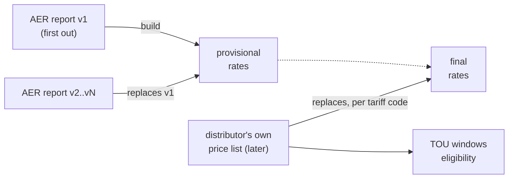

# Update and validate the tariff database

Schema: [schema.md](schema.md). Everything below runs from the repository root.

## The rule: AER first, distributor replaces



| When | Load | `status` |
|---|---|---|
| AER publishes v1 | the AER report | provisional |
| AER publishes a later version | that version (replaces the earlier one) | provisional |
| Distributor publishes its list | the list, for every code it prices | final |
| A code only the AER prices | stays on the AER rates | provisional |

> ⚠ The AER report has rates only. **TOU windows and eligibility usually wait for the distributor's documents**:
> until then a provisional tariff can have rates but no `tou_window` / `eligibility` rows.
> `validate.py --coverage` lists those gaps.

## Recipes

### New AER version (v1 or later)

| # | Step |
|---|---|
| 1 | Save the file under `sources/aer/` and **commit it** (the AER makes superseded versions private) |
| 2 | Add a row to `sources/inventory.csv` (URL, SHA-256) |
| 3 | Register it in `build_support.AER_CONSOLIDATED_FILES`, and its changelog line in `build_support.AER_VERSIONS` |
| 4 | `./run.sh` (parses the latest held version into `out/aer_long.csv`) |
| 5 | Rebuild, then validate (below) |

### Distributor publishes its price list

| # | Step |
|---|---|
| 1 | Add a row to `sources/inventory.csv`; `./run.sh` fetches and parses it (parser: `scripts/dnsp/`) |
| 2 | Curate TOU windows and eligibility from its documents into `data/tariffdb/curated/<distributor>.yaml`, each fact with a verbatim `quote` at its `locator` |
| 3 | Check the YAML: `.venv/bin/python scripts/tariffdb/curated.py data/tariffdb/curated/<distributor>.yaml` |
| 4 | Two price lists for the same year and day? Name the billed one in `build_support.FINAL_DOCUMENT` (the build fails until you do) |
| 5 | Rebuild, then validate |

### Mid-year price change

| # | Step |
|---|---|
| 1 | Register the re-issued list like any distributor list |
| 2 | Add its first day to `build_support.EFFECTIVE_FROM` (`local_path` → `YYYY-MM-DD`) |
| 3 | Rebuild: each code it prices gets a new period from that day; the old period ends the day before |

```text
tariff X   2025-07-01 ─────────── 2025-09-30 │ 2025-10-01 ─────────── 2026-06-30
           list of 1 July                    │ re-issued list
```

### New financial year

| # | Step |
|---|---|
| 1 | Add the year to `spec.FIN_YEARS` **and** `build_support.FIN_YEAR_DATES` (a test checks they agree) |
| 2 | Follow "New AER version", then "Distributor publishes" |

### Schema change

| # | Step |
|---|---|
| 1 | Edit `scripts/tariffdb/spec.py` (never the generated files) |
| 2 | Rebuild (writes `schema.json`, `schema.sqlite.sql`, the CSVs) |
| 3 | `.venv/bin/python scripts/tariffdb/schema_doc.py` (writes `docs/schema.md`, `docs/schema-erd.svg`) |

## Commands

| Do | Command |
|---|---|
| Rebuild | `.venv/bin/python scripts/tariffdb/build.py` (`--verbose` lists curated facts not loaded) |
| Validate (seconds) | `.venv/bin/python scripts/tariffdb/validate.py` |
| Validate against sources (minutes) | `.venv/bin/python scripts/tariffdb/validate.py --sources` |
| Same, committed files only (CI) | `.venv/bin/python scripts/tariffdb/validate.py --sources --committed-only` |
| Gaps to fill | `.venv/bin/python scripts/tariffdb/validate.py --coverage` |
| Build SQLite | `.venv/bin/python scripts/tariffdb/load.py --out out/tariffdb.sqlite` |
| Schema docs | `.venv/bin/python scripts/tariffdb/schema_doc.py` (`--check` to verify) |
| Tests | `.venv/bin/python -m unittest tests/test_tariffdb.py` |

## Checks

`validate.py` prints `PASS` / `FAIL` per check and exits 1 on any failure.

| Check | Verifies | A failure means |
|---|---|---|
| `load` | CSVs load into SQLite with every key, foreign key and CHECK | a hand edit or a build bug: rebuild; never edit the CSVs |
| `periods` | one tariff's periods never overlap; rates, windows and criteria sit inside their tariff's period; the document's year holds the period | a wrong `EFFECTIVE_FROM`, or a document registered under the wrong year |
| `status` | `final` exactly when the document is the distributor's own published list; each rate has its tariff's status and document | a document registered with the wrong side or price status in `sources/inventory.csv` |
| `units` | each unit is a standard unit that fits its charge type | a parser read the wrong column or unit heading; fix the parser (a real misprint goes in `validate.KNOWN_MISPRINTS` with its evidence) |
| `blocks` | blocks number 1..n and their lower bounds rise | a block ladder in the curated `steps` that does not match the price list |
| `tou` | windows of one tariff and period name never overlap on a day type and month | a mistyped window in the curated YAML |
| `files` | each held document matches its recorded SHA-256 (`--sources`) | the publisher replaced the file: record it as a new version |
| `values` | each rate's published value is at its cell or PDF page (`--sources`) | the parser or locator is wrong for that row |
| `quotes` | each eligibility quote is at its locator; each curated YAML validates (`--sources`) | a curated fact does not match its source |

## Before you commit

- [ ] `.venv/bin/python scripts/tariffdb/build.py` (no error; read the "not loaded" count)
- [ ] `.venv/bin/python scripts/tariffdb/validate.py --sources`: all `PASS`
- [ ] `.venv/bin/python scripts/tariffdb/schema_doc.py`
- [ ] `.venv/bin/python -m unittest tests/test_tariffdb.py tests/test_reconciliation.py`: OK
- [ ] `git diff --stat data/tariffdb/tables/`: only the rows you expected changed

## Rules

| Rule | Why |
|---|---|
| CSVs are generated; only `data/tariffdb/curated/*.yaml` is hand-written | a rebuild must reproduce every row |
| Every curated fact carries a verbatim `quote` | `validate.py --sources` can prove it |
| The `.sqlite` is never committed | build it with `load.py --out`; a binary does not diff |
| Superseded provisional rows are not kept as rows | `git log -p data/tariffdb/tables/rate.csv` has them |
