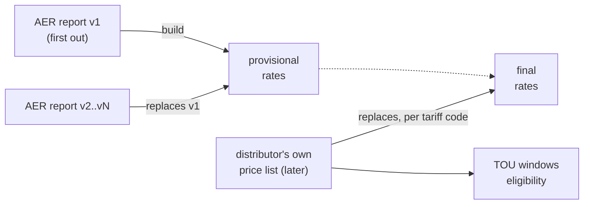
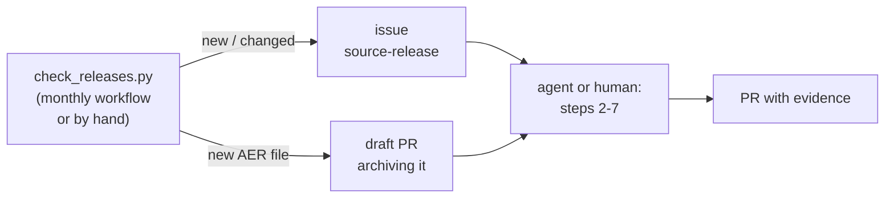

# Update and validate the tariff database

Schema: [schema.md](schema.md). Everything below runs from the repository root.

## The rule: AER first, distributor replaces



| When | Load | `status` |
|---|---|---|
| AER publishes v1 | the AER report | provisional |
| AER publishes a later version | that version (replaces the earlier one) | provisional |
| Distributor publishes its list | the list, for every code it prices | final |
| A code only the AER prices | stays on the AER rates | provisional |

> ⚠ The AER report has rates only. **TOU windows and eligibility usually wait for the distributor's documents**:
> until then a provisional tariff can have rates but no window sets or `eligibility` rows.
> `validate.py --coverage` lists those gaps.
>
> The pricing years before 2023-24 (stored from 1 January 2017: 2016-17 / Victoria 2017 through 2022-23) carry TOU
> windows, demand measurement rules and block bounds from each year's own price list, pricing proposal or tariff guide,
> or the tariff structure statement for its period; eligibility starts 2023-07-01, so `--coverage` lists every tariff
> of those years without it. `billcalc.py sweep` counts what each gap blocks.

## Find and load new releases

Works for any year: nothing below names one.



| # | Step | How |
|---|---|---|
| 1 | Find | `.venv/bin/python scripts/check_releases.py` (`--no-files` for pages only). Reports new AER versions (landing-page changelog vs `build_support.AER_VERSIONS`), new or gone document links on the pages in `sources/watch.csv`, and inventory files whose SHA-256 changed. Pages listed as not reachable block bots: open them in a real browser |
| 2 | Archive | AER files: `--archive` saves each new one and its landing page under `sources/aer/`; commit both at once (the AER takes superseded versions private). Distributor files: `./run.sh` fetches them from `sources/inventory.csv`; a publisher that blocks downloads gets a Wayback copy (`https://web.archive.org/web/<timestamp>id_/<url>`), committed with a `.gitignore` allow line |
| 3 | Register | One `sources/inventory.csv` row per file (URL, access note, SHA-256), then the recipe below: "New AER version", "Distributor publishes its price list", "Mid-year price change" or "New financial year". An AER landing page saved by `--archive` replaces the year's `build_support.LANDING` entry, and its changelog lines go into `AER_VERSIONS` verbatim |
| 4 | Parse | `./run.sh`. A format the parser rejects: fix `scripts/parse_aer.py` or `scripts/dnsp/<group>.py` (contract: `scripts/dnsp/CONTRACT.md`), never the output |
| 5 | Apply the rule | Automatic in the build: AER versions stay `provisional`, the distributor's list replaces them per code as `final`. TOU windows and eligibility only come from the distributor's documents (curated YAML) |
| 6 | Validate | "Before you commit" below, every box |
| 7 | Accept | `.venv/bin/python scripts/check_releases.py --no-files --accept` records the current links in `sources/watch_seen.csv`, so the next check reports only what is newer. Accept irrelevant links the same way, and a page's links the first time it answers (a page never reached has no baseline) |
| 8 | PR | One PR per release; the body has the evidence (below). It closes the `source-release` issue |
| 9 | Publish | Once the PR is merged: `.venv/bin/python scripts/release.py --publish` fetches origin, builds the SQLite and the CSV zip from `origin/main` and publishes them as a GitHub release (the README's "Download" links follow the newest) |

PR evidence:

| Include | From |
|---|---|
| Each new document: URL, local path, SHA-256, retrieval date | `sources/inventory.csv` diff |
| AER changelog lines quoted verbatim | the saved landing page |
| `validate.py --sources` output (all `PASS`) and the test result | the commands above |
| Rows changed per table and status counts (`provisional` → `final`) | `git diff --stat data/tariffdb/tables/` |
| Gaps left (codes without TOU or eligibility) | `validate.py --coverage` |
| Anything not loaded, and why | build output (`--verbose`) |

### Monthly schedule

| Where | How |
|---|---|
| GitHub (default) | `.github/workflows/release-check.yml` runs on the 2nd of every month on the repository's own GitHub runners, with only the default `GITHUB_TOKEN`; it reads public pages and writes only an issue and a draft PR to this repository. Run now: Actions > Source release check > Run workflow |
| A fork | Scheduled workflows are off in forks: enable them in the fork's Actions tab. For the draft PR, also turn on Settings > Actions > General > "Allow GitHub Actions to create and approve pull requests" (without it, the issue still lists every new file) |
| Your own machine | `crontab -e`, then `17 3 2 * * cd /path/to/repo && .venv/bin/python scripts/check_releases.py --report out/release-check.md` (exit 2 = something new; read the report) |

## Recipes

### New AER version (v1 or later)

| # | Step |
|---|---|
| 1 | Save the file under `sources/aer/` and **commit it** (the AER makes superseded versions private) |
| 2 | Add a row to `sources/inventory.csv` (URL, SHA-256) |
| 3 | Register it in `build_support.AER_CONSOLIDATED_FILES`, and its changelog line in `build_support.AER_VERSIONS` |
| 4 | `./run.sh` (parses the latest held version into `out/aer_long.csv`) |
| 5 | Rebuild, then validate (below) |

### Distributor publishes its price list

| # | Step |
|---|---|
| 1 | Add a row to `sources/inventory.csv`; `./run.sh` fetches and parses it (parser: `scripts/dnsp/`) |
| 2 | Curate TOU windows and eligibility from its documents into `data/tariffdb/curated/<distributor>.yaml`, each fact with a verbatim `quote` at its `locator` |
| 3 | Check the YAML: `.venv/bin/python scripts/tariffdb/curated.py data/tariffdb/curated/<distributor>.yaml` |
| 4 | Two price lists for the same year and day? Name the billed one in `build_support.FINAL_DOCUMENT` (the build fails until you do) |
| 5 | Rebuild, then validate |

### AER spells a code differently

The distributor's spelling wins; the AER's copy of that tariff is dropped.

| AER prints | Distributor prints | Handled by |
|---|---|---|
| `LVDed` | `LVDED` | automatic (case, spaces, trailing `*` ignored) |
| `HVAD-SA` | `HVAD` | rule in `data/tariffdb/code_alias.csv` |
| `EBDEM` | `EBDEMT1`, `EBDEMT2`, `EBDEMT3` | rule |
| `HV` | `HV1`, `HV2`, `HV3` | rule |

| # | Step |
|---|---|
| 1 | Add one row to `data/tariffdb/code_alias.csv`: `distributor_id, aer_code, distributor_code, valid_from, valid_to, reason` |
| 2 | Prefer a pattern: `{code}` = same text both sides, `{n}` = one digit (distributor side). A literal pair also works |
| 3 | Rebuild, then validate: the `aliases` check fails while a duplicate remains |

One AER code may map to several distributor codes (`EBDEM` → `EBDEMT1`–`T3`): the AER copy gives way to all of them.
A rule only matches codes the distributor's list really prices that day; it never creates a code.

### Mid-year price change

| # | Step |
|---|---|
| 1 | Register the re-issued list like any distributor list |
| 2 | Add its first day to `build_support.EFFECTIVE_FROM` (`local_path` → `YYYY-MM-DD`) |
| 3 | Rebuild: each code it prices gets a new period from that day; the old period ends the day before |

```text
tariff X   2025-07-01 ─────────── 2025-09-30 │ 2025-10-01 ─────────── 2026-06-30
           list of 1 July                    │ re-issued list
```

### New financial year

| # | Step |
|---|---|
| 1 | Raise `spec.LAST_FIN_YEAR` (pricing years and their dates follow from it) |
| 2 | Follow "New AER version", then "Distributor publishes" |

### A year before 2023-24

| # | Step |
|---|---|
| 1 | Register the document in the archive: `scripts/archive_sources.py add ...` (`sources/archive/README.md`) |
| 2 | Parse it in its group's `scripts/history/<slug>.py` (contract: `scripts/history/CONTRACT.md`) |
| 3 | `.venv/bin/python scripts/history/check.py <slug> --sources`: all `PASS` |
| 4 | Rebuild, then validate |

The database stores only the years in effect on or after `build_support.FIRST_STORED_DAY` (2017-01-01); an older
year is parsed and checked but not stored until that day is lowered (README, "Older years").
Such a year is stored with rates only until its billing rules are curated ("Billing rules" below); eligibility is
curated from 2023-24 only.
A year whose documents print the price only as parts (DUOS / TUOS / jurisdictional, no total) is listed in
`sources/archive/gaps.csv` rather than stored, for example Ergon 2016-17 to 2019-20.

The distributor's own list, or a state regulator's published schedule, is `final`; an AER-hosted proposal stands in
(`provisional`) only for a year with neither.

### Billing rules (curated)

What a bill needs beyond the prices, each fact quoted from the distributor's documents (format: the docstring of
`scripts/tariffdb/curated.py`). The tariff structure statement (TSS) and the network price guide state most of them;
the AER file states none.

| YAML section | Table | States |
|---|---|---|
| `tou_schedules` | `window_set`, `season`, `season_part`, `time_window`, `tariff_window_set` | when each rate's period applies: one schedule is one window set, used by the tariffs it names; `period` = the rate's `tou_period`; a seasonal window has `season` (the rate's), `season_label` (as printed) and its months (`dst` / `not_dst` for a season the document defines by daylight saving); `time_basis` and `public_holidays` each quote the statement that sets them (`time_basis_locator` / `_quote`, and `_doc` when another document of the year states it), or are `not_stated` with no quote (stored NULL; billcalc flags the assumption) |
| `rate_periods` | `rate.tou_period`, `rate.season` | the period or season of a rate whose price list column names it differently (the rate's note records the change) |
| `rate_units` | `rate.unit` | the billing period (and kW or kVA) of a demand rate whose price list prints none (`c/kW/?`); with no such fact the build stores `c/kW/period_not_stated` and billcalc blocks it |
| `conditions` | `rate_condition` | a rate only some sites pay: `opt_in:<name>`, `meter_type:<type>`, `meter_class:<class>` (`a\|b` = either; one row per value) |
| `tariff_links` | `tariff_link` | a relation the document states to another code or class: `opt_out_to`, `replaces`, `secondary_of`, `cannot_combine`, `available_only_from` ... (one row per linked code; the AER's spellings become `alias` / `zone_variant_of` links by themselves) |
| `metering` | `rate` (`charge_type` metering) | a network-wide metering schedule row, applied to the codes (or `all`) the document says, with its condition |
| `charge_rules` | `charge_rule` | how a demand, capacity or export quantity is measured: kW/kVA/kWh (or `kva_else_kw`), interval, highest or mean of the n highest, reset (`rolling_months` with `lookback_months`), minimum and threshold (each with its unit, the measure's by default), allowance (`codes: all` for a glossary definition) |

A fact's `fin_year` may list several pricing years (`[2019-20, 2020-21]`) when one document states it for each of
them, e.g. a tariff structure statement for its regulatory period; a year's own price list states only that year.
An archived tariff structure statement is registered like any archived document (`archive_sources.py add --kind
tariff_structure_statement`).

`scripts/tariffdb/joins.py` says how a rate finds its windows: a usage rate with no period beside period-priced usage
rates prices the rest of the time; event periods (critical peak...) need no window; the `joins` check fails on a rate
whose period has no window or whose window is ambiguous, and on a window (other than a demand window) of a period
its charge group prices in no season the window belongs to. A window of a period the price list leaves unpriced
(no rate of its group in that period, e.g. Energex 92000 off-peak and shoulder at 0) is information only.

### Bill calculator

`scripts/billcalc.py` bills interval data on the tables, says which facts it had to assume, and refuses (status
`blocked`) where the tables cannot price a charge. Interval data: a CSV with the interval start in NEM time (UTC+10)
and kWh columns `E1` (import), `E2` (controlled load), `B1` (export), `Q1` (kvarh, for kVA demand).

| Do | Command |
|---|---|
| Bill | `.venv/bin/python scripts/billcalc.py bill sapn RTOU 2025-07-01 2025-09-30 data.csv --meter-type interval` |
| Label every interval with its periods | `.venv/bin/python scripts/billcalc.py categorise sapn RTOU 2025-07-01 2025-07-31 data.csv` |
| Compare tariffs | `.venv/bin/python scripts/billcalc.py compare sapn RSR,RTOU 2025-07-01 2026-06-30 data.csv` |
| Gaps sweep | `.venv/bin/python scripts/billcalc.py sweep` (every tariff-period on a synthetic month; `--write` records the counts) |

`tests/test_billcalc.py` bills the distributors' published example bills (within $0.50) and fails when a
tariff-period's sweep status worsens from the one recorded in `tests/billcalc_sweep_status.csv` (exact < assumed <
blocked) or the `blocked` count rises above `tests/billcalc_sweep.json`. A blocked tariff-period that curation makes
computable on a fact its documents leave unstated (e.g. the clock basis) becomes `assumed`, so `assumed` may rise.
When statuses improve, record them: `.venv/bin/python scripts/billcalc.py sweep --write`. A status that rested on an
unsourced fact may worsen only when `tests/billcalc_sweep_exceptions.csv` names the tariff-period, its from and to
status and the reason.

### Schema change

| # | Step |
|---|---|
| 1 | Edit `scripts/tariffdb/spec.py` (never the generated files) |
| 2 | Rebuild (writes `schema.json`, `schema.sqlite.sql`, the CSVs) |
| 3 | `.venv/bin/python scripts/tariffdb/schema_doc.py` (writes `docs/schema.md`, `docs/schema-erd.svg`) |

## Commands

| Do | Command |
|---|---|
| Rebuild | `.venv/bin/python scripts/tariffdb/build.py` (`--verbose` lists curated facts not loaded) |
| Validate (seconds) | `.venv/bin/python scripts/tariffdb/validate.py` |
| Validate against sources (minutes) | `.venv/bin/python scripts/tariffdb/validate.py --sources` |
| Same, committed files only (CI) | `.venv/bin/python scripts/tariffdb/validate.py --sources --committed-only` |
| Gaps to fill | `.venv/bin/python scripts/tariffdb/validate.py --coverage` |
| Build SQLite | `.venv/bin/python scripts/tariffdb/load.py --out out/tariffdb.sqlite` |
| Release (SQLite + CSV zip + xlsx of the views + notes) | `.venv/bin/python scripts/release.py` (writes `out/release/<tag>/`; `--publish` fetches origin and creates the GitHub release; `--ref` another commit; `--tag tariffdb-<date>.2` for a second release from a later commit on the same day) |
| Schema docs | `.venv/bin/python scripts/tariffdb/schema_doc.py` (`--check` to verify) |
| Tests | `.venv/bin/python -m unittest tests/test_tariffdb.py tests/test_release.py tests/test_billcalc.py` |
| New or changed source documents | `.venv/bin/python scripts/check_releases.py` (`--no-files`, `--archive`, `--accept`) |

## Checks

`validate.py` prints `PASS` / `FAIL` per check and exits 1 on any failure.

| Check | Verifies | A failure means |
|---|---|---|
| `load` | CSVs load into SQLite with every key, foreign key and CHECK | a hand edit or a build bug: rebuild; never edit the CSVs |
| `periods` | one tariff's periods never overlap; the document's year holds the period | a wrong `EFFECTIVE_FROM`, or a document registered under the wrong year |
| `status` | `final` exactly when the document is the distributor's own published list | a document registered with the wrong side or price status in `sources/inventory.csv` |
| `units` | the `unit` table is `spec.UNITS`, and each rate's unit measures a quantity its charge type is priced in (the build already stops on a unit outside `spec.UNITS`) | a parser read the wrong column or unit heading; fix the parser, or add a `rate_units` fact for a unit with no stated billing period (a real misprint goes in `validate.KNOWN_MISPRINTS` with its evidence) |
| `magnitude` | no c/kWh rate outside `critical_peak` exceeds 200 c/kWh unless its note contains `confirmed high rate:` | a parser read a $/kWh cell as c/kWh, or a demand charge as usage; fix the parser (a real high price gets a parser note `confirmed high rate: ...` quoting its evidence) |
| `blocks` | blocks number 1..n and their lower bounds rise | a block ladder in the curated `steps` that does not match the price list |
| `tou` | a window's season is in its own window set; windows one tariff uses for a charge group and period name never overlap on a day type and month | a mistyped window in the curated YAML |
| `joins` | in a tariff-period with windows, each rate priced in a period or season finds its windows, each window but a demand window of a period its charge group prices is priced by a rate of that group in its season, and no demand or export rate without a period sits beside windows naming several | a window missing from the curated YAML, a rate whose period the price list names differently, or a window in a season no rate of its period covers: add the window or a `rate_periods` fact, or find the missing rate |
| `rules` | each `charge_rule` measures a rate of its tariff-period, in the quantity the rate is priced in | a curated rule names the wrong charge type, period, season or measure |
| `aliases` | no provisional tariff is a final tariff of the same distributor and period under another spelling or an alias | the AER spells a code differently: add a rule to `data/tariffdb/code_alias.csv` |
| `views` | each view (`tariff_flat`, `tou_flat`, `unit_spelling`) has its spec.py columns; the two tariff views return every tariff-period and `tariff_flat` every rate | a view's SQL in `spec.VIEWS` drifted from its columns or lost rows: fix the SQL |
| `files` | each held document matches its recorded SHA-256 (`--sources`) | the publisher replaced the file: record it as a new version |
| `values` | each rate's published value is at its cell or PDF page (`--sources`) | the parser or locator is wrong for that row |
| `quotes` | each eligibility, tariff_assignment, tariff_link and rate_condition quote, and each window set's time-basis and public-holiday statement, is at its locator; each curated YAML validates (`--sources`) | a curated fact does not match its source |

## Before you commit

- [ ] `.venv/bin/python scripts/tariffdb/build.py` (no error; read the "not loaded" count)
- [ ] `.venv/bin/python scripts/tariffdb/validate.py --sources`: all `PASS`
- [ ] `.venv/bin/python scripts/tariffdb/schema_doc.py`
- [ ] `.venv/bin/python -m unittest tests/test_tariffdb.py tests/test_release.py tests/test_billcalc.py tests/test_reconciliation.py tests/test_check_releases.py`: OK
- [ ] `git diff --stat data/tariffdb/tables/`: only the rows you expected changed

## Rules

| Rule | Why |
|---|---|
| CSVs are generated; only `data/tariffdb/curated/*.yaml` and `data/tariffdb/code_alias.csv` are hand-written | a rebuild must reproduce every row |
| `sources/watch.csv` (pages to watch) is hand-written; `sources/watch_seen.csv` is written only by `check_releases.py --accept` | the baseline must be what the pages really showed |
| Every curated fact carries a verbatim `quote` | `validate.py --sources` can prove it |
| The `.sqlite` and the release zip are never committed | build them with `load.py --out` or `release.py`; a binary does not diff, and releases carry them |
| Superseded provisional rows are not kept as rows | `git log -p data/tariffdb/tables/rate.csv` has them |
